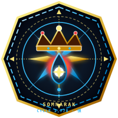

<p align="center">
  
</p>

<h1 align="center">Somnarak Wiki</h1>

<p align="center">
  Official encyclopedia of <strong>Somnarak</strong> — the City of Unresolved Sorrow<br>
  Year 4,238 · Dawn Initiative
</p>

<p align="center">
  <a href="https://redditor008.github.io/PROJECT.SOMNARAK-WIKI/"><strong>Open the wiki →</strong></a>
</p>

---

Static GitHub Pages site. No account, no build step — open the link.

## Archives

| Hub | What it covers |
| --- | --- |
| [Sorrow Entities](https://redditor008.github.io/PROJECT.SOMNARAK-WIKI/entities/) | Containment registry (published slice of ~288) |
| [M.A.W.](https://redditor008.github.io/PROJECT.SOMNARAK-WIKI/maw/) | Weapons, suits, gifts |
| [Characters](https://redditor008.github.io/PROJECT.SOMNARAK-WIKI/characters/) | Nine Echo-Cores and supporting cast |
| [Mechanics](https://redditor008.github.io/PROJECT.SOMNARAK-WIKI/mechanics/) | Han, work types, ordeals, containment |
| [Factions](https://redditor008.github.io/PROJECT.SOMNARAK-WIKI/factions/) | Reverie Directorate, Council, guilds |
| [Facility 01](https://redditor008.github.io/PROJECT.SOMNARAK-WIKI/departments/) | Hand of Change, floors 1–8 |
| [Atlas](https://redditor008.github.io/PROJECT.SOMNARAK-WIKI/locations/) | Zones A–E, the Maw, the Desolate |
| [Lore](https://redditor008.github.io/PROJECT.SOMNARAK-WIKI/lore/) | Cycles, Alpha Tree, taboos, Weeping |

## Repository

| Path | Role |
| --- | --- |
| [`docs/`](docs/) | Public wiki (HTML, CSS, art, search) — GitHub Pages root |
| [`REFERENCE_SOMNARAK_WIKI/`](REFERENCE_SOMNARAK_WIKI/) | Canon sources and diagrams |

## Run locally

```bash
python3 -m http.server 8000 --bind 0.0.0.0 --directory docs
```

Then open `http://localhost:8000/`.

Canon terms stay Somnarak-native: Sorrow Entities, SECC, M.A.W., Reverie Directorate, Echo-Cores, Han, Absolvohan.
