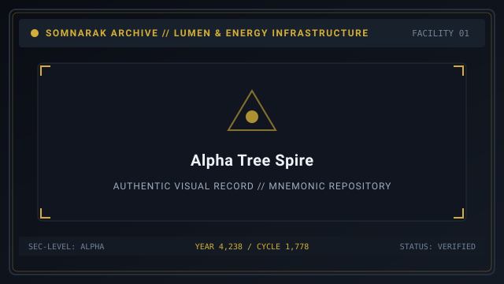
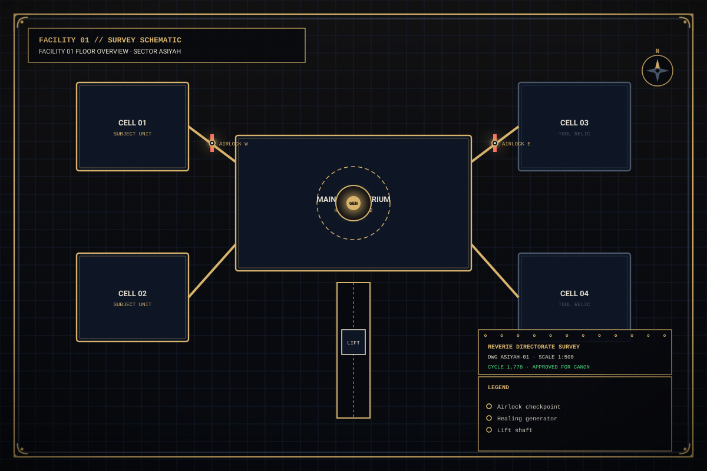
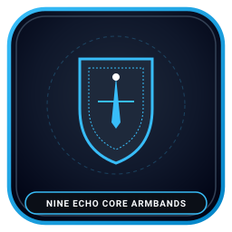
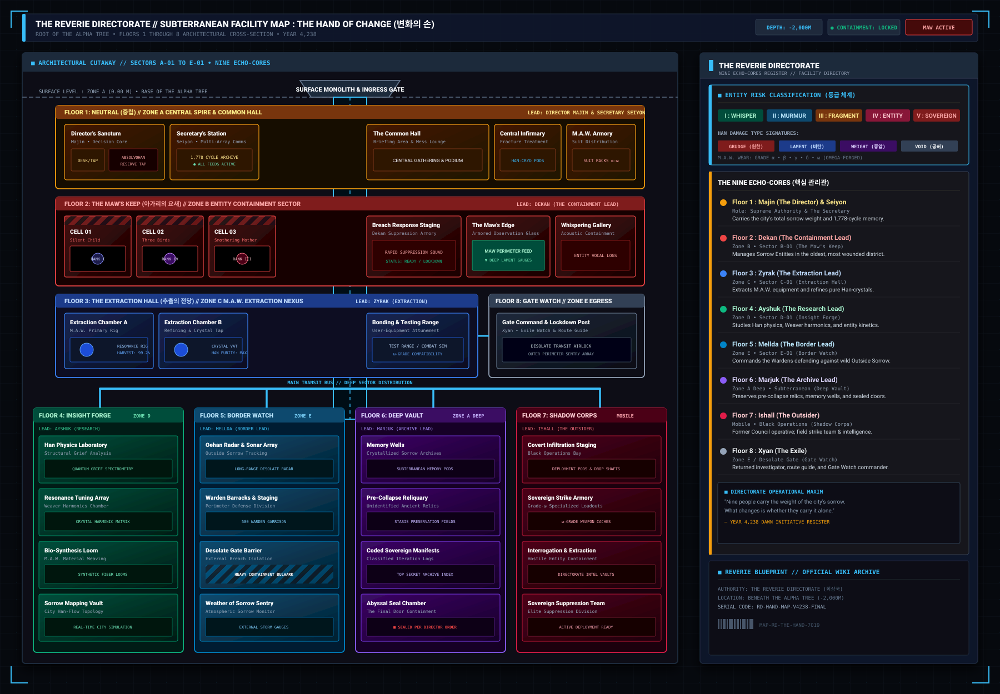
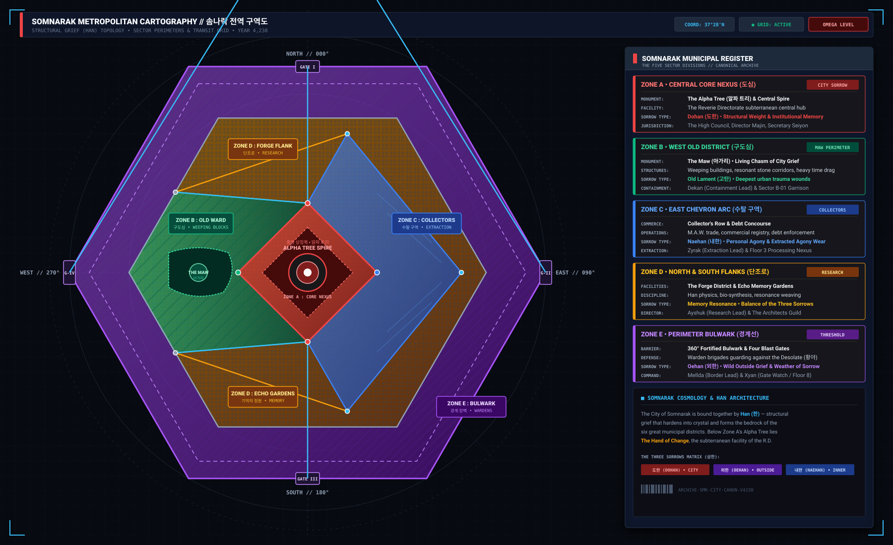

# Somnarak Wiki



> *We are currently maintaining **291** [Sorrow Entities](07-Sorrow%20Entities.md) (291 files, **284** cataloged SECC), **198** **M.A.W. sets** (**1,165** profiles), **60** [Ordeals](10-Ordeals.md), and 44 Codices. Please feel free to contribute by expanding existing records.*

**Somnarak Wiki** is the comprehensive encyclopedia for [[SOMNARAK-WORLD](https://github.com/Redditor008/PROJECT.SOMNARAK-WIKI/tree/arena/01a0b699-project-somnarak-wiki/SOMNARAK-WORLD "SOMNARAK-WORLD")] — the vertical municipal civilization of **1.29 billion** souls built where the **Weeping**  [비탄의 강]  (_Bitan-ui Gang_ — River of 🔵 **Lament**) surfaces beneath the Alpha Tree  [알파 트리]  (_Alpa Teuri_).

Within this municipal order, the **Hand of Change** (Facility 01) descends eight floors plus Central beneath the ancient root system, housing nine [Echo-Cores](14-Echo-Cores.md) and hundreds of contained sorrow entities. As a **Warden** overseeing facility operations, you are tasked with directing specialists, managing volatile containment cells, extracting refined **Lumen**, and enduring the relentless metaphysical incursions known as **Ordeals**.

```text
+========================================================================+
| SOMNARAK WIKI - MAIN GRAND PORTAL                                      |
+------------------------------------------------------------------------+
| Lore Archive           | SOMNARAK-WORLD / Pages (Canonical Wiki)       |
| Maintained Records     | 291 Entities - 198 M.A.W. Sets - 60 Ordeals   |
| Anchor Era             | Year 4,238 / Reverie Cycle 1,778              |
| Primary Structure      | Facility 01 (Hand of Change - 9 Echo-Cores)   |
| Corporate Framework    | 10 Primary Companies (5 Main - 5 Sub)         |
+========================================================================+
```

## Contents

- [1 Primary Portals](#1-primary-portals)
  - [1.1 The 3 Main Ways](#11-the-3-main-ways)
  - [1.2 The 2 Sub Ways](#12-the-2-sub-ways)
  - [1.3 Archive Statistics at a Glance](#13-archive-statistics-at-a-glance)
- [2 Individual Entity Showcases](#2-individual-entity-showcases)
- [3 Facility 01 Departments and Echo-Cores](#3-facility-01-departments-and-echo-cores)
- [4 Gameplay and Tactical Systems](#4-gameplay-and-tactical-systems)
- [5 Navigation Tools](#5-navigation-tools)
- [6 Gallery](#6-gallery)
- [7 See also](#7-see-also)

## 1 Primary Portals

The Somnarak archive is organized across **Three Main Hubs** and **Two Sub Portals**, supported by individual specimen dossiers:

### 1.1 The 3 Main Ways

- **[07-Sorrow Entities](07-Sorrow%20Entities.md)**: The Master Bestiary hub. Contains all thirteen canonical sections documenting the nature, behavior, origins, Lumen extraction, M.A.W. gear, and classification of all 291 crystallized sorrows.
- **[05-Chronicle](05-Chronicle.md)**: The Story and Lore hub. Documents the master historical timeline spanning Ante-Dawn expeditions, the 1,778 cycles of the Reverie Directorate, the Dawn of Hope (Year 4,238), and the six Story Cantos.
- **[01-Main Page](01-Main%20Page.md)**: The Central Grand Portal and directory navigation index.

### 1.2 The 2 Sub Ways

- **[06-Personnel](06-Personnel.md)**: The Character hub. Profiles the nine sovereign [Echo-Cores](14-Echo-Cores.md), their departmental armbands and signature weapons, ten Specialist Cadres, and the ten Primary Companies.
- **[22-Departments](22-Departments.md)**: The Department hub. Details Facility 01's spatial architecture, departmental team bonuses, Command Room healing generators (6 HP/SP), containment chambers, and progressive research unlocks.

### 1.3 Archive Statistics at a Glance

| Archive Metric | Canonical Count | Reference Hub |
|---|---|---|
| Sorrow Entities | 291 entities (284 unique SECC) | [07-Sorrow Entities](07-Sorrow%20Entities.md) |
| M.A.W. Equipment Sets | 198 sets (1,165 profiles) | [09-M.A.W. Equipment](09-M.A.W.%20Equipment.md) |
| Ordeal Incursions | 60 across 5 Colors and 4 Watches | [10-Ordeals](10-Ordeals.md) |
| Story Cantos | 6 sequential Cantos | [05-Chronicle](05-Chronicle.md) |
| Facility Floors | 9 (Floors 1-8 plus Central) | [22-Departments](22-Departments.md) |
| Echo-Core Directors | 9 sovereign directors | [06-Personnel](06-Personnel.md) |
| Primary Companies | 10 (5 Main, 5 Sub) | [06-Personnel](06-Personnel.md) |
| Specimen Dossiers | 4 showcase articles | [27-The Debt Eater](27-The%20Debt%20Eater.md) |

New Wardens should read the hubs in this order: Main Page (orientation) -> [07-Sorrow Entities](07-Sorrow%20Entities.md) (what you contain) -> [05-Chronicle](05-Chronicle.md) (why it matters) -> [06-Personnel](06-Personnel.md) and [22-Departments](22-Departments.md) (who and where) -> the four specimen dossiers (how it plays).

## 2 Individual Entity Showcases

To illustrate the diverse containment archetypes cataloged by the Directorate, four primary specimen articles demonstrate the distinction between breaching non-tool subjects and the three functional classes of tool relics:

| Specimen Article | Classification | Operational Archetype | Functional Description |
|---|---|---|---|
| **[27-The Debt Eater](27-The%20Debt%20Eater.md)** | `SE-C-IIIβ-014` | **Non-Tool Subject** | Mobile breaching entity; responds to all 4 work types; features full preference table. |
| **[28-The Echo Compass](28-The%20Echo%20Compass.md)** | `SE-C-IIIβ-016` | **Tool: Single Use** | Instant acoustic scan revealing floor agitation; unlocked by cumulative Number of Uses. |
| **[29-The Crucible](29-The%20Crucible.md)** | `SE-C-IIIβ-275` | **Tool: Channeled Use** | Continuous endurance refining Han-Energy; unlocked by Time; fatal past 30 seconds. |
| **[30-The Debt Scale](30-The%20Debt%20Scale.md)** | `SE-C-IIIβ-015` | **Tool: Equippable** | Wearable passive talisman; restores SP and inverts Void defense; paired with Debt Eater. |

## 3 Facility 01 Departments and Echo-Cores

Somnarak fields nine operational departments across eight descending levels plus Central Administration:

| Floor Level | Department Name | Sovereign Director | Armband Motif | Departmental Mandate |
|---|---|---|---|---|
| **Floor 1 (Top)** | Spires | Majin  [마진] | Pale Veil of Threshold | Threshold discipline, command, and entry security |
| **Floor 1 (Central)** | Central Administration | Seiyon  [세이연] | Azure Ribbon of Records | Archival continuity, municipal ledgers, and coordination |
| **Floor 2** | Maw's Keep | Dekan  [데칸] | Crimson Flesh Arm | Perimeter defense and lip containment |
| **Floor 3** | Extraction Hall | Zyrak  [지락] | Cogwheel & Copper Wire | Mnemonic well drilling and raw Han extraction |
| **Floor 4** | Insight Forge | Ayshuk  [아이숙] | Amber Lens & Glass | Analytical observation and research tree synthesis |
| **Floor 5** | Border Watch | Mellda  [멜다] | Obsidian Edge & Vow | Frontier quarantine and heavy suppression |
| **Floor 6** | Deep Vault | Marjuk  [마주크] | Silver Key & Padlock | Deep storage of volatile relics and unknown entities |
| **Floor 7** | Shadow Corps | Ishall  [이샬] | Shadowed Cowl | Covert intervention (co-monitored by Zyrak and Seiyon) |
| **Floor 8 (Lowest)** | Gate Watch | Xyan  [시안] | Neural Spine Wire | Final gatekeeper against subterranean Maw incursions |

## 4 Gameplay and Tactical Systems

- **[08-Sorrow List](08-Sorrow%20List.md)** — complete catalog of all 291 unique SECC codes
- **[09-M.A.W. Equipment](09-M.A.W.%20Equipment.md)** — weapon, suit, and stigma armory (198 sets, 1,165 profiles)
- **[10-Ordeals](10-Ordeals.md)** — sixty hostile incursions across 5 Colors and 4 Watches
- **[11-Reverberations](11-Reverberations.md)** — departmental meltdown crises and floor realization trials
- **[12-Specialists](12-Specialists.md)** — operative recruitment, stat progression, and loadout pairing
- **[13-Operations](13-Operations.md)** — daily municipal missions and tactical deployment guidelines
- **[15-Research](15-Research.md)** — departmental upgrades, healing generator enhancements, and bullet tech
- **[16-Daily Cycle](16-Daily%20Cycle.md)** — shift execution, watch timing, and daily quota quotas
- **[17-Pressure Types](17-Pressure%20Types.md)** — four elemental damage pressures: 🔴 **Grudge**, 🔵 **Lament**, ⚪ **Void**, ⚫ **Weight**
- **[18-Containment Levels](18-Containment%20Levels.md)** — departmental stability gauges from Tranquil to Rupture
- **[19-Lumen Surge](19-Lumen%20Surge.md)** — energy overload thresholds and emergency containment protocols
- **[20-Challenge Mode](20-Challenge%20Mode.md)** — endgame operational trials and high-density incursions
- **[21-Game Mechanics](21-Game%20Mechanics.md)** — comprehensive combat calculations and clash physics
- **[37-Relic Entities](37-Relic%20Entities.md)** — complete taxonomy of the 88 relic and tool specimens
- **[38-Classification Code](38-Classification%20Code.md)** — SECC nomenclature and decoding manual

## 5 Navigation Tools

- [02-Recent Echoes](02-Recent%20Echoes.md) — recent changes, patchnotes, and field logs
- [03-Random Dossier](03-Random%20Dossier.md) — random draw generator across all 291 containment records
- [04-Help](04-Help.md) — reading guide for novices and containment safety standards
- [42-Navigation](01-Main%20Page.md) — complete directory index

## 6 Gallery

| Grand Vista | Floor Cross-Section | Command Insignia |
|---|---|---|
| [](images/alpha-tree-spire.svg) | [](images/facility-01-floor-overview.svg) | [](images/nine-echo-core-armbands.svg) |
| *The Alpha Tree over Facility 01* | *Departmental floor cross-section* | *Armbands of the nine Echo-Cores* |

| Facility Blueprint | City Masterplan |
|---|---|
| [](images/the-hand-facility-layout.svg) | [](images/somnarak-city-layout.svg) |
| *Full Facility 01 architectural schematic* | *Somnarak City municipal masterplan* |
---

## 7 See also

- [07-Sorrow Entities](07-Sorrow%20Entities.md) — master entity bestiary
- [05-Chronicle](05-Chronicle.md) — master history and story cantos
- [06-Personnel](06-Personnel.md) — directors, specialists, and companies
- [22-Departments](22-Departments.md) — facility layout and room systems
