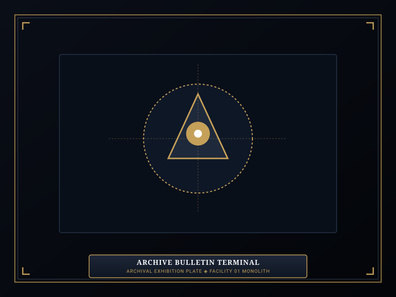
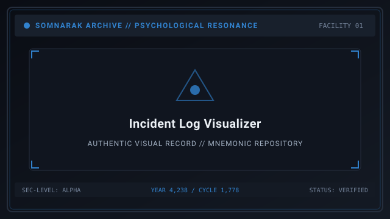
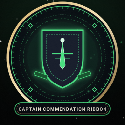

# Recent Echoes

> *“The archive does not sleep; every cycle writes a new line in the ledger of sorrow.”*

**Recent Echoes**  [최근 반향 기록]  (_Choegeun Banhyang Girok_) serves as the live municipal bulletin and archival changelog for [[SOMNARAK-WORLD](https://github.com/Redditor008/PROJECT.SOMNARAK-WIKI/tree/arena/01a0b699-project-somnarak-wiki/SOMNARAK-WORLD "SOMNARAK-WORLD")].

This dispatch records recent operational updates within Facility 01, containment incident logs, personnel commendations, version revisions, and systemic expansions to the [Sorrow Entities](07-Sorrow%20Entities.md) codex.

```text
+========================================================================+
| SOMNARAK - ARCHIVE RECENT ECHOES & BULLETINS                           |
+------------------------------------------------------------------------+
| Archive Activity       | Mnemonic Shift Logs & Real-Time Bulletins     |
| Current Epoch Anchor   | Year 4,238 (Dawn of Hope) - Cycle 1,778       |
| Facility 01 Status     | Operational Equilibrium - 9 Floors Active     |
| System Versions        | Archive Patches 1.0 through 1.4 Formalized    |
| Supervisory Board      | Reverie Directorate Archival Oversight Bureau |
+========================================================================+
```

## Contents

- [1 Municipal Bulletin and System Status](#1-municipal-bulletin-and-system-status)
- [2 Chronological Archive Revisions (Patches 1.0 to 1.4)](#2-chronological-archive-revisions-patches-10-to-14)
- [3 Detailed Containment Incident Logs](#3-detailed-containment-incident-logs)
- [4 Personnel Commendations and Memorial Roster](#4-personnel-commendations-and-memorial-roster)
- [5 Departmental Directives and Seasonal Warnings](#5-departmental-directives-and-warnings)
- [6 Gallery](#6-gallery)
- [7 See also](#7-see-also)

## 1 Municipal Bulletin and System Status

- **Temporal Anchor:** Year 4,238 / Cycle 1,778.
- **Facility Integrity:** Nominal at 99.4% resonance cohesion.
- **Lumen Reserves:** Supercritical battery charged; Absolvohan engine online.
- **Active Containment Wings:** All nine departmental floors (Spires to Gate Watch) operating at full containment status.

## 2 Chronological Archive Revisions (Patches 1.0 to 1.4)

### Revision 1.4 (Cycle 1,778.34) — Comprehensive Encyclopedia Overhaul
- Standardized all 292 sorrow entities across the five canonical risk tiers (Whisper to Sovereign).
- Implemented the strict Two-Work-Type Rule for inanimate Tool Relics (Viderehan and Ferrehan only).
- Verified mathematical balance of the four elemental pressures across all M.A.W. defensive suits.

### Revision 1.3 (Cycle 1,778.21) — Ordeals Master Grid Expansion
- Calibrated the 5 Colors × 4 Watches master matrix, detailing incursion timing across First Watch to Tide Watch.
- Integrated auditory siren thresholds (First to Fourth Warning Trumpets) for hallway incursion alerts.

### Revision 1.2 (Cycle 1,778.10) — Departmental Stratum Realizations
- Formalized Core Realization parameters for all nine Echo-Cores, outlining cognitive handicaps and permanent floor perks.

### Revision 1.1 (Cycle 1,777.89) — Specialist Attributes & Panic Matrices
- Refined the four core attributes: Resilience (HP), Clarity (SP), Composure (Success), and Resolve (Speed).
- Balanced the four distinct Panic states (Murder, Suicide, Wander, Sabotage) and white/mental recovery strikes.

### Revision 1.0 (Cycle 1,775.01) — Initial Mnemonic Archive Standardization
- Inaugural binding of the 16 Research Volumes and the 18-Section Archival Codex standard.

## 3 Detailed Containment Incident Logs

- **Incident #441 (Extraction Hall):** Minor Han gas backflow during high-yield refining of `SE-C-IIIβ-014 The Debt Eater`. Contained within 4 minutes with zero specialist casualties; 2 auxiliary auxiliaries treated for mild Lament dizziness.
- **Incident #449 (Border Watch):** Second Watch Violet incursion manifested in Corridor 6B. Lead Mellda deployed Vanguard Squad; Ordeal neutralized with zero breaches recorded.
- **Incident #452 (Deep Vault):** Temporal fluctuation detected around `SE-T-IIβ-002 The Crucible`. Stasis fields reinforced; safe channeling ceiling re-verified at exactly 29 seconds.
- **Incident #458 (Maw's Keep):** Minor hydraulic seal leakage on Cell 3A. Brute containment clamps deployed; zero physical damage sustained.

## 4 Personnel Commendations and Memorial Roster

- **Senior Specialist Kang:** Awarded Departmental Captain Sash for Floor 6 Border Watch after 12 consecutive shifts without taking health or sanity damage.
- **Recruit Talia:** Promoted to Rank III Senior Specialist following exemplary Pugnahan containment work with high-threat Fragment entities.
- **Veteran Arin:** Received the *Null Shield of Redress* for holding the line against a Third Watch Ordeal.
- **Memorial Roster:** Five auxiliary auxiliaries honored in the facility memorial ledger following emergency containment operations during Cycle 1,777.

## 5 Departmental Directives and Warnings

- **Director Majin (Spires):** Wardens are reminded to verify weapon and suit loadout affinities before dispatching operatives into unfamiliar cells.
- **Secretary Seiyon (Central Admin):** Energy overcharge quotas must be maintained at a minimum of 110% to support surface transmission grids.
- **Lead Xyan (Gate Watch):** Increased abyssal seismic activity reported from the lower Maw; all personnel stationed at blast doors must maintain SP above 80 points.

## 6 Gallery

[](images/archive-bulletin-terminal.svg)
[](images/incident-log-visualizer.svg)
[](images/captain-commendation-ribbon.svg)

*Left: municipal bulletin console; Center: containment incident log interface; Right: captain commendation insignia.*
---

## 7 See also

- [01-Main Page](01-Main%20Page.md) — Grand Portal and central directory
- [05-Chronicle](05-Chronicle.md) — master historical chronicle and Cantos
- [13-Operations](13-Operations.md) — active departmental mission directives
- [08-Sorrow List](08-Sorrow%20List.md) — complete catalog of 292 sorrow entities
