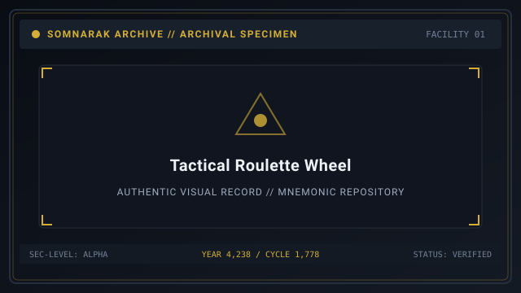
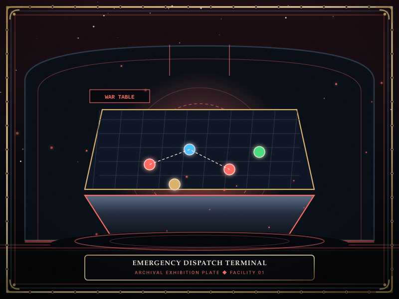
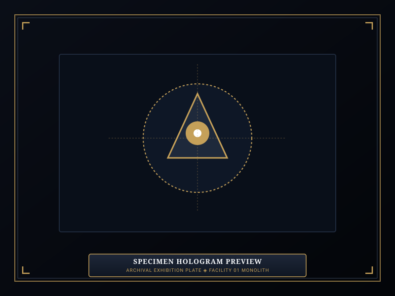

# Random Dossier

> *“Draw a card from the deck of sorrows; whichever name you speak will be waiting in the dark.”*

**Random Dossier**  [무작위 개체 선별기]  (_Mujakwi Gaeche Seonbyeolgi_) functions as the tactical dispatch roulette within Facility 01's archival network.

Used extensively by the Directorate for training wardens and running containment drills, this system selects random specimens across the 292 cataloged [Sorrow Entities](07-Sorrow%20Entities.md), testing a commander's adaptability against diverse behavioral quirks, elemental [Pressure Types](17-Pressure%20Types.md), and breach hazards.

```text
+========================================================================+
| SOMNARAK - RANDOM TACTICAL DOSSIER DISPATCH                            |
+------------------------------------------------------------------------+
| System Utility         | Archival Randomizer & Specimen Roulette       |
| Specimen Pool          | 292 Registered Entities across 5 Risk Tiers   |
| Training Focus         | Emergency Deployment & Unpredictable Containme|
| Representative Pool    | Subjects - Single-Use - Channeled - Equippable|
| Scenarios              | 10 Randomized Simulation Training Drills      |
+========================================================================+
```

## Contents

- [1 Tactical Purpose of the Randomizer](#1-tactical-purpose-of-the-randomizer)
- [2 Specimen Selection Algorithm and Weighting Table](#2-specimen-selection-algorithm-and-weighting-table)
- [3 Featured Specimen Rotations](#3-featured-specimen-rotations)
  - [3.1 Featured Subject Specimen: The Debt Eater](#31-featured-subject-specimen-the-debt-eater)
  - [3.2 Featured Single-Use Relic: The Echo Compass](#32-featured-single-use-relic-the-echo-compass)
  - [3.3 Featured Channeled Relic: The Crucible](#33-featured-channeled-relic-the-crucible)
  - [3.4 Featured Equippable Relic: The Debt Scale](#34-featured-equippable-relic-the-debt-scale)
- [4 Ten Randomized Tactical Training Drills](#4-ten-randomized-tactical-training-drills)
- [5 Evaluation Rubrics and Performance Grades](#5-evaluation-rubrics-and-performance-grades)
- [6 Gallery](#6-gallery)
- [7 See also](#7-see-also)

## 1 Tactical Purpose of the Randomizer

In standard facility shifts, Wardens gradually select entities during expansion checkpoints. However, real-world crises do not permit careful planning:
- **Emergency Scrambles:** Simulates sudden unexpected containment transfers or catastrophic multi-cell failures.
- **Mental Agility:** Forces Wardens to immediately recall work preferences, escape counters, and M.A.W. resistance pairings without consulting manual ledgers.
- **Cadre Versatility:** Prevents squads from over-relying on a single armor archetype.

## 2 Specimen Selection Algorithm and Weighting Table

The randomizer uses a calibrated probability curve:

| Risk Tier | Distribution Weight | Operational Role in Drills |
|---|---|---|
| **Whisper (Rank I)** | 25% | Baseline stability; tests quick execution speed. |
| **Murmur (Rank II)** | 30% | Early hazard; tests correct work-type selection. |
| **Fragment (Rank III)** | 25% | Tactical core; tests gear resistance balancing. |
| **Wail (Rank IV)** | 15% | High crisis; tests multi-room containment discipline. |
| **Sovereign (Rank V)** | 5% | Catastrophic apex; tests full facility mobilization. |

## 3 Featured Specimen Rotations

### 3.1 Featured Subject Specimen: The Debt Eater
- **SECC Code:** `SE-C-IIIβ-014`
- **Classification:** Rank III Fragment Subject
- **Damage Pressure:** ⚪ Void (Pale)
- **Core Guideline:** Highly prefers ⚔ **Pugnahan** (Discipline). Never send recruits with low Resolve; Void strikes execute low-health specialists instantly.
- **Full Article:** [27-The Debt Eater](27-The%20Debt%20Eater.md).

### 3.2 Featured Single-Use Relic: The Echo Compass
- **SECC Code:** `SE-T-Iα-001`
- **Classification:** Rank I Whisper Tool Relic (Single-Use)
- **Core Guideline:** Specialist enters, executes instant acoustic pulse revealing all floor threats, and departs immediately.
- **Full Article:** [28-The Echo Compass](28-The%20Echo%20Compass.md).

### 3.3 Featured Channeled Relic: The Crucible
- **SECC Code:** `SE-T-IIβ-002`
- **Classification:** Rank II Murmur Tool Relic (Channeled Use)
- **Damage Pressure:** 🔴 Grudge (Physical)
- **Core Guideline:** Specialist channels inside, refining bonus Lumen; must be recalled before 30 seconds or operative suffers instant combustion.
- **Full Article:** [29-The Crucible](29-The%20Crucible.md).

### 3.4 Featured Equippable Relic: The Debt Scale
- **SECC Code:** `SE-T-IIIγ-003`
- **Classification:** Rank III Fragment Tool Relic (Equippable)
- **Core Guideline:** Operative carries the scale into corridors; converts Void damage into healing, but inverts physical defense.
- **Full Article:** [30-The Debt Scale](30-The%20Debt%20Scale.md).

## 4 Ten Randomized Tactical Training Drills

1. **Drill A1 (Triple Whisper):** Contain 3 docile entities within 90 seconds.
2. **Drill A2 (Dual Murmur Breach):** Intercept 2 breaching Murmurs using only starter weapons.
3. **Drill B1 (Fragment Scramble):** Clear 4 ticking meltdown overloads across three different departments.
4. **Drill B2 (Void Inversion):** Suppress a Void-dealing entity while wearing physical armor.
5. **Drill C1 (Blind Containment):** Complete 5 work sessions with cell cameras disabled.
6. **Drill C2 (The Crucible Sprint):** Channel exactly 28 seconds inside The Crucible without perishing.
7. **Drill D1 (Wail Lockdown):** Hold a breaching Rank IV entity inside a single corridor.
8. **Drill D2 (Panic Rescue):** Recover 3 panicked specialists using White/Lament weapons.
9. **Drill E1 (Sovereign Trial):** Subdue a Rank V Sovereign within 4 minutes of emergence.
10. **Drill E2 (Absolute Zero Casualties):** Harvest 500 LU with zero auxiliary or specialist deaths.

## 5 Evaluation Rubrics and Performance Grades

Drill outcomes are graded on response latency, casualty rates, and containment efficiency:
- **Grade S:** Zero casualties; completed in under 75% allocated time.
- **Grade A:** Minor SP damage; completed within standard parameters.
- **Grade B:** Auxiliary casualties under 20%; all specialists survived.
- **Grade C:** Specialist casualties sustained; crisis subdued.
- **Grade F:** Facility collapse or complete squad wipeout.

## 6 Gallery

[](images/tactical-roulette-wheel.svg)
[](images/emergency-dispatch-terminal.svg)
[](images/specimen-hologram-preview.svg)

*Left: tactical selection roulette; Center: emergency dispatch terminal; Right: holographic specimen preview.*
---

## 7 See also

- [07-Sorrow Entities](07-Sorrow%20Entities.md) — master bestiary framework
- [08-Sorrow List](08-Sorrow%20List.md) — full 292 entities register
- [23-Risk Levels](23-Risk%20Levels.md) — risk tier classifications
- [21-Game Mechanics](21-Game%20Mechanics.md) — core containment mechanics
