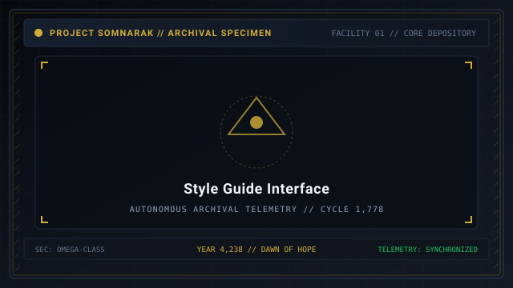
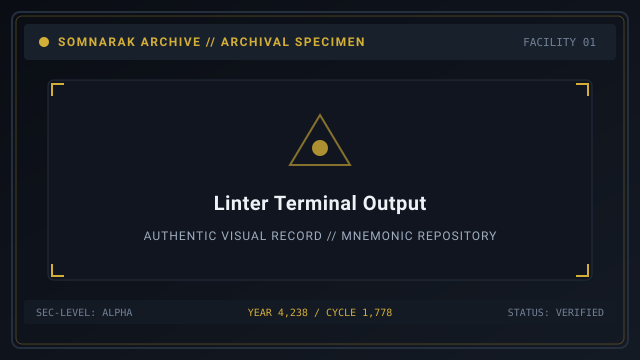
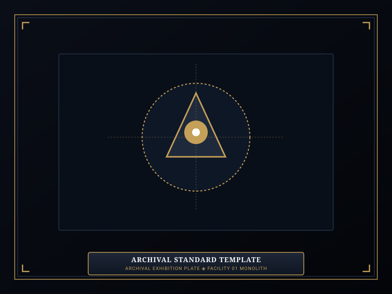

# Help

> *“A Warden who does not read the manual will soon become an entry within it.”*

**Help**  [편집 및 기여 지침]  (_Pyeonjip mit Giyeo Jichim_) serves as the official contributor manual and technical style guide for the [[SOMNARAK-WORLD](https://github.com/Redditor008/PROJECT.SOMNARAK-WIKI/tree/arena/01a0b699-project-somnarak-wiki/SOMNARAK-WORLD "SOMNARAK-WORLD")] encyclopedia.

To maintain worldbuilding immersion, architectural elegance, and mechanical rigor, all articles within this wiki must strictly adhere to the Directorate's editorial standards.

```text
+========================================================================+
| SOMNARAK - MUNICIPAL WIKI CONTRIBUTOR MANUAL                           |
+------------------------------------------------------------------------+
| Manual Designation     | Editorial Guidelines & Documentation Standards|
| Core Principle         | Zero External Canon Terms (Pure Somnarak Lore)|
| Border Geometry        | Strict 74-Column Border Symmetry (+ and |)    |
| Hangul Standard        | Zero Hangul inside boxes; Buffer outside boxes|
| Linter Suite           | Box Symmetry - Semantic Seams - Canon Timeline|
+========================================================================+
```

## Contents

- [1 Welcome to the Somnarak Encyclopedia](#1-welcome-to-the-somnarak-encyclopedia)
- [2 Canonical Terminology and the Zero-PM Rule](#2-canonical-terminology-and-the-zero-pm-rule)
- [3 Geometric Formatting and 74-Column Box Standards](#3-geometric-formatting-and-74-column-box-standards)
- [4 Korean Typography and Buffer Rules](#4-korean-typography-and-buffer-rules)
- [5 Standard Article Structure](#5-standard-article-structure)
- [6 Automated Linter Verification Suite](#6-automated-linter-verification-suite)
- [7 Editing Best Practices and Quality Checklists](#7-editing-best-practices-and-quality-checklists)
- [8 Gallery](#8-gallery)
- [9 See also](#9-see-also)

## 1 Welcome to the Somnarak Encyclopedia

The Somnarak Wiki is designed as an in-universe municipal archive operated by the Reverie Directorate. Contributors write from the perspective of archival scholars, tactical officers, and field researchers documenting the ongoing containment of sorrow.

## 2 Canonical Terminology and the Zero-PM Rule

All articles must use pure, proprietary Somnarak vocabulary. The use of external intellectual property terms (such as Project Moon terminology) is strictly prohibited across all canonical pages:

| Prohibited External Term | Mandatory Somnarak Canonical Equivalent |
|---|---|
| Abnormality / Abnormalities | **Sorrow Entity / Sorrow Entities** |
| Sephirah / Sephirot | **Echo-Core / Echo-Cores** |
| E.G.O (Equipment / Suit / Weapon) | **M.A.W. Equipment / M.A.W. Suit / Weapon** |
| Enkephalin / PE-Boxes | **Lumen / Lumen Units (LU) / Positive Boxes** |
| LOB Points / LOB Credits | **Municipal Investment Credits** |
| NE-Boxes | **Fracture Boxes / Negative Boxes** |
| ZAYIN / TETH / HE / WAW / ALEPH | **Whisper / Murmur / Fragment / Wail / Sovereign** |
| Qliphoth Meltdown | **Mugenhan Meltdown / Containment Overload** |
| Work (Instinct / Insight / Attachment / Repression) | **Viderehan / Ferrehan / Flerehan / Pugnahan** |
| Red / White / Black / Pale | **Grudge (Red) / Lament (Blue) / Void (Pale) / Weight (Black)** |

## 3 Geometric Formatting and 74-Column Box Standards

Every major wiki article begins with an ASCII summary box that must follow exact geometric rules:
- **Total Border Width:** Exactly 74 characters from left border to right border.
- **Border Symbols:** Header and footer lines must use `+========================================================================+`. Section dividers must use `+------------------------------------------------------------------------+`. Content rows must start with `| ` and end with `|` at column 74.
- **Zero Hangul Inside Boxes:** ASCII boxes must contain only ASCII text (English alphanumeric characters and standard punctuation). Korean characters possess double display width and must never be placed inside boxes.

## 4 Korean Typography and Buffer Rules

Outside of ASCII boxes, Korean terms may be included for authentic flavor, subject to strict buffer rules:
- Always format Korean terms with a two-space buffer inside brackets: `  [한글]  `.
- Follow the Korean term with its official Romaja transcription and English translation: e.g., `  [비탄의 강]  (_Bitan-ui Gang_ — River of Tears)`.
- Never use HTML break tags `<br>` inside wiki markdown files.

## 5 Standard Article Structure

To prevent flat, truncated, or stub-like pages, every wiki article should feature:
1. Title H1 (`# Article Title`)
2. Atmospheric Quote Banner (`> *“Quote...”*`)
3. Opening lead paragraph defining the subject
4. 74-column ASCII Infobox
5. Table of Contents (`## Contents`)
6. Numbered H2 and H3 body sections (`## 1 ...`, `### 1.1 ...`)
7. Concrete data tables, formulas, and operational lists
8. Image Gallery (`## Gallery`) with placeholder images and captions
9. Cross-reference section (`## See also`)

## 6 Automated Linter Verification Suite

Before committing any changes to git, contributors must execute the repository's three automated linters:
1. `python3 tools/check_box_symmetry.py`: Verifies 100% geometric border and character width alignment across all ASCII boxes.
2. `python3 tools/seam_lint.py`: Scans all files to guarantee 0 foreign vocabulary seams.
3. `python3 tools/timeline_lint.py`: Audits pan-repo files to ensure historical consistency with the Year 4,238 / Cycle 1,778 temporal anchor.

## 7 Editing Best Practices and Quality Checklists

- Always verify that internal markdown links point to existing `.md` files.
- Ensure that articles exceed 1,000 words to provide comprehensive encyclopedic depth.
- Never duplicate generic filler text; provide authentic lore, concrete stats, and tactical guidance.

## 8 Gallery

[](images/style-guide-interface.svg)
[](images/linter-terminal-output.svg)
[](images/archival-standard-template.svg)

*Left: editorial style guide; Center: automated linter terminal run; Right: standard article layout template.*
---

## 9 See also

- [01-Main Page](01-Main%20Page.md) — Grand Portal hub
- [38-Classification Code](38-Classification%20Code.md) — entity naming and coding standards
- [39-Archival Codex](39-Archival%20Codex.md) — the 18 standard dossier sections
- [42-Navigation](42-Navigation.md) — pan-wiki directory and site map
