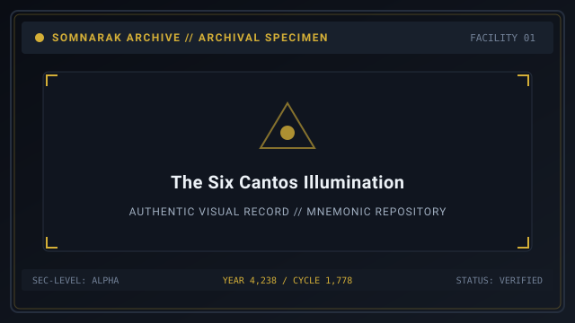
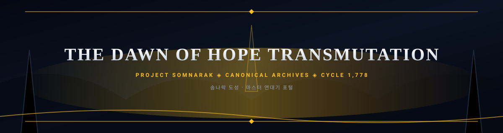
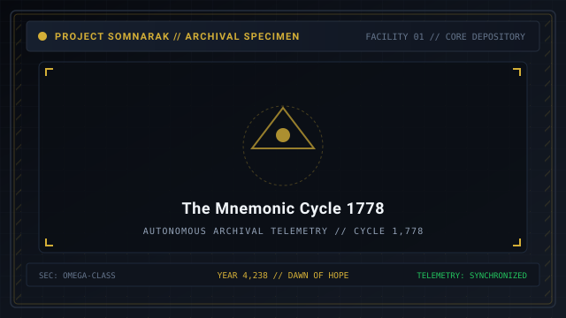
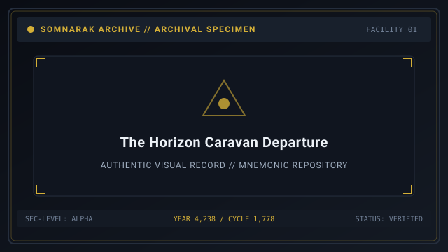

# Chronicle



> *“The Hand opened. The Weeping answered. The city learned to dream.”*

**Chronicle** is the master historical narrative of Somnarak, chronicling the rise of the vertical municipal civilization from the primordial discovery of the **Weeping**  [비탄의 강]  (_Bitan-ui Gang_ — River of 🔵 **Lament**) to the post-Dawn era of continental reconstruction.

Somnarak's timeline is defined by a singular watershed: the **Dawn of Hope** at Year **4,238**. This moment permanently bisects history into **Ante-Dawn** (the centuries of subterranean descent, syndicate suppression, and the 1,778 mnemonic cycles of the Reverie Directorate) and **Post-Dawn** (the outbound expansion of the Horizon Caravan, the founding of the Memory Archive, and the frontier vigil of the Wound Walkers).

```text
+========================================================================+
| SPOILER WARNING: SOMNARAK CANON CHRONICLE                              |
+------------------------------------------------------------------------+
| Classification         | Archival Narrative Record (Year 0000 - 4,255+)|
| Narrative Baseline     | Ante-Dawn - Dawn of Hope - Post-Dawn Epochs   |
| Sovereign Anchor       | Year 4,238 / Reverie Cycle 1,778              |
| Primary Archives       | Facility 01 - Absolvohan - Story Cantos I-VI  |
+========================================================================+
```

## Contents

- [1 Overview and Narrative Synopsis](#1-overview-and-narrative-synopsis)
- [2 Master Epoch Partition](#2-master-epoch-partition)
  - [2.1 Ante-Dawn Era (Years 0000 to 4,238)](#21-ante-dawn-era-years-0000-to-4238)
  - [2.2 The Dawn of Hope (Year 4,238 and Cycle 1,778)](#22-the-dawn-of-hope-year-4238-and-cycle-1778)
  - [2.3 Post-Dawn Era (Years 4,238 to 4,255+)](#23-post-dawn-era-years-4238-to-4255)
- [3 The Six Story Cantos](#3-the-six-story-cantos)
  - [3.1 Canto I: Rust and Covenant](#31-canto-i-rust-and-covenant)
  - [3.2 Canto II: Ash in the Well](#32-canto-ii-ash-in-the-well)
  - [3.3 Canto III: The Hundredth Bell](#33-canto-iii-the-hundredth-bell)
  - [3.4 Canto IV: Frost on the Lantern](#34-canto-iv-frost-on-the-lantern)
  - [3.5 Canto V: Suture of Lost Pages](#35-canto-v-suture-of-lost-pages)
  - [3.6 Canto VI: The Unbroken Horizon](#36-canto-vi-the-unbroken-horizon)
- [4 Core Narrative Themes](#4-core-narrative-themes)
- [5 Gallery](#5-gallery)
- [6 See also](#6-see-also)

## 1 Overview and Narrative Synopsis

The story of Somnarak is not an ordinary tale of urban development; it is an epic of structural grief. Built over the colossal fissure where human regret liquefies into subterranean rivers, the city survived for millennia by burying its trauma deeper into the bedrock.

When the subterranean pressure threatened to rupture the bedrock, the founders of the **Hand of Change** (Facility 01) devised a radical solution: rather than fleeing the grief, the city would build containment wards directly above the fissures, harvest the emotional friction into refined energy (**Lumen**), and weaponize the crystallized memories (**M.A.W.**) to maintain municipal order.

## 2 Master Epoch Partition

All Somnarak history pivots on a single year. Use this master table to orient every date cited anywhere in the wiki:

| Year / Cycle | Epoch | Threshold Event |
|---|---|---|
| Year 0000 | Ante-Dawn | Settlement Arrival at the Mugenhan valley |
| Year 0195 | Ante-Dawn | The First Weeping: liquid Han river discovered |
| Years 2,460–3,970 | Ante-Dawn | Katabagil: seven deep descents into the Maw |
| Years 3,973–4,039 | Ante-Dawn | Katharcheok: six Underworld sweeps |
| Years 4,202–4,238 | Ante-Dawn | Reverie Directorate; 1,778 Mnemonic Cycles |
| **Year 4,238 / Cycle 1,778** | **The Dawn of Hope** | **Stasis loop shattered; sorrow transmuted** |
| Year 4,239 onward | Post-Dawn | Jipyeongseondae: six Horizon expeditions |
| Year 4,240 onward | Post-Dawn | Gieok Jeojangso sanctuary founded |
| Year 4,250 onward | Post-Dawn | Wound Walkers frontier garrisons |
| Year 4,255 onward | Post-Dawn | Continental Reconstruction begins |

### 2.1 Ante-Dawn Era (Years 0000 to 4,238)

The Ante-Dawn spans over four millennia of hardship, subterranean exploration, and industrial consolidation:

1. **Settlement Arrival (Year 0000):** Refugee pioneer convoys fleeing continental cataclysms discover the towering Alpha Tree  [알파 트리]  (_Alpa Teuri_) and establish the first subterranean shelters in the Mugenhan valley.
2. **The First Weeping (Year 0195):** Geological menders breach subterranean caverns beneath Zone B, discovering a massive, glowing river of liquid **Han** (unresolved human sorrow). The river's emotional vapors cause mass hallucinations and spontaneous crystallization among early settlers.
3. **Subterranean Expedition Division (Katabagil) (Years 2,460 to 3,970):** The city charter establishes Katabagil  [카타바길]  to chart the lower depths. Across fifteen centuries, the division conducts seven deep descents, mapping the vertical chasm from -2,000 meters down to -7,200 meters into the unmapped **Maw**.
4. **Underworld Cleanup Descend (Katharcheok) (Years 3,973 to 4,039):** Rapid industrial expansion leads to the rise of five powerful criminal syndicates controlling the subterranean trade enclaves. Katharcheok  [카타르척]  executes six ruthless military sweeps, purging the rogue wards, culminating in the Great Rust Severance (retrospectively dated to Cycle 1,512).
5. **The Reverie Directorate and the 1,778 Cycles (Years 4,202 to 4,238):** In Year 4,202, the Directorate assumes sovereign administrative control. In Year 4,232, Director Majin and Chief Engineer Min-Jae lock the sovereign **Absolvohan** stasis engine into a closed 365-day mnemonic loop. For six external calendar years, Facility 01 relives the same annual cycle **1,778** times. Each reset condenses exactly 0.02 tons of sovereign Han-crystal, accumulating supercritical metaphysical mass necessary to trigger the Dawn.

### 2.2 The Dawn of Hope (Year 4,238 and Cycle 1,778)

On the final day of Cycle **1,778**, the sovereign stasis loop is deliberately shattered. The **Hand of Hope** opens aboard the mobile fortress vessel *The Lantern*.

Under the guidance of twelve designated Hope Bearers, the collected Han-crystals are subjected to harmonic resonance. Transmutation of municipal sorrow jumps from 15% to 45%, converting billions of tons of stagnant grief into radiant, living warmth. The eternal cycle ends, time resumes its linear flow, and the city enters the modern era.

### 2.3 Post-Dawn Era (Years 4,238 to 4,255+)

Following the Dawn of Hope, Somnarak looks beyond its vertical walls toward the shattered world outside:

1. **The Horizon Caravan (Jipyeongseondae) (Year 4,239 onward):** Jipyeongseondae  [지평선대]  launches six great overland expeditions across the barren Desolate toward legendary pre-collapse sanctuaries, forging trade corridors toward Cheonbulok and Mugeukji.
2. **The Memory Archive (Gieok Jeojangso) (Year 4,240 onward):** Established in the deep sub-Alpha roots (-3,250m) under Secretary Seiyon, Gieok Jeojangso  [기억 저장소]  serves as a municipal sanctuary. Operating across seven thematic strata floors and seven Receptions, it curates traumatic historical memories into living **Key Pages**.
3. **The Wound Walkers (Company 4) (Year 4,250 onward):** Outlying frontier defense garrisons established under Specialist Sooah, defending seven Crucible Stations against colossal beasts emerging from the untamed Outskirts.
4. **Continental Reconstruction (Year 4,255 onward):** Large-scale engineering initiatives laying trans-continental acoustic rail lines and tectonic stabilization lattices to reconnect isolated human settlements.

## 3 The Six Story Cantos

The primary dramatic narrative of Somnarak is told across six sequential **Story Cantos**, each spotlighting a critical historical threshold:

### 3.1 Canto I: Rust and Covenant
Set during the aftermath of the Underworld sweeps. Operative Taeho investigates an illegal blood-contract forged in the depths of Zone C, leading to the first recorded encounter with [27-The Debt Eater](27-The%20Debt%20Eater.md).

> *“A signature does not fade because the ink dried; it fades only when the heart that promised it stops beating.”* — Specialist Taeho

### 3.2 Canto II: Ash in the Well
Focuses on the comatose Mnemonic Wells beneath Extraction Hall. Extraction Lead Zyrak struggles with the moral cost of extracting cognitive horrors from comatose subjects, confronting the drowned choir of unclaimed voices pooled in the well sediment.

> *“We do not drill for oil or water. We drill for the things mankind screamed into their pillows at three in the morning.”* — Zyrak

### 3.3 Canto III: The Hundredth Bell
Details the psychological strain of the 1,778 Mnemonic Cycles within Facility 01. Min-Jae endures cognitive dilation while maintaining the Absolvohan's coolant cores as the facility resets for the hundredth time.

> *“Every morning I wake up to the same cold coffee and the same alarm chime. The only difference is that my hands remember dying yesterday.”* — Min-Jae

### 3.4 Canto IV: Frost on the Lantern
Documents the dramatic activation of the Dawn of Hope at Year 4,238. Twelve Hope Bearers defend the central transmutation coil against a simultaneous breach of five Sovereign fragments.

> *“Let the furnace burn cold no longer. If the city must carry sorrow, let it carry it as fire, not as ice!”* — Hope Bearer Yeonhwa

### 3.5 Canto V: Suture of Lost Pages
Secretary Seiyon descends into the deep roots of Gieok Jeojangso to face her own erased memories, unlocking the sovereign Key Pages of the Silent City.

> *“To preserve a memory is to sew a wound that refuses to close. Every page we bind is a suture against oblivion.”* — Seiyon

### 3.6 Canto VI: The Unbroken Horizon
The Horizon Caravan crosses the Great Salt Waste toward Mugeukji, confronting colossal Tier 3 Mortal beasts and bearing witness to the dawn breaking over the distant sea.

> *“The wall behind us was five miles high, but looking forward, there was nothing between our boots and tomorrow.”* — Caravan Lead Kang

## 4 Core Narrative Themes

1. **Grief as Material Reality:** In Somnarak, sadness is not a passing emotional state; it is a dense, physical mineral that pools in pipes, corrodes iron beams, and forms autonomous monsters.
2. **The Price of Structuring:** Order is never free. Every quiet evening experienced in the upper spires is bought with the blood, sanity, and disciplined vigilance of containment specialists working beneath the earth.
3. **Refusal to Erase:** The city rejects historical amnesia. Rather than attempting to obliterate past atrocities, Somnarak catalogs them, classifies them, and harnesses their memory to fuel the future.

## 5 Gallery

| The Dawn Array | The Stasis Clock | The Departure |
|---|---|---|
| [](images/the-dawn-of-hope-transmutation.svg) | [](images/the-mnemonic-cycle-1778.svg) | [](images/the-horizon-caravan-departure.svg) |
| *Year 4,238 transmutation array* | *Cycle 1,778 stasis clock* | *Caravan departure into the Desolate* |
---

## 6 See also

- [01-Main Page](01-Main%20Page.md) — central wiki portal
- [07-Sorrow Entities](07-Sorrow%20Entities.md) — master entity bestiary
- [06-Personnel](06-Personnel.md) — directors, specialists, and companies
- [14-Echo-Cores](14-Echo-Cores.md) — nine floor directors of Facility 01
