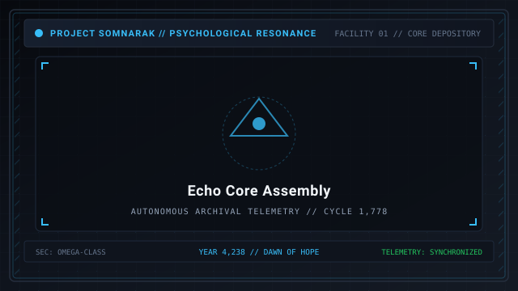
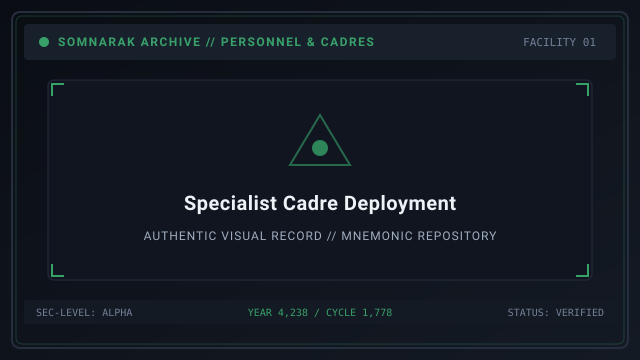
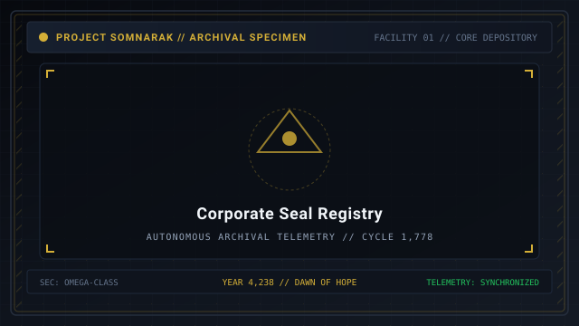

# Personnel

> *“You do not hire hands. You borrow burdens.”*

**Personnel** documents the operational personnel, directors, specialist cadres, and corporate leadership maintaining the vertical civilization of Somnarak. From the sovereign [Echo-Cores](14-Echo-Cores.md) governing the nine departmental floors of Facility 01 to the frontline specialists who carry crystallized **M.A.W.** armaments into volatile containment cells, human labor in Somnarak is defined by the willing assumption of collective grief.

Under municipal regulations, operatives are not treated as casual laborers; they are certified handlers bound to the city's metaphysical containment grid. Operating within Facility 01, approximately one hundred sixteen thousand words of detailed personnel records document the physiological, psychological, and tactical histories of the staff across nine director dossiers in `09_Personnel_Archives/`.

```text
+========================================================================+
| SOMNARAK - PERSONNEL AND CADRES                                        |
+------------------------------------------------------------------------+
| Sovereign Echo-Cores   | 9 Floor Directors (Floors 1 to 8 + Central)   |
| Specialist Cadres      | 10 Active Cadres + 5 Syndicate Pools          |
| Primary Companies      | 10 Primary (5 Main Charters - 5 Sub Charters) |
| Mnemonic Archive       | ~116,000 words across 9 Director Dossiers     |
+========================================================================+
```

## Contents

- [1 The Nine Echo-Cores (Floor Directors)](#1-the-nine-echo-cores-floor-directors)
- [2 Specialist Cadres and Loadout Pairing](#2-specialist-cadres-and-loadout-pairing)
- [3 The Ten Primary Companies](#3-the-ten-primary-companies)
- [4 Mnemonic Dilation and Specialized Tenure](#4-mnemonic-dilation-and-specialized-tenure)
- [5 Gallery](#5-gallery)
- [6 See also](#6-see-also)

## 1 The Nine Echo-Cores (Floor Directors)

Facility 01 is organized into nine departmental floors, each under the absolute administrative and metaphysical authority of an **Echo-Core**. Each director wears a distinct departmental armband that functions as a localized **Veil**, insulating their mind against the cognitive radiation of the contained sorrows:

| Director Title | Personal Name | Assigned Department | Signature Armament | Core Operational Mandate |
|---|---|---|---|---|
| **The Director** | Majin  [마진]  (_Majin_) | Floor 1: Spires | Reaper Hungered (Ω Scythe) | Overall facility command, threshold discipline, and high-threat intervention. |
| **The Secretary** | Seiyon  [세이연]  (_Seiyon_) | Floor 1: Central Admin | The Promise (Memory Leaves) | Administrative ledgers, inter-floor coordination, and historical records. |
| **The Containment Lead** | Dekan  [데칸]  (_Dekan_) | Floor 2: Maw's Keep | Scaled Maw-Flesh Arm | Heavy physical containment, cell reinforcement, and suppression barricades. |
| **The Extraction Lead** | Zyrak  [지락]  (_Jyrak_) | Floor 3: Extraction Hall | Mechanical Hands & Rig | Mnemonic Well operations, raw Han pumping, and Lumen distillation. |
| **The Research Lead** | Ayshuk  [아이숙]  (_Ayshuk_) | Floor 4: Insight Forge | Research Ledger | Behavioral decoding, work-affinity analysis, and technical innovation. |
| **The Border Lead** | Mellda  [멜다]  (_Melda_) | Floor 5: Border Watch | Threshold Vow (Arm-Blade) | Quarantine protocols, incursion interception, and perimeter suppression. |
| **The Archive Lead** | Marjuk  [마주크]  (_Marjuk_) | Floor 6: Deep Vault | Memory Lens | Deep storage of volatile relics, suppressed texts, and unknown entities. |
| **The Outsider** | Ishall  [이샬]  (_Ishall_) | Floor 7: Shadow Corps | Unanswered (Relic Gloves) | Covert tactical deployment and crisis containment (co-monitored by Zyrak and Seiyon). |
| **The Exile** | Xyan  [시안]  (_Xyan_) | Floor 8: Gate Watch | Neural Spine Wire | Subterranean abyss sentry duty and guarding the threshold of the Maw. |

### Director Dialogues and Voice Transcripts

- **Director Majin (Floor 1):** *“Keep your back straight. When an operative panics, they do not merely endanger their squad; they tear a hole in the ceiling that lets the dark in.”*
- **Secretary Seiyon (Central Admin):** *“A ledger that loses a single line loses the right to command. If someone died in Sector C, write their name down before you wash the blood off the floor.”*
- **Containment Lead Dekan (Floor 2):** *“Do not look into the creature's eyes; look only at the hydraulic clamps. The clamps do not have memories, and therefore they do not weep.”*
- **Extraction Lead Zyrak (Floor 3):** *“Every liter of Lumen powering the streetlamps above was once a human regret screaming in the dark. Handle the valves with respect.”*
- **Research Lead Ayshuk (Floor 4):** *“To understand a sorrow is not to forgive it. It is to calculate its exact breaking point so we can extract its energy without dying.”*
- **Border Lead Mellda (Floor 5):** *“The quarantine line is drawn in chalk and blood. Chalk washes away in the rain, so we budget generously for the other.”*
- **Archive Lead Marjuk (Floor 6):** *“Every relic in my vault asked, once, to be remembered. I said yes to all of them, and now none of them will let me sleep.”*
- **The Outsider Ishall (Floor 7):** *“You will not see my operatives. If you ever do, file the incident report first and scream afterward.”*
- **The Exile Xyan (Floor 8):** *“I stand where the floor ends and the dark begins. The dark has introduced itself many times. I have never once replied.”*

## 2 Specialist Cadres and Loadout Pairing

Frontline containment and suppression tasks are executed by **Specialists** recruited from ten authorized municipal cadres, supplemented by five contract pools drawn from the merchant syndicates:

1. **Cadre Specialization:** Cadres specialize across the four primary work disciplines:
   - **Optic Cadres:** Specialize in 👁 **Viderehan**  [비데레한]  (_Clarity_), logging remote sensor data.
   - **Vigil Cadres:** Specialize in 🤲 **Ferrehan**  [페레한]  (_Resilience_), enduring prolonged presence in high-pressure cells.
   - **Mourning Cadres:** Specialize in 💧 **Flerehan**  [플레레한]  (_Composure_), establishing emotional resonance.
   - **Clamping Cadres:** Specialize in ⚔ **Pugnahan**  [푸그나한]  (_Resolve_), executing physical and acoustic subdual.
2. **Tactical Loadout Pairing:** High-threat encounters require complementary equipment pairing. A specialist wielding high-damage 🔴 **Grudge** weaponry (such as *Threshold Vow*) is paired with a specialist cloaked in ⚪ **Void**-resistant mantles (such as *Debt Shroud* from [27-The Debt Eater](27-The%20Debt%20Eater.md)), ensuring the squad can endure diverse damage pressures during multi-entity breaches.

| Cadre Discipline | Primary Protocol | Battlefield Role | Key Attribute |
|---|---|---|---|
| Optic Cadres | 👁 Viderehan | Reconnaissance and sensor logging | Clarity |
| Vigil Cadres | 🤲 Ferrehan | Cell endurance and pressure soaking | Resilience |
| Mourning Cadres | 💧 Flerehan | Emotional resonance and yield lifting | Composure |
| Clamping Cadres | ⚔ Pugnahan | Physical subdual and breach suppression | Resolve |

## 3 The Ten Primary Companies

Somnarak corporate governance is strictly codified. Exactly **Ten Primary Companies** hold sovereign operational charters recognized by the municipal Council of Sighs:

### The Five Main Companies (Central Charters)
- **First Main Charter:** Heavy structural engineering and spire maintenance.
- **Second Main Charter:** Energy grid distribution and macro-Lumen transmission.
- **Third Main Charter:** Hydraulic pumping and deep drainage networks.
- **Fourth Main Charter:** Food synthesis, hydroponic algae towers, and municipal rations.
- **Fifth Main Charter:** Civic defense garrison, gate security, and public peace enforcement.

### The Five Sub Companies (Subsidiary Charters)
- **Sub-Company A (Logistics):** High-speed acoustic rail transport and freight elevators.
- **Sub-Company B (Textiles):** Resonant fiber weaving and standard specialist uniform manufacturing.
- **Sub-Company C (Acoustic Damping):** Soundproof barrier installations and anti-resonance baffling.
- **Sub-Company D (Reclamation):** Slag recycling and granular Han extraction from industrial runoff.
- **Sub-Company E (Contract Security):** Auxiliary suppression squads and perimeter hazard sweeps.

All non-chartered commercial workshops and rogue manufacturing labs operating outside these ten entities are legally designated as **Somnarak Outsider Factories**, subject to immediate audit and suppression. Furthermore, **Gieok Jeojangso**  [기억 저장소]  (_Memory Archive_) is designated as a sovereign municipal sanctuary, not a commercial enterprise.

## 4 Mnemonic Dilation and Specialized Tenure

A critical distinction in personnel records separates linear civilian tenure from mnemonic dilation:
- **Absolvohan Stasis:** Figures such as Chief Engineer Min-Jae endured 266-plus operational cycles suspended inside the Absolvohan stasis array, maintaining technical coherence across centuries of internal time.
- **Linear Frontier Vigil:** In contrast, the post-Dawn **Wound Walkers** (Company 4) hold perimeter Crucible Stations under normal temporal flow, relying on rotational relief shifts to mitigate physical and psychological fatigue.

## 5 Gallery

| The Nine Directors | Cadre Deployment | Company Seals |
|---|---|---|
| [](images/echo-core-assembly.svg) | [](images/specialist-cadre-deployment.svg) | [](images/corporate-seal-registry.svg) |
| *The nine sovereign Echo-Cores* | *Specialist squad in full M.A.W. gear* | *Seals of the ten Primary Companies* |
---

## 6 See also

- [01-Main Page](01-Main%20Page.md) — central wiki portal
- [14-Echo-Cores](14-Echo-Cores.md) — individual director dossiers and mechanics
- [12-Specialists](12-Specialists.md) — specialist recruitment, training, and promotion
- [22-Departments](22-Departments.md) — facility floor layout and department architecture
