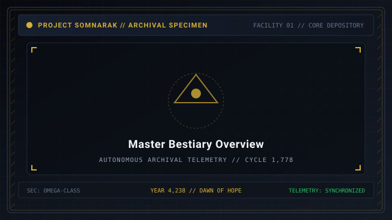
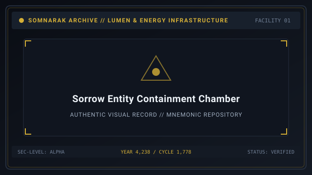
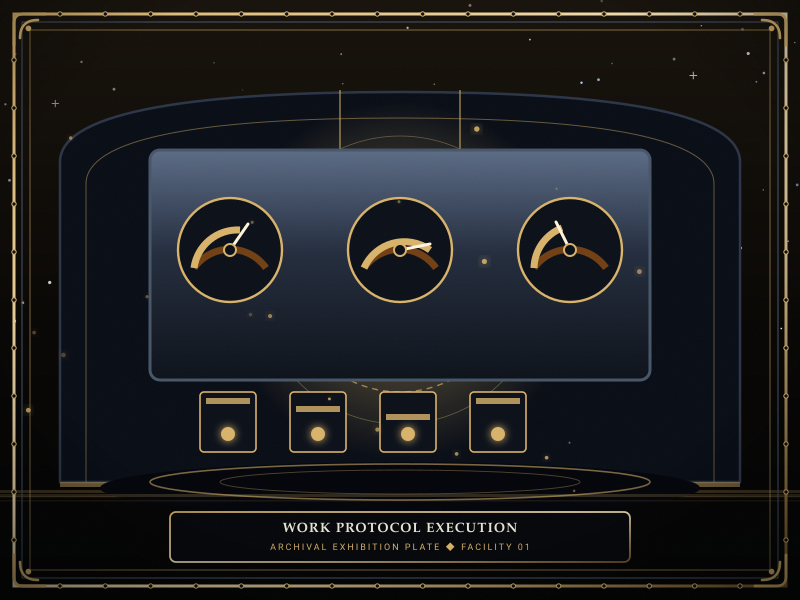
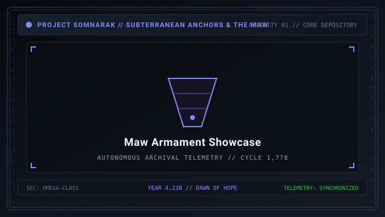

# Sorrow Entities



> *“They are not monsters. They are what we left behind.”*

**Sorrow Entities** (슬픔체, _Seulpeumche_) are cognitive beings made manifest — “monsters”  [괴물]  (_goemul_) born from human fears, complexes, and generational trauma given physical form and persistence beneath the **Hand of Change** (Facility 01). They are harvested by the Reverie Directorate and municipal facilities for energy generation, containment study, and **M.A.W.** extraction.

Before the **Hand** learned to refine liquid **Han** into **Lumen**, sorrows were ancient horrors dwelling in the dark fissures of the Outskirts and the subterranean **Maw**. Today, two hundred ninety-two distinct entities are cataloged across five hundred twenty-nine containment dossiers, representing two hundred eighty-five unique classification codes. Every sorrow carries an unyielding will to persist, obeying an internal logic that defies conventional human morality.

```text
+========================================================================+
| SOMNARAK - SORROW ENTITIES MASTER BESTIARY                             |
+------------------------------------------------------------------------+
| Total Tracked SE       | 291 entities (291 files, 284 unique SECC)     |
| Risk Classifications   | Residue - Echo - Fragment - Entity - Sovereign|
| Standard Work-Types    | Viderehan - Ferrehan - Flerehan - Pugnahan    |
| Damage Pressures       | Grudge - Lament - Void - Weight               |
| Tool Relic Types       | Single Use - Channeled Use - Equippable (88)  |
+========================================================================+
```

## Contents

- [1 Overview](#1-overview)
- [2 Behavior](#2-behavior)
  - [2.1 Pairs and Families](#21-pairs-and-families)
- [3 Origin](#3-origin)
  - [3.1 The Weeping (Primordial River)](#31-the-weeping-primordial-river)
  - [3.2 The Root Grid (Conduit)](#32-the-root-grid-conduit)
  - [3.3 Extraction Process and Mnemonic Wells](#33-extraction-process-and-mnemonic-wells)
- [4 Lumen Energy](#4-lumen-energy)
- [5 M.A.W. Equipment](#5-maw-equipment)
  - [5.1 Resonance Overload](#51-resonance-overload)
  - [5.2 M.A.W. Stigmas](#52-maw-stigmas)
- [6 Related Entities](#6-related-entities)
  - [6.1 Mugenhan Ecology](#61-mugenhan-ecology)
  - [6.2 Ordeals](#62-ordeals)
  - [6.3 Unknown Entities](#63-unknown-entities)
- [7 Containment Protocols and Tactical Engine](#7-containment-protocols-and-tactical-engine)
- [8 Tool Sorrow Entities](#8-tool-sorrow-entities)
  - [8.1 Single Use Tools](#81-single-use-tools)
  - [8.2 Channeled Use Tools](#82-channeled-use-tools)
  - [8.3 Equippable Tools](#83-equippable-tools)
- [9 Classification Code (SECC)](#9-classification-code-secc)
- [10 Archival Codex and Dissolution](#10-archival-codex-and-dissolution)
- [11 Story Cantos and Historical Trivia](#11-story-cantos-and-historical-trivia)
- [12 Institutional Frontiers and Wings](#12-institutional-frontiers-and-wings)
- [13 Navigation](#13-navigation)
- [14 Gallery](#14-gallery)
- [15 See also](#15-see-also)

## 1 Overview

Sorrow Entities are not natural biological lifeforms; they are living concepts crystallized from concentrated **Han** (한, accumulated generational regret). Their forms vary dramatically: some resemble hunched humanoids bearing paper skin, others manifest as mechanical automatons, shifting geometric voids, or stationary relic instruments.

A fundamental axiom of Somnarak containment physics is **Immortality**: a Sorrow Entity cannot be permanently slain or extinguished. When an entity is suppressed in combat or its physical vessel is shattered, its bodily coherence collapses into granular Han dust. Over the subsequent hours, this residue dissipates through the floorboards and recrystallizes within its assigned containment chamber, returning to its baseline state. Containment, not destruction, is the sole viable doctrine.

Sorrow Entities are categorized into five **Risk Tiers** representing the severity of facility damage they inflict if breached:
- **Rank I: Residue (잔여물 / Janyeo): Negligible passive hazard; minimal breach risk (46 entities).
- **Rank II: Echo (메아리 / Meari): Low-to-moderate threat; standard security guards sufficient (70 entities).
- **Rank III: Fragment (파편)**: Lethal capabilities; requires disciplined specialist assignments (82 entities).
- **Rank IV: Entity (존재)**: Critical threat; capable of massive departmental slaughter (80 entities).
- **Rank V: Sovereign (군주)**: Catastrophic existential disaster; potential facility-wide collapse (13 entities).

## 2 Behavior

Interaction with Sorrow Entities is governed by their **orange-and-blue morality**. An entity does not act out of conventional malice, benevolence, or composure; its motives are tethered entirely to the core trauma it embodies. A creditor entity will relentlessly demand repayment, an avian entity will obsessively enforce surveillance, and an abandoned doll will weep until its seams tear.

Genuine emotional bonds between handlers and sorrows are impossible. What appears to be affection or obedience is merely an entity's reaction to having its intrinsic ritual entertained. Handlers who attempt to reason with or reform a sorrow invariably suffer psychological collapse or violent dismemberment.

### 2.1 Pairs and Families

Certain entities share metaphysical bonds born from interconnected human histories:
- **Symbiotic Pairs:** Entities that harmonize and provide mutual defensive amplification. For example, [27-The Debt Eater](27-The%20Debt%20Eater.md) (`SE-C-IIIβ-014`) and [30-The Debt Scale](30-The%20Debt%20Scale.md) (`SE-C-IIIβ-015`) represent the mutual covenant of debt and appraisal.
- **Hostile Pairings:** Entities whose philosophies clash violently. If housed in adjacent cells or allowed to encounter one another during a breach, they engage in lethal combat, destroying facility infrastructure in the crossfire.
- **Entity Families (Triads and Clusters):** Groups of three or more entities sharing a common thematic origin. The most famous example is the avian triad of the Forgotten Forest: *The Observing Bird* (`SE-C-IIIγ-031`), *The Weighting Bird* (`SE-C-IIIγ-032`), and *The Guarding Bird* (`SE-C-IIIγ-033`). If all three birds breach simultaneously, they converge within the central atrium to merge into a singular Sovereign-tier abomination. Directorate regulations mandate housing family members across separate wings.

## 3 Origin

The genesis of all Sorrow Entities traces through three primordial components of Somnarak cosmology:

### 3.1 The Weeping (Primordial River)

Flowing deep beneath the city's foundation strata is the **Weeping**  [비탄의 강]  (_Bitan-ui Gang_ — River of 🔵 **Lament**). It is a subterranean torrent of raw, unrefined liquid **Han** containing the collective suffering of human history. Just as groundwater seeps into basements, the Weeping seeps upward through geological fractures, condensing into anomalous cognitive entities wherever historical trauma was left unburied.

### 3.2 The Root Grid (Conduit)

Raw Weeping cannot crystallize directly into stable entities; its torrent churns centuries of unrelated grief into undifferentiated flood. Filtration is performed by the **Root Grid**  [뿌리 격자]  (_Ppuri Gyeokja_ — Root Lattice) — the living lattice of Alpha Tree roots plunging through the cavern ceiling into the river’s main channel.

Each root fiber combs the passing flow: heavy grief-sediment settles along the bark into discrete sorrow nodes, refined Han sap rises through the xylem to power the upper municipal sectors, and hostile intent is scrubbed from the current before it reaches the intake galleries. Facility 01’s lower floors were engineered directly over the primary channel so that the Mnemonic Wells below draw only pre-strained flow — which is why entities harvested beneath the Directorate hold stable shapes instead of dissolving back into flood.

### 3.3 Extraction Process and Mnemonic Wells

Beneath Facility 01 lie the **Mnemonic Wells** — massive cylindrical stone pillars housing comatose subjects immersed in liquid Han. Under the supervision of Extraction Lead Zyrak, refined catalysts are injected into the wells, drawing forth dormant conceptual engrams and precipitating them into physical containment cells as newly classified Sorrow Entities.

## 4 Lumen Energy

The central objective of containment work is the harvesting of **Lumen**. As specialists interact with an entity through appropriate containment protocols, the entity's emotional friction releases refined psychic energy.

This energy is stabilized and condensed into standardized canisters known as **Lumen**. Refined Lumen provides the electrical and metaphysical power required to sustain Somnarak's vertical infrastructure, charge defense barriers, and maintain the departmental **Veil** that shields civilian districts from anomalous cognition.

## 5 M.A.W. Equipment

Through prolonged observation and extraction, the Reverie Directorate crystallizes an entity's conceptual identity into physical combat gear known as **M.A.W. (Memoria Armamentarium Weaponry)**. Each completed set consists of three components:
1. **M.A.W. Weapon:** Offensively aligned crystal that projects the sorrow's intrinsic damage element (🔴 **Grudge**, 🔵 **Lament**, ⚪ **Void**, or ⚫ **Weight**).
2. **M.A.W. Suit:** Protective armor woven with resonant fibers that insulate the wearer against specific damage pressures.
3. **M.A.W. Stigma:** A cosmetic and functional relic that attaches to an operative's body upon completing exceptional containment work.

Forty-two standardized M.A.W. sets encompassing 1,165 distinct equipment profiles are documented within the [09-M.A.W. Equipment](09-M.A.W.%20Equipment.md) armory.

### 5.1 Resonance Overload

When an operative wielding powerful M.A.W. equipment suffers severe psychological exhaustion or panic, the weapon's lingering memory can overwhelm the handler's ego. In this state of **Resonance Overload**, the operative loses voluntary control, transforming into a frenzied vector of the sorrow's original grievance that must be subdued by squadmates.

### 5.2 M.A.W. Stigmas

Operatives who achieve high work success rates have a chance to receive an entity's **M.A.W. Stigma** (e.g. badges, masks, talismans, or eye markings). Stigmas occupy specific equipment slots and provide passive stat enhancements (+HP, +SP, +Speed, or +Success Rate). However, stigmas cannot be manually unequipped; they can only be replaced if a new stigma is earned in the same body slot.

## 6 Related Entities

Containment personnel must distinguish true Sorrow Entities from related anomalous phenomena:

### 6.1 Mugenhan Ecology

The wild fauna dwelling beyond the city's perimeter in the Desolate. Divided into Tier 1 Mundane (15 species of mutated subterranean beasts), Tier 2 Sorrow-Infused (6 predatory abominations bearing localized Han mutations), and Tier 3 Mortal (6 colossal terrors capable of breaching surface walls).

### 6.2 Ordeals

Hostile metaphysical incursions that manifest periodically during facility operations, cataloged at [10-Ordeals](10-Ordeals.md). Sixty Ordeals are tracked across five distinct **Colors**:
- **BLACK (⚫ Weight):** The Grinding Slab and Crushing Tide incursions.
- **BLUE (🔵 Lament):** The Weeping Choir and Drowning Shore incursions.
- **GREY (🔴 Grudge):** The Iron March and Resentful Pike incursions.
- **PALE (⚪ Void):** The Fading Horizon and Pale Reaper incursions.
- **PURPLE (Raw Han):** Reality-warping existential storms.

Ordeals emerge at designated times of the shift, known as the **Four Watches** (First Watch, Second Watch, Third Watch, and Tide Watch).

### 6.3 Unknown Entities

Twelve unclassified entities discovered within the Deep Vault beneath Sector C-04. These entities manifested strictly following the conclusion of Reverie Directorate Cycle 1,778 and operate outside conventional SECC classification parameters.

## 7 Containment Protocols and Tactical Engine

Daily facility management is executed through the **Tactical Engine**, requiring specialists to perform one of four canonical **Work Protocols**:

| Protocol | Korean Name | Method and Focus | Tested Attribute |
|---|---|---|---|
| 👁 **Viderehan** | 관찰작업 (Observation) | Optical sensor recording and philosophical analysis | Clarity (명료) |
| 🤲 **Ferrehan** | 인내작업 (Endurance) | Physical barrier stabilization and seated vigil | Resilience (탄력) |
| 💧 **Flerehan** | 공감작업 (Lamentation) | Acoustic synchronization and emotional listening | Composure (침착) |
| ⚔ **Pugnahan** | 억제작업 (Confrontation) | Force clamping and acoustic disruption | Resolve (결의) |

### The Two-Work-Type Rule

A strict foundational law of Somnarak containment physics is the **Two-Work-Type Rule**:
- **Subject Entities** (mobile organisms with distinct biological or cognitive forms) permit all four work types: 👁 **Viderehan**, 🤲 **Ferrehan**, 💧 **Flerehan**, and ⚔ **Pugnahan**.
- **Relic Entities** (stationary objects, geographical spaces, temporal anomalies, and hazardous tools) permit **only** 👁 **Viderehan** (Observation) and 🤲 **Ferrehan** (Endurance). They reject emotional empathy (💧 **Flerehan**) and physical suppression (⚔ **Pugnahan**); attempting either results in immediate operational failure.

Across the archive, 283 of 291 entities strictly conform to this physical partition.

## 8 Tool Sorrow Entities

Eighty-eight entities across the archive are designated as **Tool-Type Relic Entities**. Unlike standard specimen entities that demand continuous routine work to extract daily energy quotas, Tools are functional artifacts deployed strategically to benefit the facility.

Tool entities have no standard work preferences and produce no normal Positive Ticks. Instead, they are divided into **Three Distinct Sub-Types**, each featuring unique operational mechanics and information unlocking criteria:

### 8.1 Single Use Tools

Tools that grant an instantaneous, one-time operational effect upon being activated by an assigned operative.
- **Operational Flow:** An operative enters the chamber, triggers the instrument, receives an immediate departmental buff or tactical scan, and exits.
- **Unlocking Mechanism:** Information, logs, and methods are unlocked by cumulative **Number of Uses**.
- **Canonical Example:** [28-The Echo Compass](28-The%20Echo%20Compass.md) (`SE-C-IIIβ-016`), which immediately scans departmental agitation at the cost of mental composure.

### 8.2 Channeled Use Tools

Tools that require an operative to remain stationed inside the chamber, continuously maintaining active containment work until manually ordered to cancel and withdraw.
- **Operational Flow:** The specialist enters and channels endurance work. While channeled, the tool produces steady energy or departmental buffs, but subjects the operative to accelerating physiological damage over time.
- **Unlocking Mechanism:** Information, logs, and methods are unlocked by cumulative **Time of Use**.
- **Critical Danger:** Channeled tools carry fatal fail-safes; if an operative remains inside beyond a critical time limit (e.g. 30 seconds), the operative is instantly destroyed.
- **Canonical Example:** [29-The Crucible](29-The%20Crucible.md) (`SE-C-IIIβ-275`), a thermal basalt refinery yielding rapid Han-Energy but threatening instant vaporization past 30 seconds.

### 8.3 Equippable Tools

Tools that an operative removes from containment and carries as a wearable accessory into corridors, hallways, and combat engagements.
- **Operational Flow:** An operative equips the relic, gaining continuous passive defensive or regenerative auras. An operative may only carry **one** equippable tool at any time.
- **Return Conditions:** The tool is returned by clicking its containment unit, upon the operative's death, or automatically when the Watch concludes.
- **Unlocking Mechanism:** Information, logs, and methods are unlocked by cumulative **Equipped Duration**.
- **Canonical Example:** [30-The Debt Scale](30-The%20Debt%20Scale.md) (`SE-C-IIIβ-015`), a silver balance pendant that continually heals SP and inverts Void defense, but risks catastrophic resonance if brought near its paired subject [The Debt Eater](27-The%20Debt%20Eater.md).

## 9 Classification Code (SECC)

Every registered entity is assigned a permanent **Somnarak Sorrow Entity Classification Code (SECC)** following the standardized format:

`SE-[M]-[T][S]-[N]`

1. **Prefix:** `SE` (Sorrow Entity).
2. **Manifestation Class `[M]`:**
   - `C` (City / Concrete / Physical Form — 159 entities)
   - `N` (Inner / Non-physical / Acoustic / Mental Form — 72 entities)
   - `O` (Outside / Abstract / Extramural / Hazard Form — 61 entities)
3. **Threat Tier `[T]`:** Roman numerals `I` (Residue), `II` (Echo), `III` (Fragment), `IV` (Entity), `V` (Sovereign).
4. **Resonance Subtype `[S]`:** Greek letters `α` (Stable), `β` (Fluctuating), `γ` (Aggressive), `δ` (Volatile reality-warping).
5. **Identifier `[N]`:** Unique registry call number (e.g. `001`, `014`, `015`, `016`, `275`).

A comprehensive decoding guide is maintained at [38-Classification Code](38-Classification%20Code.md).

## 10 Archival Codex and Dissolution

The complete repository of containment records is maintained within the **Archival Codex**. As personnel conduct successful work sessions, record observations, and unlock M.A.W. gear, the facility's **Dissolution Percentage** increases toward 100.0%.

Achieving complete Dissolution across all two hundred eighty-five unique codes is required to unlock the sovereign **Dawn of Hope** archives and stabilize the city's macro-transmutation field.

## 11 Story Cantos and Historical Trivia

The manifestation of individual Sorrow Entities is inextricably linked to the historical narrative of Somnarak:
- The **Story Cantos** (Cantos I through VI) document pivotal historical encounters between facility directors (such as Director Majin and Secretary Seiyon) and breaching sovereign sorrows.
- The word **Han (한)** denotes unexpressed, accumulated historical grief that has hardened into metaphysical density.
- The word **Somnarak** combines the Latin *Somnus* (Dream / Slumber) with the Korean *Narak* (  나락  , Abyss / Great Chasm), capturing the city's twin coordinates of sleep and drowning.

## 12 Institutional Frontiers and Wings

Facility 01 operates within a vast institutional network established by the Dawn Initiative:
- **The Absolvohan:** The sovereign stasis engine that maintained the 366-day mnemonic loop across 1,778 cycles.
- **Katabagil (SED):** The Subterranean Expedition Division, responsible for seven deep descents (-2,000m to -7,200m) into the Maw.
- **Katharcheok (UCD):** The Underworld Cleanup Descend, which executed six sweeps to purge rogue syndicate enclaves.
- **Gieok Jeojangso (Memory Archive):** The municipal sanctuary housing seven strata floors to curate permanent Memory Leaves for the Silent City.
- **Jipyeongseondae (Horizon Caravan):** The overland expedition force conducting six exploratory arcs into the Desolate.
- **Wound Walkers (Company 4):** Frontier defensive detachments holding seven Crucible Stations across the perimeter.

## 13 Navigation

- [01-Main Page](01-Main%20Page.md) — grand portal home
- [08-Sorrow List](08-Sorrow%20List.md) — complete catalog of all 291 SECC codes
- [27-The Debt Eater](27-The%20Debt%20Eater.md) — specimen dossier: Non-Tool Subject
- [28-The Echo Compass](28-The%20Echo%20Compass.md) — specimen dossier: Single Use Tool
- [29-The Crucible](29-The%20Crucible.md) — specimen dossier: Channeled Use Tool
- [30-The Debt Scale](30-The%20Debt%20Scale.md) — specimen dossier: Equippable Tool
- [37-Relic Entities](37-Relic%20Entities.md) — complete relic and tool taxonomy
- [38-Classification Code](38-Classification%20Code.md) — SECC classification decoding guide

## 14 Gallery

[](images/sorrow-entity-containment-chamber.svg)
[](images/work-protocol-execution.svg)
[](images/maw-armament-showcase.svg)
[](images/master-bestiary-overview.svg)

*Left to right: standard containment unit, four canonical work protocols, crystallized M.A.W. armament, and master bestiary registry.*
---

## 15 See also

- [08-Sorrow List](08-Sorrow%20List.md) — full registry
- [09-M.A.W. Equipment](09-M.A.W.%20Equipment.md) — weapon and suit codex
- [10-Ordeals](10-Ordeals.md) — ordeal incursions
- [17-Pressure Types](17-Pressure%20Types.md) — damage mechanics
- [21-Game Mechanics](21-Game%20Mechanics.md) — systems framework
