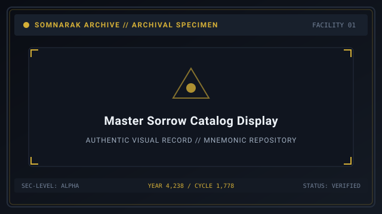
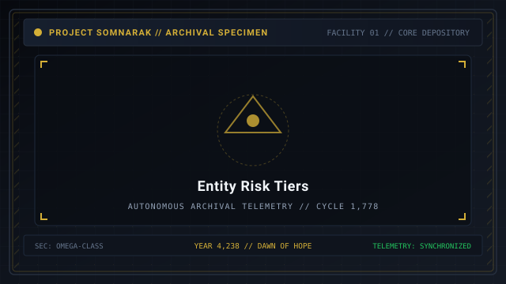
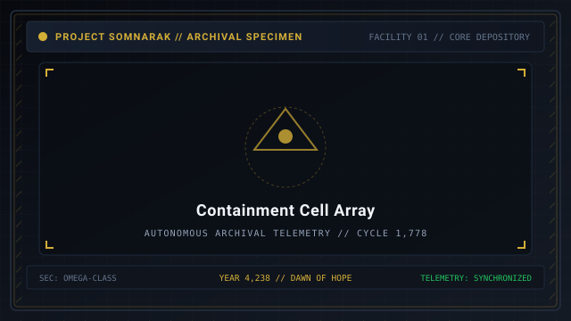

# Sorrow List

> *“To number the sorrows is not to conquer them, but to know how many cages remain unbroken before the dawn.”*

The **Sorrow List**  [슬픔 개체 목록]  (_Seulpeum Gaeche Mokrok_) serves as the comprehensive tactical register of all [Sorrow Entities](07-Sorrow%20Entities.md) documented and contained by the Reverie Directorate within Facility 01.

Every entity cataloged in this archive is cataloged under the Somnarak Entity Classification Code (SECC), detailing its structural origin, behavioral risk tier, primary elemental pressure, containment capacity, and breach status.

```text
+========================================================================+
| SOMNARAK - MASTER SORROW ENTITIES CATALOG                              |
+------------------------------------------------------------------------+
| Registered Archive     | 292 Entities (285 SECC Master Codices)        |
| Risk Tier Scale        | Whisper (I) to Sovereign (V) + Relics         |
| Containment Protocols  | Viderehan - Ferrehan - Flerehan - Pugnahan    |
| Pressure Types         | Grudge - Lament - Void - Weight               |
| Municipal Archive      | Reverie Directorate - Facility 01 Depository  |
+========================================================================+
```

## Contents

- [1 Master Classification Index](#1-master-classification-index)
- [2 Master Entity Catalog](#2-master-entity-catalog)
  - [2.1 Rank I: Whisper Entities](#21-rank-i-whisper-entities)
  - [2.2 Rank II: Murmur Entities](#22-rank-ii-murmur-entities)
  - [2.3 Rank III: Fragment Entities](#23-rank-iii-fragment-entities)
  - [2.4 Rank IV: Wail Entities](#24-rank-iv-wail-entities)
  - [2.5 Rank V: Sovereign Entities](#25-rank-v-sovereign-entities)
  - [2.6 Tool Relic Entities](#26-tool-relic-entities)
- [3 Filtering and Tactical Sorting Criteria](#3-filtering-and-tactical-sorting-criteria)
- [4 Departmental Distribution Matrix](#4-departmental-distribution-matrix)
- [5 Gallery](#5-gallery)
- [6 See also](#6-see-also)

## 1 Master Classification Index

Entities in the Somnarak universe are categorized across five core risk levels, based on the danger they present to facility stability and the strength of the [M.A.W. Equipment](09-M.A.W.%20Equipment.md) they yield:
- **Rank I — Whisper (46 entities):** Low threat; docile behavior; excellent training subjects for novice specialists.
- **Rank II — Murmur (70 entities):** Moderate threat; may breach or inflict mental trauma upon failure.
- **Rank III — Fragment (82 entities):** Substantial threat; complex containment rules; requires specialized protective suits.
- **Rank IV — Wail (80 entities):** Severe facility threat; capable of wide-area corridor devastation and auxiliary massacres.
- **Rank V — Sovereign (14 entities):** Catastrophic municipal crisis; capable of triggering facility-wide collapse.
- **Tool Relics (5 entities):** Inanimate artifacts utilizing the Two-Work-Type Rule (Viderehan and Ferrehan only).

## 2 Master Entity Catalog

### 2.1 Rank I: Whisper Entities

| SECC ID | Entity Name | Korean Name | Pressure | Max Lumen | Best Work | Breach? |
|---|---|---|---|---|---|---|
| `SE-C-Iα-000` | Kind Echo | 친절한 메아리 | 🔵 Lament | 10 LU | 🤲 Ferrehan | Yes |
| `SE-C-Iα-011` | Whispering Walls | 속삭이는 벽 | 🔵 Lament | 10 LU | 👁 Viderehan | No |
| `SE-C-Iα-071` | The Kind Healer | 친절한 치유자 | 🔵 Lament | 12 LU | 🤲 Ferrehan | Yes |
| `SE-C-Iα-071c` | Apostle Maker | 사도 만드는 자 | 🔵 Lament + Hope | 12 LU | 💧 Flerehan | Yes |

### 2.2 Rank II: Murmur Entities

| SECC ID | Entity Name | Korean Name | Pressure | Max Lumen | Best Work | Breach? |
|---|---|---|---|---|---|---|
| `SE-C-IIα-062` | Forgotten Market Stall | 잊혀진 가게 | ⚪ Void | 14 LU | 👁 Viderehan | No |
| `SE-C-IIα-081` | Broken Mirror | 거울의 조각 | ⚪ Void | 14 LU | ⚔ Pugnahan | No |
| `SE-C-IIβ-048` | Hums | 노래하는 돌 | 🔵 Lament | 16 LU | 🤲 Ferrehan | No |
| `SE-C-IIβ-101` | Emberling | 의 아이 | 🔵 Lament | 16 LU | 💧 Flerehan | Yes |

### 2.3 Rank III: Fragment Entities

| SECC ID | Entity Name | Korean Name | Pressure | Max Lumen | Best Work | Breach? |
|---|---|---|---|---|---|---|
| `SE-C-IIIβ-014` | [The Debt Eater](27-The%20Debt%20Eater.md) | 빚을 먹는 자 | ⚪ Void | 16 LU | ⚔ Pugnahan | Yes |
| `SE-C-IIIβ-015` | The Debt Scale | 빚의 저울 | ⚪ Void | 18 LU | 💧 Flerehan | No |
| `SE-C-IIIβ-016` | The Echo Compass | 메아리 나침반 | ⚪ Void | 18 LU | 🤲 Ferrehan | No |
| `SE-C-IIIγ-031` | The Observing Bird | 지켜보는 새 | 🔵 Lament | 20 LU | 👁 Viderehan | Yes |

### 2.4 Rank IV: Wail Entities

| SECC ID | Entity Name | Korean Name | Pressure | Max Lumen | Best Work | Breach? |
|---|---|---|---|---|---|---|
| `SE-C-IVβ-041` | The Grieving Maiden | 슬픔의 처녀 | 🔵 Lament | 24 LU | ⚔ Pugnahan | Yes |
| `SE-C-IVβ-042` | The Angry Maiden | 분노의 처녀 | 🔴 Grudge | 26 LU | 💧 Flerehan | Yes |
| `SE-N-IVβ-019` | The Inherited Debt | 물려받은 빚 | ⚫ Weight | 28 LU | 🤲 Ferrehan | Yes |
| `SE-N-IVδ-005` | The Smothering Mother | 질식하는 어머니 | 🔴 Grudge | 30 LU | 👁 Viderehan | Yes |

### 2.5 Rank V: Sovereign Entities

| SECC ID | Entity Name | Korean Name | Pressure | Max Lumen | Best Work | Breach? |
|---|---|---|---|---|---|---|
| `SE-C-Vδ-002` | The Grieving Colossus | 슬픔의 거인 | ⚫ Weight | 32 LU | 👁 Viderehan | Yes |
| `SE-C-Vδ-010` | The Convergence | 수렴 | ⚫ Weight | 32 LU | ⚔ Pugnahan | Yes |
| `SE-C-Vδ-265` | Forgotten God | 잊혀진 신 | 🔴🔵⚪⚫ All four | 34 LU | 💧 Flerehan | Yes |
| `SE-O-Vγ-003` | Wilderness Tide | 야생의 조수 | ⚫ Weight | 36 LU | 🤲 Ferrehan | No |

### 2.6 Tool Relic Entities

| SECC ID | Relic Name | Functional Subtype | Primary Function | Safe Threshold |
|---|---|---|---|---|
| `SE-C-IIIβ-016` | [The Echo Compass](28-The%20Echo%20Compass.md) | Single-Use | Facility acoustic radar sweep | Immediate discharge |
| `SE-C-IIIβ-275` | [The Crucible](29-The%20Crucible.md) | Channeled Use | Sustained Han distillation | Under 30 seconds |
| `SE-C-IIIβ-015` | [The Debt Scale](30-The%20Debt%20Scale.md) | Equippable | Inverts Void pressure & heals SP | Must balance debt |

## 3 Filtering and Tactical Sorting Criteria

Wardens can filter entities by operational parameters:
- **By Elemental Pressure:** Prioritize equipping armors resistant to the entity's attack type before initiating containment work.
- **By Work Preference:** Match specialist attribute specialties (Resilience, Clarity, Composure, Resolve) to maximize positive Han-Energy yield.
- **By Breach Hazard:** Keep high-mobility combat squads stationed in departments housing active breaching horrors.

## 4 Departmental Distribution Matrix

To minimize catastrophic cascade breaches, entities of equal risk levels are distributed evenly across the facility's vertical tiers:
- **Upper Spires & Central Admin:** Primarily Whisper and Murmur entities for recruit training.
- **Middle Floors (Border Watch & Deep Vault):** Fragment and Wail entities for specialized weapon harvesting.
- **Lower Gate Watch & Shadow Corps:** Sovereign entities quarantined behind reinforced hydraulic blast doors.

## 5 Gallery

[](images/master-sorrow-catalog-display.svg)
[](images/entity-risk-tiers.svg)
[](images/containment-cell-array.svg)

*Left: terminal interface of the master catalog; Center: risk tier symbols; Right: containment row overview.*
---

## 6 See also

- [07-Sorrow Entities](07-Sorrow%20Entities.md) — comprehensive master bestiary framework
- [23-Risk Levels](23-Risk%20Levels.md) — detailed guide to threat classifications
- [27-The Debt Eater](27-The%20Debt%20Eater.md) — full specimen dossier: Non-Tool Subject
- [38-Classification Code](38-Classification%20Code.md) — SECC nomenclature decryption
