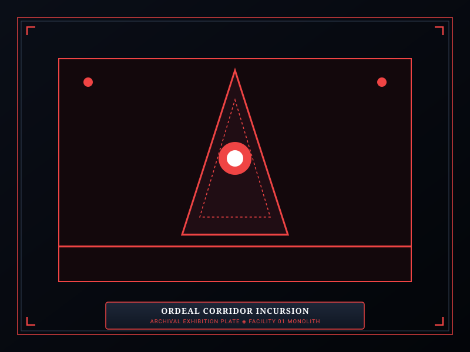
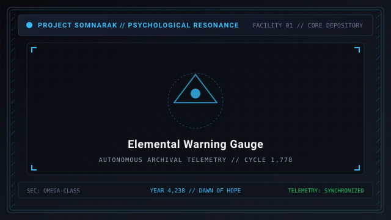

# Ordeals

> *“By the way, have you seen something creepier than the Sorrow Entities? We don't have enough data on them. No matter how meticulous our plan is, we can't control the unknown.”*  
> — Director Majin, Spires Atrium

**Ordeals**  [시련]  (_Siryeon_ — Trials) are facility-wide hostile incursions that erupt during the daily management shift. Unlike [Sorrow Entities](07-Sorrow%20Entities.md), Ordeals are not contained within cells; they are external metaphysical eruptions manifesting directly from the subterranean **Maw** and wandering the corridors.

Ordeals force the Warden to prepare suppression teams for active combat rather than relying purely on passive routine care. Sixty distinct Ordeals are cataloged across five **Colors** and four **Watches**, each demanding specific damage resistances and tactical coordination.

```text
+========================================================================+
| SOMNARAK - ORDEALS FRAMEWORK                                           |
+------------------------------------------------------------------------+
| Operational Incursions | 60 Tracked Ordeals across Facility 01         |
| Temporal Axis (Watches) | First - Second - Third - Tide                |
| Elemental Axis (Colors) | BLACK - BLUE - GREY - PALE - PURPLE          |
| Containment Status     | Uncontainable - Hallway Roamers - Faction Comb|
| Primary Hazard         | Veil Erosion & Facility-Wide Catastrophe      |
+========================================================================+
```

## Contents

- [1 Incursion Mechanics and General Rules](#1-incursion-mechanics-and-general-rules)
- [2 The Temporal Axis: The Four Watches](#2-the-temporal-axis-the-four-watches)
- [3 The Elemental Axis: The Five Colors](#3-the-elemental-axis-the-five-colors)
- [4 Master Ordeals Grid (Colors and Watches)](#4-master-ordeals-grid-colors-and-watches)
- [5 Pre-Ordeal Warning and Gauge Mechanics](#5-pre-ordeal-warning-and-gauge-mechanics)
- [6 Tactical Suppression Guidelines](#6-tactical-suppression-guidelines)
- [7 Gallery](#7-gallery)
- [8 See also](#8-see-also)

## 1 Incursion Mechanics and General Rules

Ordeals operate under distinct combat and spatial rules:
1. **Uncontainable Wanderers:** Ordeal entities cannot be worked with, pacified through conversation, or assigned to containment units. They materialize in random hallways and patrol the facility, attacking staff on sight.
2. **Faction Conflict:** Ordeal entities do not attack creatures belonging to their own Color, but will fiercely engage other Ordeal types, breaching sorrow entities, and facility personnel.
3. **No Financial Penalty:** Unlike dead employees, leaving surviving Ordeal entities in corridors when completing the daily energy quota inflicts no municipal financial deductions. However, surviving entities prevent peaceful shift conclusions if essential personnel are pinned down.

## 2 The Temporal Axis: The Four Watches

Ordeals manifest sequentially throughout the shift, escalating in difficulty across the **Four Watches**:
- **First Watch:** Low-density scouting incursions (Rank II Murmur equivalent). Easily suppressed by entry-level specialists.
- **Second Watch:** Moderate assault waves (Rank III Fragment equivalent). Features armored units and localized area-of-effect damage.
- **Third Watch:** Severe multi-floor emergencies (Rank IV Entity equivalent). Employs coordinated swarms, debuffs, and high mobility.
- **Tide Watch:** Catastrophic endgame incursions (Rank V Sovereign equivalent). Giant monoliths, facility-wide laser sweeps, or conceptual erasure fields that threaten total facility liquidation.

## 3 The Elemental Axis: The Five Colors

Each Ordeal belongs to one of five thematic and elemental classifications:

### BLACK (⚫ Weight)
Theme: Subterranean grinding larvae, shifting stone slabs, and crushing gravity.
- Units deal heavy ⚫ **Weight** damage, grinding both HP and SP simultaneously.
- Swarms emerge from burrowed floor tiles, attempting to surround isolated specialists.

### BLUE (🔵 Lament)
Theme: The Weeping Choir, acoustic sirens, and drowners in stagnant brine.
- Units emit constant 🔵 **Lament** soundwaves that bypass physical armor to erode mental composure.
- Triggers mass panic if personnel lack high Clarity or 🔵 **Lament**-resistant mantles.

### GREY (🔴 Grudge)
Theme: The Iron March, mechanical automatons, and heavy industrial clamps.
- Constructs constructed from scrap iron that deal massive 🔴 **Grudge** (physical) damage.
- Units march relentlessly in formation, crushing blast doors and sweeping hallways.

### PALE (⚪ Void)
Theme: The Fading Horizon, pale reapers, and conceptual erasure.
- Rare, terrifying apparitions dealing pure ⚪ **Void** damage.
- Attacks calculate percentage-based vital damage (where 1% Void inflicts 5% of maximum vital endurance), making high-HP specialists just as vulnerable as recruits.

### PURPLE (Raw Han)
Theme: Reality-warping monoliths, tectonic ruptures, and mother floods.
- Spawns colossal stationary obelisks that warp environmental gravity and summon auxiliary anomalies until physically shattered by high-damage strike teams.

## 4 Master Ordeals Grid (Colors and Watches)

The sixty tracked Ordeal files map into a rigorous grid across the five Colors and four Watches:

| Color Classification | First Watch | Second Watch | Third Watch | Tide Watch |
|---|---|---|---|---|
| **BLACK (⚫ Weight)** | *The Grinding Slab* | *The Crushing Column* | *The Buried Pillar* | *The Final Ton* |
| **BLUE (🔵 Lament)** | *The Leaking Eyes* | *The Sobbing Wall* | *The Brine Walkers* | *The Drowned World* |
| **GREY (🔴 Grudge)** | *The Iron Brawler* | *The Blade Wall* | *The Marching Forge* | *The Great Severance* |
| **PALE (⚪ Void)** | *The Fading Spark* | *The Pale Husk* | *The Sinking Horizon* | *The Sovereign Reaper* |
| **PURPLE (Raw Han)** | *The Resonant Shard* | *The Trembling Stone* | *The Rupture Pillar* | *The Mother Flood* |

## 5 Pre-Ordeal Warning and Gauge Mechanics

Facility 01's monitoring grid provides advance tactical warnings:
- When the facility's **Resonance Gauge** approaches a threshold level, the gauge flashes with the specific Color and Watch tier of the imminent incursion.
- The highest Watch tier scheduled to manifest during the shift is displayed on the deployment terminal before the Warden initiates the morning sequence.
- During Tide Watch incursions, all standard facility sirens are replaced with the *Third Trumpet* alarm chime, signaling an existential survival scenario.

## 6 Tactical Suppression Guidelines

1. **Pre-Positioning Squads:** Once the pre-Ordeal warning flashes, withdraw vulnerable low-level specialists into fortified Command Rooms equipped with active Healing Generators.
2. **Elemental Matching:** Intercept BLACK incursions using high ⚫ **Weight**-resistant armor (*Reaper Shroud*). Counter GREY automatons with long-range weapons to kite physical strikes.
3. **Targeting Monoliths:** During PURPLE incursions, ignore minor auxiliary summons and focus all heavy combat personnel on destroying the central obelisk to collapse the field.

## 7 Gallery

[](images/ordeal-corridor-incursion.svg)
[](images/tide-watch-sovereign.svg)
[](images/elemental-warning-gauge.svg)

*Left: corridor swarm incursion; Center: Tide Watch monolith; Right: pre-incursion warning display.*
---

## 8 See also

- [07-Sorrow Entities](07-Sorrow%20Entities.md) — master entity bestiary
- [09-M.A.W. Equipment](09-M.A.W.%20Equipment.md) — combat gear for incursion defense
- [17-Pressure Types](17-Pressure%20Types.md) — damage calculations and resistance bands
- [11-Reverberations](11-Reverberations.md) — department meltdown crises
