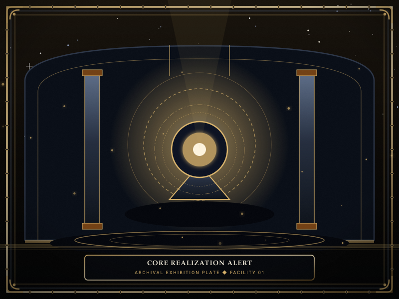
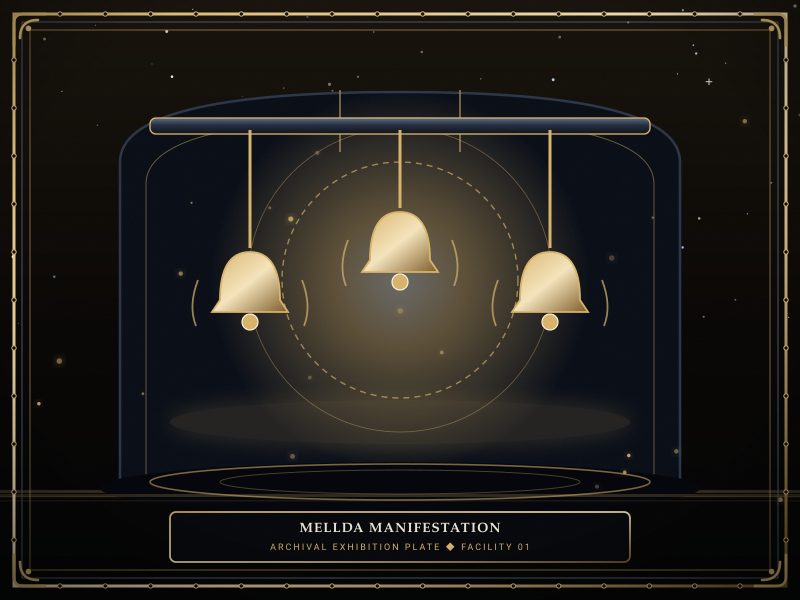
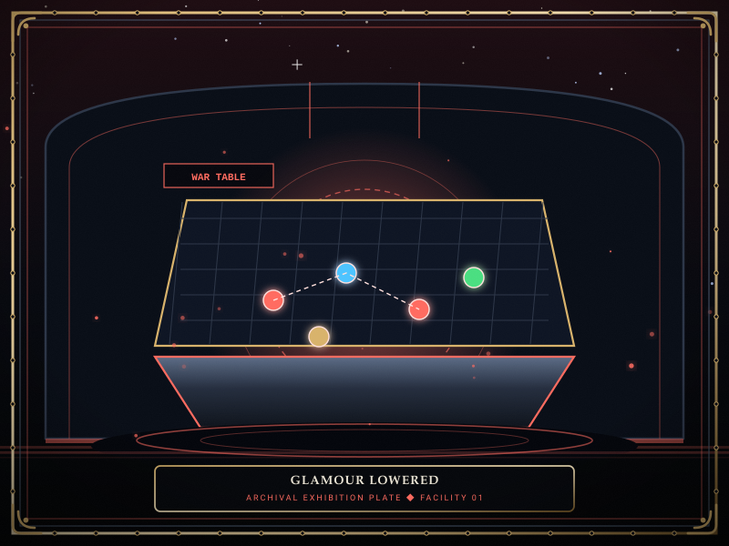

# Reverberations

> *“When an Echo-Core forgets its boundaries, the department stops being a room and becomes the director's screaming skull.”*

**Reverberations**  [공명폭주]  (_Gongmyeong Pokju_ — Resonance Meltdowns), also designated as **Core Realizations** and **Stratum Realizations**, are climatic crisis events unlocked after completing all four departmental missions of a given [Echo-Core](14-Echo-Cores.md). 

During a Reverberation, the director's psychological insulation fractures, causing their accumulated grief to flood the physical floor. The department enters an existential emergency: the [Healing Generator](22-Departments.md) shuts down, containment cells undergo spontaneous agitation, and severe cognitive handicaps distort the Warden's command interface until the core is stabilized through direct suppression.

```text
+========================================================================+
| WARNING: REVERBERATION & CORE REALIZATION                              |
+------------------------------------------------------------------------+
| Event Classification   | Echo-Core Meltdown & Stratum Realization      |
| Prerequisite Criteria  | Completion of 4 Departmental Missions         |
| Layer Unlocks          | Shallow (Day 21+) - Middle (36+) - Deep (41+) |
| Environmental Hazards  | Generator Shutdown & Cognitive Handicaps      |
| Permanent Clearance    | Meltdown Immunity & Glamour Lowered           |
+========================================================================+
```

## Contents

- [1 Core Realization Mechanics and Initiation](#1-core-realization-mechanics-and-initiation)
- [2 Department Layer Progression](#2-department-layer-progression)
- [3 The Nine Departmental Meltdowns](#3-the-nine-departmental-meltdowns)
  - [3.1 Spires Meltdown (Director Majin)](#31-spires-meltdown-director-majin)
  - [3.2 Central Administration Meltdown (Secretary Seiyon)](#32-central-administration-meltdown-secretary-seiyon)
  - [3.3 Maw's Keep Meltdown (Lead Dekan)](#33-maws-keep-meltdown-lead-dekan)
  - [3.4 Extraction Hall Meltdown (Lead Zyrak)](#34-extraction-hall-meltdown-lead-zyrak)
  - [3.5 Insight Forge Meltdown (Lead Ayshuk)](#35-insight-forge-meltdown-lead-ayshuk)
  - [3.6 Border Watch Meltdown (Lead Mellda)](#36-border-watch-meltdown-lead-mellda)
  - [3.7 Deep Vault Meltdown (Lead Marjuk)](#37-deep-vault-meltdown-lead-marjuk)
  - [3.8 Shadow Corps Meltdown (Lead Ishall)](#38-shadow-corps-meltdown-lead-ishall)
  - [3.9 Gate Watch Meltdown (Lead Xyan)](#39-gate-watch-meltdown-lead-xyan)
- [4 Permanent Rewards and Glamour](#4-permanent-rewards-and-glamour)
- [5 Gallery](#5-gallery)
- [6 See also](#6-see-also)

## 1 Core Realization Mechanics and Initiation

A Core Realization differs fundamentally from standard routine management:
1. **Initiation Criteria:** Unlocked once the Warden completes all four progressive missions issued by that floor's Echo-Core. The event is triggered from the deployment terminal at the start of a shift.
2. **Floor Evacuation:** Specialists stationed in the affected department are evacuated to adjacent wings. The department's Command Room ceases to provide restorative healing as its **Healing Generator** is overwhelmed by resonance noise.
3. **Cognitive Handicaps:** The manifesting Echo-Core projects severe operational distortions across the entire facility. These handicaps test the Warden's adaptability by inverting controls, scrambling assignments, or muting sensory feeds.
4. **Resolution Conditions:** To clear the suppression, the facility must accumulate its complete daily **Lumen** energy quota while advancing through multiple escalating phases of the meltdown gauge.

## 2 Department Layer Progression

Core Realizations are divided across the facility's vertical strata and become available at specific calendar intervals:
- **Shallow Floors (Upper Layer):** Unlocked after Day 21 (Majin, Seiyon, Dekan, Zyrak, Ayshuk).
- **Middle Floors (Middle Layer):** Unlocked after Day 36 (Mellda, Marjuk).
- **Deep Floors (Lower Layer):** Unlocked after Day 41 (Ishall, Xyan).

## 3 The Nine Departmental Meltdowns

### 3.1 Spires Meltdown (Director Majin)
- **Handicap:** *Command Scramble* — Work assignments ordered by the Warden are randomly reassigned to different protocols upon specialist dispatch. An order for 👁 **Viderehan** may morph into ⚔ **Pugnahan**, requiring careful manual overrides.
- **Goal:** Reach Meltdown Level VI while keeping casualties below the threshold.

### 3.2 Central Administration Meltdown (Secretary Seiyon)
- **Handicap:** *Sensor Glitch* — Heavy visual pixelation obscures the facility display. Health and composure gauges over specialists' heads become invisible, forcing the Warden to monitor staff by physical gait and audio cues.

### 3.3 Maw's Keep Meltdown (Lead Dekan)
- **Handicap:** *Brittle Armor* — Physical barricades weaken, and incoming 🔴 **Grudge** (physical) damage across all containment cells is amplified by 100%. Specialists require constant shield rotation.

### 3.4 Extraction Hall Meltdown (Lead Zyrak)
- **Handicap:** *Well Backflow* — Energy collection triggers secondary shockwaves. Every completed work session has a chance to rupture adjacent cells, releasing localized Han gas.

### 3.5 Insight Forge Meltdown (Lead Ayshuk)
- **Handicap:** *Analytical Stasis* — Operative stats are temporarily downgraded by one tier across all four disciplines, drastically lowering work success rates and increasing attack vulnerability.

### 3.6 Border Watch Meltdown (Lead Mellda)
- **Handicap:** *The Red Hunt* — Mellda actively manifests in the corridors wielding *Threshold Vow*. Unlike stationary directors, Mellda patrols hallways, engaging specialists in high-speed combat across four escalating phases.

### 3.7 Deep Vault Meltdown (Lead Marjuk)
- **Handicap:** *Temporal Inversion* — Time itself dilates. Accelerating the simulation speed induces violent spatial tremors that panic specialists, forcing the entire trial to be fought at strict real-time speed.

### 3.8 Shadow Corps Meltdown (Lead Ishall)
- **Handicap:** *Shroud of Silence* — Departmental warning sirens and breach notifications are suppressed. The Warden must manually scan every corridor to detect roaming entities.

### 3.9 Gate Watch Meltdown (Lead Xyan)
- **Handicap:** *Abyss Rupture* — The subterranean boundary fractures, summoning continuous waves of Maw horrors and requiring simultaneous suppression across all eight descending levels.

## 4 Permanent Rewards and Glamour

Successfully subduing an Echo-Core permanently stabilizes the department:
- **Permanent Meltdown Immunity:** The cleared department will never again be targeted by random environmental meltdowns during future shifts.
- **Passive Departmental Boon:** Unlocks permanent facility-wide perks (e.g. +5 Maximum HP/SP for all staff, +10% Lumen yield, or +10% Movement Speed).
- **Lowering of the Glamour:** The heavy holographic glamour that disguises the Echo-Core as an abstract machine or armored construct is lowered, revealing their true, fragile human form and unlocking their canonical story logs.

## 5 Gallery

[](images/core-realization-alert.svg)
[](images/mellda-manifestation.svg)
[](images/glamour-lowered.svg)

*Left: Core Realization alarm interface; Center: Lead Mellda in combat form; Right: Echo-Core true human revelation.*
---

## 6 See also

- [06-Personnel](06-Personnel.md) — director profiles and voice transcripts
- [14-Echo-Cores](14-Echo-Cores.md) — director dossiers and mechanics
- [22-Departments](22-Departments.md) — facility floor layout and room architecture
- [13-Operations](13-Operations.md) — departmental mission requirements
