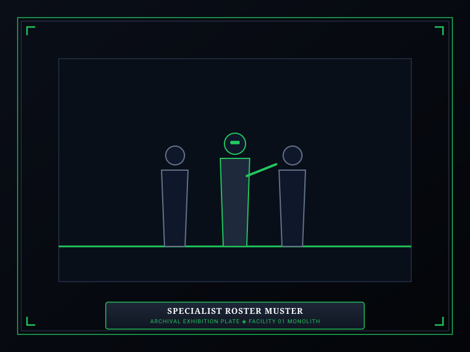
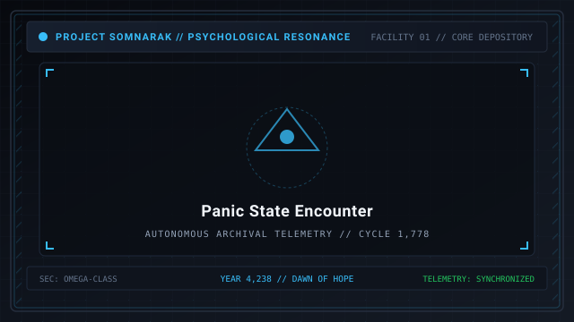

# Specialists

> *“Writing the sorrow encyclopedia is a pain in the neck. Nobody'll know if I just fudge the details and make some stuff up, right?”*  
> — A rookie specialist, Floor 1 Spires Atrium

**Specialists** are the trained operatives employed by the Reverie Directorate to manage, study, and suppress [Sorrow Entities](07-Sorrow%20Entities.md). They represent the player's primary hands on the floor. 

Within Facility 01, human personnel are divided into two distinct classes: **Specialists**, who actively engage in containment work and combat, and **Auxiliaries**, who manage administrative paperwork and maintenance across the corridors.

```text
+========================================================================+
| SOMNARAK - SPECIALIST CADRES AND OPERATIVES                            |
+------------------------------------------------------------------------+
| Personnel Classes      | Specialists (Active Duty) - Auxiliaries       |
| Primary Attributes     | Resilience (HP) - Clarity (SP) - Composure    |
| Combat Attribute       | Resolve (Attack Speed & Movement Speed)       |
| Psychological Hazard   | Four Panic States: Murder - Suicide - Wander  |
| Operational Ranks      | Rank I (Recruit) to Rank V (Veteran Captain)  |
+========================================================================+
```

## Contents

- [1 Specialists vs Auxiliaries](#1-specialists-vs-auxiliaries)
- [2 The Four Primary Attributes](#2-the-four-primary-attributes)
- [3 The Four Panic States](#3-the-four-panic-states)
  - [3.1 Murder Panic](#31-murder-panic)
  - [3.2 Suicide Panic](#32-suicide-panic)
  - [3.3 Wander Panic](#33-wander-panic)
  - [3.4 Sabotage Panic](#34-sabotage-panic)
- [4 Terror and Fear Levels](#4-terror-and-fear-levels)
- [5 Recruitment, Promotion, and Loadout Pairing](#5-recruitment-promotion-and-loadout-pairing)
- [6 Gallery](#6-gallery)
- [7 See also](#7-see-also)

## 1 Specialists vs Auxiliaries

Facility 01 maintains a strict division of labor between frontline operatives and support staff:

### Specialists
- **Control:** Fully directable combatants wearing customized [M.A.W. Equipment](09-M.A.W.%20Equipment.md).
- **Duties:** Dispatched into containment cells to execute the four canonical work types, intercepting breaching horrors, and subduing active Ordeals.
- **Value:** Specialists represent major investments of municipal capital. If all specialists assigned to the facility perish during a shift, the day terminates in an immediate **Catastrophic Collapse (Game Over)**.

### Auxiliaries
- **Control:** Non-directable civilian staff who wander departmental hallways attending to municipal duties.
- **Passives:** Auxiliaries emit passive departmental stat bonuses (+Movement Speed, +Work Success, or +Damage Resistance) based on the percentage of auxiliaries remaining alive and sane on each floor.
- **Vulnerability:** Unarmored and fragile, auxiliaries frequently become collateral victims during entity breaches or Ordeal incursions.

## 2 The Four Primary Attributes

A specialist's effectiveness is governed by four core attributes, each trained through routine containment protocols:

| Attribute | Korean Name | Vital Function | Trained Protocol |
|---|---|---|---|
| **Resilience** | 탄력 (Fortitude) | Increases maximum **Health Points (HP)**, determining physical endurance. | 🤲 **Ferrehan** (Endurance) |
| **Clarity** | 명료 (Prudence) | Increases maximum **Sanity Points (SP)**, determining mental fortitude. | 👁 **Viderehan** (Observation) |
| **Composure** | 침착 (Temperance) | Increases work execution speed and positive resonance probability. | 💧 **Flerehan** (Lamentation) |
| **Resolve** | 결의 (Justice) | Increases weapon attack speed and corridor sprint velocity. | ⚔ **Pugnahan** (Confrontation) |

Attributes progress from **Level I** (Novice) up to **Level V** (Master), with veteran operatives achieving elite **EX-Rank** status through prolonged service.

## 3 The Four Panic States

When an operative's Sanity Points (SP) are reduced to zero by 🔵 **Lament** or ⚫ **Weight** trauma, their ego shatters, triggering an acute **Panic State**. The specific behavioral breakdown is determined by the operative's lowest primary attribute:

### 3.1 Murder Panic
The specialist's survival instincts warp into predatory frenzy. Convinced their squadmates are monsters in disguise, the operative turns their M.A.W. weapon against colleagues, hunting down nearby auxiliaries and specialists.

### 3.2 Suicide Panic
The specialist is engulfed by overwhelming existential futility. Muttering incoherent fragments of personal regret, the operative uses their own weapon or leaps from elevated spires to terminate their life immediately.

### 3.3 Wander Panic
The specialist's motor functions decouple from rational thought. Dropping their offensive guard, the operative wanders aimlessly through corridors, screaming incoherently and inflicting secondary 🔵 **Lament** panic upon every auxiliary they encounter.

### 3.4 Sabotage Panic
The specialist experiences an irresistible compulsion to spread the facility's ruin. The operative rushes toward nearby containment units and manually disengages hydraulic airlocks, releasing dangerous sorrow entities into the hallways.

### Restoring Sane Composure
A panicked operative is not lost permanently. Squadmates wielding weapons that deal 🔵 **Lament** (mental) or ⚪ **Void** damage can attack the panicked specialist. Instead of causing physical injury, these resonant strikes restore the victim's SP gauge. Once their SP is fully refilled, the specialist recovers their sanity and returns to duty.

## 4 Terror and Fear Levels

When encountering a high-threat entity or witnessing the gruesome demise of a squadmate, specialists undergo an immediate **Fear Check**. The check compares the specialist's rank against the entity's risk tier:
- **Calm:** Operative is higher rank than the entity; suffers no penalty.
- **Normal:** Operative and entity are equal rank; suffers minor SP loss.
- **Fear:** Entity is one tier higher; operative suffers 25% immediate SP drain.
- **Hopeless:** Entity is two tiers higher; operative suffers 50% immediate SP drain.
- **Overwhelming:** Low-rank recruit encounters a Rank V Sovereign; triggers **Instant Panic**.

## 5 Recruitment, Promotion, and Loadout Pairing

- **Hiring:** Wardens recruit new operatives at the start of a shift using municipal investment credits, customizing appearance and base attributes.
- **Promotion:** Performing successful containment work earns experience, promoting specialists at shift end.
- **Loadout Pairing:** Effective wardens pair operatives in mutual squads — pairing a heavy ⚫ **Weight** tank (*Threshold Vow*) with a long-range ⚪ **Void** sniper (*Reaper Hungered* from [27-The Debt Eater](27-The%20Debt%20Eater.md)) to cover diverse combat profiles.

## 6 Gallery

[](images/specialist-roster-muster.svg)
[](images/panic-state-encounter.svg)
[](images/promotion-and-ranks.svg)

*Left: specialists mustering in Command Room; Center: operative suffering panic state; Right: rank promotion ceremonies.*
---

## 7 See also

- [06-Personnel](06-Personnel.md) — director profiles and specialist cadres
- [09-M.A.W. Equipment](09-M.A.W.%20Equipment.md) — weapon and suit armory
- [17-Pressure Types](17-Pressure%20Types.md) — damage types and panic mechanics
- [22-Departments](22-Departments.md) — department team bonuses and floor layout
