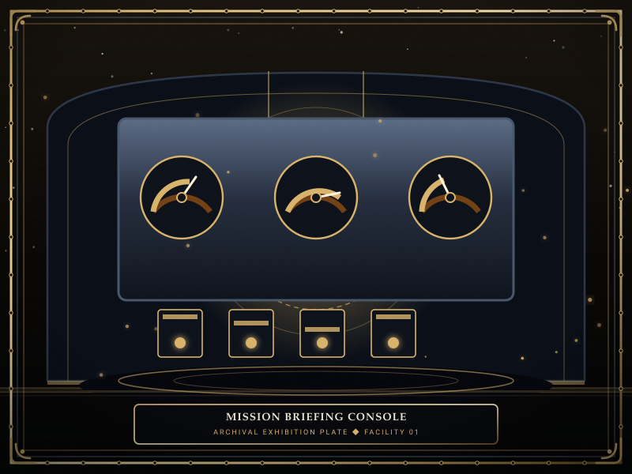
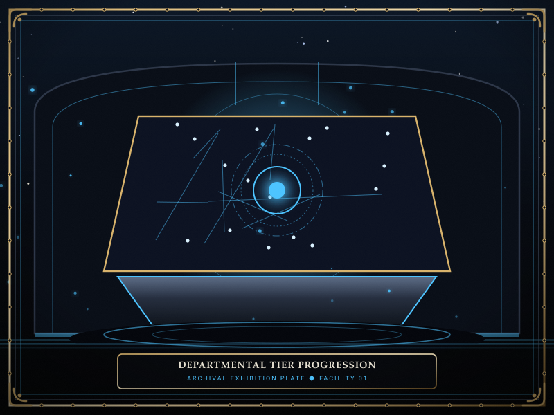
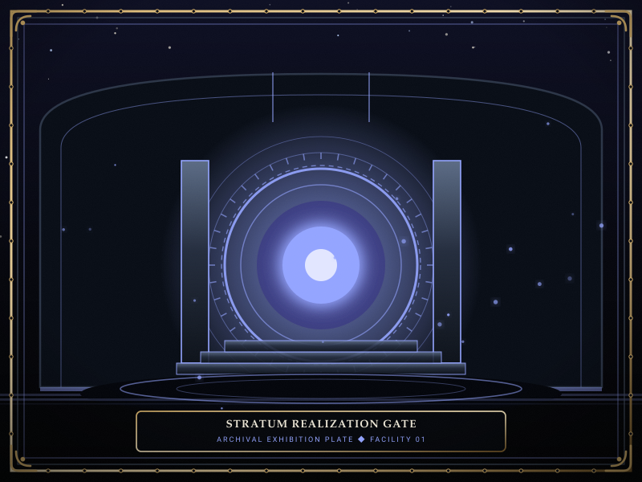

# Operations

> *“A mission is not an order to survive; it is a blueprint to expand what the facility can endure.”*

**Operations**  [작전 지령]  (_Jakjeon Jiryeong_), also designated as **Missions**, are progressive tactical assignments issued by the nine sovereign [Echo-Cores](14-Echo-Cores.md) governing Facility 01.

Completing missions is the primary mechanism for unlocking facility capabilities: every cleared directive permanently unlocks a research upgrade from [15-Research](15-Research.md), expands specialist recruitment thresholds, and ultimately unlocks access to the climatic [Stratum Realization](11-Reverberations.md) trials.

```text
+========================================================================+
| SOMNARAK - OPERATIONAL MISSIONS                                        |
+------------------------------------------------------------------------+
| Mission Directory      | 36 Progressive Departmental Directives        |
| Issuing Authority      | 9 Sovereign Echo-Cores (Floors 1-8 + Central) |
| Tier Structure         | Tier 1 (Routine) to Tier 4 (Mastery)          |
| Operational Goal       | Stratum Realization Clearance & Research Perks|
| Failure Condition      | Shift Reset & Directorial Meltdown Stagnation |
+========================================================================+
```

## Contents

- [1 Mission Architecture and Tier Progression](#1-mission-architecture-and-tier-progression)
- [2 Complete Missions Directory across the Nine Departments](#2-complete-missions-directory-across-the-nine-departments)
  - [2.1 Spires Missions (Director Majin)](#21-spires-missions-director-majin)
  - [2.2 Central Administration Missions (Secretary Seiyon)](#22-central-administration-missions-secretary-seiyon)
  - [2.3 Maw's Keep Missions (Lead Dekan)](#23-maws-keep-missions-lead-dekan)
  - [2.4 Extraction Hall Missions (Lead Zyrak)](#24-extraction-hall-missions-lead-zyrak)
  - [2.5 Insight Forge Missions (Lead Ayshuk)](#25-insight-forge-missions-lead-ayshuk)
  - [2.6 Border Watch Missions (Lead Mellda)](#26-border-watch-missions-lead-mellda)
  - [2.7 Deep Vault Missions (Lead Marjuk)](#27-deep-vault-missions-lead-marjuk)
  - [2.8 Shadow Corps Missions (Lead Ishall)](#28-shadow-corps-missions-lead-ishall)
  - [2.9 Gate Watch Missions (Lead Xyan)](#29-gate-watch-missions-lead-xyan)
- [3 Tactical Preparation and Shift Planning](#3-tactical-preparation-and-shift-planning)
- [4 Gallery](#4-gallery)
- [5 See also](#5-see-also)

## 1 Mission Architecture and Tier Progression

Each Echo-Core issues four progressive tiers of missions:
- **Tier 1 (Operational Foundation):** Focuses on standard work execution and basic containment discipline within the department.
- **Tier 2 (Work Diversity):** Demands executing containment across all four canonical protocols (👁 **Viderehan**, 🤲 **Ferrehan**, 💧 **Flerehan**, ⚔ **Pugnahan**).
- **Tier 3 (Combat Suppression):** Requires neutralizing active entity breaches or surviving designated [Ordeal](10-Ordeals.md) incursions using departmental squads.
- **Tier 4 (Mastery and Zero-Casualty):** Demands completing an entire operational shift without a single specialist death or panic breakdown while reaching maximum daily energy quotas.

Completing all four tiers for a department permanently unlocks that director's **Core Realization** at [11-Reverberations.md](11-Reverberations.md).

## 2 Complete Missions Directory across the Nine Departments

### 2.1 Spires Missions (Director Majin)
1. *Threshold Sentry:* Execute 3 standard work sessions in the Spires department. (Reward: Movement Speed +5%).
2. *Tactical Verification:* Achieve 5 Good work outcomes with Rank II Echo entities. (Reward: Enhanced Starting Uniforms).
3. *Iron Suppression:* Suppress a First Watch Ordeal incursion. (Reward: Tactical Pistol Buff).
4. *Sovereign Threshold:* Complete a shift at Meltdown Level VI with zero casualties. (Reward: Unlocks Majin Core Realization).

### 2.2 Central Administration Missions (Secretary Seiyon)
1. *Ledger Auditing:* Complete 5 work sessions with positive Han-Energy yields. (Reward: Work Success +5%).
2. *Cross-Floor Balancing:* Execute at least 2 work sessions in four different departments. (Reward: Energy Quota +5%).
3. *The Record Intact:* Suppress a Second Watch Ordeal without auxiliary casualties. (Reward: Archival Visualization).
4. *Unbroken Continuity:* Achieve daily quota with zero panic events facility-wide. (Reward: Unlocks Seiyon Core Realization).

### 2.3 Maw's Keep Missions (Lead Dekan)
1. *Barricade Inspection:* Perform 4 🤲 **Ferrehan** (Endurance) work sessions. (Reward: Max HP +10).
2. *Heavy Clamping:* Suppress a breaching Rank III Fragment entity. (Reward: Hydraulic Clamps).
3. *The Lip Holds:* Defeat a GREY Ordeal incursion in the lower corridors. (Reward: Physical Armor Weaving).
4. *Unshakable Fortress:* Complete shift with no containment airlocks broken. (Reward: Unlocks Dekan Core Realization).

### 2.4 Extraction Hall Missions (Lead Zyrak)
1. *Well Inspection:* Harvest 40 units of raw Han-Energy from Mnemonic Wells. (Reward: Max SP +10).
2. *High-Yield Distillation:* Successfully extract 3 M.A.W. Weapons from containment cores. (Reward: Energy Refinement +10%).
3. *Resonance Dampening:* Suppress a PURPLE Ordeal monolith. (Reward: Acoustic Shielding).
4. *Overcharge Protocol:* Complete shift collecting 130% of daily energy quota. (Reward: Unlocks Zyrak Core Realization).

### 2.5 Insight Forge Missions (Lead Ayshuk)
1. *Sensor Calibration:* Perform 4 👁 **Viderehan** (Observation) work sessions. (Reward: Work Speed +10%).
2. *Cognitive Decoding:* Fully unlock all four Comprehension Levels for three entities. (Reward: Positive Box Visualization).
3. *Anomalous Behavioral Study:* Successfully work with a high-threat Rank IV Entity. (Reward: Mental Shield Buff).
4. *Total Synthesis:* Complete shift with all departmental entities researched. (Reward: Unlocks Ayshuk Core Realization).

### 2.6 Border Watch Missions (Lead Mellda)
1. *Perimeter Patrol:* Station four specialists in Border Watch corridors for 5 minutes. (Reward: All-Pressure Defense +0.1).
2. *Quarantine Execution:* Intercept and suppress two breaching entities simultaneously. (Reward: Arm-Blade Fabrication).
3. *The Third Line:* Suppress a Third Watch Ordeal incursion. (Reward: Heavy Tactical Plate).
4. *Frontier Lockdown:* Clear shift with zero border breaches recorded. (Reward: Unlocks Mellda Core Realization).

### 2.7 Deep Vault Missions (Lead Marjuk)
1. *Relic Curation:* Perform 3 successful interactions with Relic entities. (Reward: Relic Strain -25%).
2. *Temporal Calibration:* Channel work for 20 seconds inside [29-The Crucible](29-The%20Crucible.md). (Reward: Stasis Shielding).
3. *Vault Sentry:* Suppress a BLACK Ordeal incursion using only relic-equipped staff. (Reward: Memory Lens Upgrade).
4. *Deep Preservation:* Complete shift with all vault relics stabilized. (Reward: Unlocks Marjuk Core Realization).

### 2.8 Shadow Corps Missions (Lead Ishall)
1. *Covert Dispatch:* Execute 5 rapid suppression orders within 30 seconds of breach. (Reward: Evade Rate +10%).
2. *Silent Strike:* Suppress a breaching entity without it entering any Command Room. (Reward: Critical Chance +5%).
3. *Night Sweep:* Subdue an Ordeal incursion using only two assigned specialists. (Reward: Shadow Cloak Weaving).
4. *Invisible Hand:* Clear shift with zero alert sirens sounding across the floor. (Reward: Unlocks Ishall Core Realization).

### 2.9 Gate Watch Missions (Lead Xyan)
1. *Abyss Watch:* Maintain specialists stationed at the Gate Watch blast doors for 10 minutes. (Reward: Panic Threshold +20 SP).
2. *Void Endurance:* Complete 5 work sessions with entities dealing ⚪ **Void** damage. (Reward: Void Inversion Mantle).
3. *The Tide Stand:* Suppress a Tide Watch Ordeal incursion. (Reward: Neural Spine Fabrication).
4. *The Final Gate:* Complete shift at Meltdown Level X with all Gate Watch staff alive. (Reward: Unlocks Xyan Core Realization).

## 3 Tactical Preparation and Shift Planning

- **Mission Stacking:** The Warden may advance multiple departmental missions simultaneously during a single shift.
- **Ordeal Synchronization:** Coordinate suppression missions with scheduled Ordeal alerts to clear incursion requirements efficiently.
- **Failure Non-Penalty:** Failing a mission condition does not cause game over; the Warden simply retries the objective during the subsequent shift.

## 4 Gallery

[](images/mission-briefing-console.svg)
[](images/departmental-tier-progression.svg)
[](images/stratum-realization-gate.svg)

*Left: tactical mission dispatch console; Center: departmental tier progress; Right: Stratum Realization trial gateway.*
---

## 5 See also

- [06-Personnel](06-Personnel.md) — director profiles and voice transcripts
- [14-Echo-Cores](14-Echo-Cores.md) — individual director dossiers and mechanics
- [11-Reverberations](11-Reverberations.md) — department meltdowns and stratum realizations
- [15-Research](15-Research.md) — research perks unlocked by completed operations
