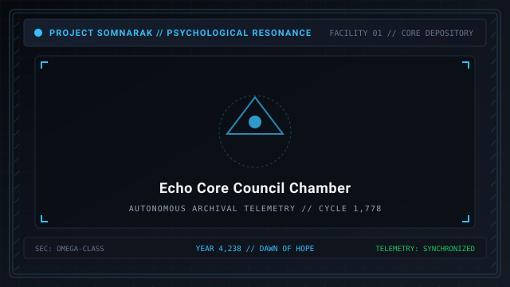
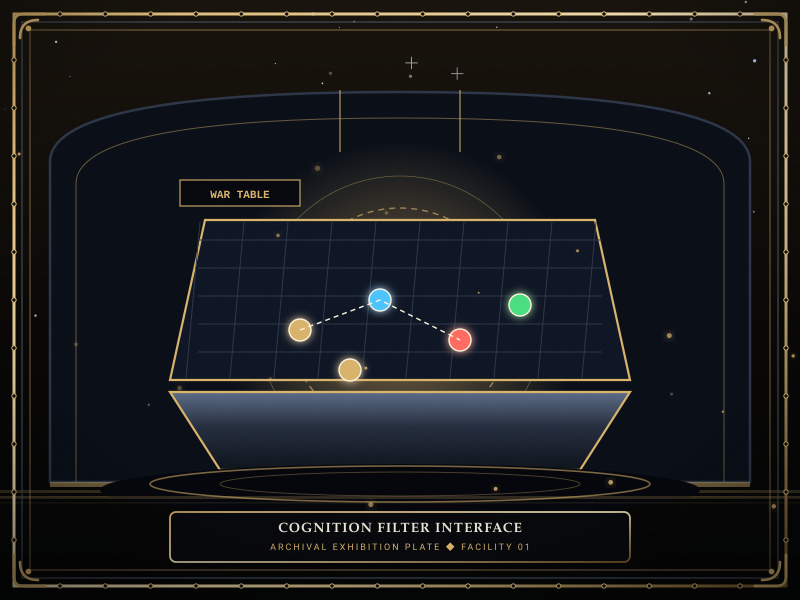
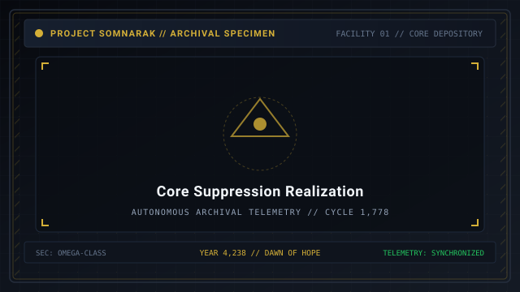

# Echo-Cores

> *“Nine anchors forged in sorrow, nine voices that keep the walls from collapsing into the Maw.”*

**Echo-Cores**  [메아리 핵]  (_Meari Haek_) are the artificial and cybernetic directors governing the departments of Facility 01. Originally living municipal pioneers, their human psyches were permanently crystallized into containment anchors to stabilize the facility against the crushing psychological pressure of the [Maw](41-Frontiers.md).

Each Echo-Core governs a designated floor, issuing [Operations](13-Operations.md) missions, granting departmental research perks, and testing the Warden's resolve during climatic [Floor Realizations](11-Reverberations.md).

```text
+========================================================================+
| SOMNARAK - THE NINE ECHO-CORES                                         |
+------------------------------------------------------------------------+
| Architectural Function | Consciousness Anchors of Facility 01          |
| Total Directors        | Nine Sovereign Echo-Cores across 3 Strata     |
| Upper Shallow Strata   | Majin - Seiyon - Dekan - Zyrak - Ayshuk       |
| Middle Strata          | Mellda (Border Watch) - Marjuk (Deep Vault)   |
| Deep Strata            | Ishall (Shadow Corps) - Xyan (Gate Watch)     |
+========================================================================+
```

## Contents

- [1 The Nature of an Echo-Core](#1-the-nature-of-an-echo-core)
- [2 The Nine Departmental Directors](#2-the-nine-departmental-directors)
  - [2.1 Director Majin (Floor 1: Spires)](#21-director-majin-floor-1-spires)
  - [2.2 Secretary Seiyon (Floor 2: Central Administration)](#22-secretary-seiyon-floor-2-central-administration)
  - [2.3 Lead Dekan (Floor 3: Maw's Keep)](#23-lead-dekan-floor-3-maws-keep)
  - [2.4 Lead Zyrak (Floor 4: Extraction Hall)](#24-lead-zyrak-floor-4-extraction-hall)
  - [2.5 Lead Ayshuk (Floor 5: Insight Forge)](#25-lead-ayshuk-floor-5-insight-forge)
  - [2.6 Lead Mellda (Floor 6: Border Watch)](#26-lead-mellda-floor-6-border-watch)
  - [2.7 Lead Marjuk (Floor 7: Deep Vault)](#27-lead-marjuk-floor-7-deep-vault)
  - [2.8 Lead Ishall (Floor 8: Shadow Corps)](#28-lead-ishall-floor-8-shadow-corps)
  - [2.9 Lead Xyan (Central: Gate Watch)](#29-lead-xyan-central-gate-watch)
- [3 The Cognition Filter and Disguise Construct](#3-the-cognition-filter-and-disguise-construct)
- [4 Core Meltdowns and Floor Realizations](#4-core-meltdowns-and-floor-realizations)
- [5 Gallery](#5-gallery)
- [6 See also](#6-see-also)

## 1 The Nature of an Echo-Core

An Echo-Core is not merely an administrator; it is a metaphysical ballast:
- **Resonance Anchoring:** Without an active Echo-Core, the physical geometry of a department rapidly dissolves into raw Han gas, causing immediate containment breaches.
- **Cognitive Burden:** The directors bear the brunt of the facility's ambient sorrow. Over prolonged cycles, this grief accumulates until the core reaches a critical boiling point, triggering a **Reverberation Meltdown**.
- **Mission Issuance:** Each director issues four tactical directives that test the Warden's ability to manage diverse containment challenges.

## 2 The Nine Departmental Directors

### 2.1 Director Majin (Floor 1: Spires)
- **Role:** Head of Facility Deployment and Corridor Logistics.
- **Personality:** Stern, perfectionist, deeply anxious about administrative failure.
- **Armband:** Amber Wing upon Charcoal Wool.
- **Signature Weapon:** *Pinnacle Gavel* (Grudge/Physical).
- **Core Handicap:** *Command Scramble* — Inverts and scrambles work assignments during suppression trials.

### 2.2 Secretary Seiyon (Floor 2: Central Administration)
- **Role:** Chief Archon of Records and Resource Allocation.
- **Personality:** Methodical, cold, obsessed with statistical balance.
- **Armband:** White Ledger upon Slate Blue.
- **Signature Weapon:** *Quill of Redress* (Lament/Mental).
- **Core Handicap:** *Sensor Glitch* — Obscures health, sanity, and interface status displays.

### 2.3 Lead Dekan (Floor 3: Maw's Keep)
- **Role:** Master of Structural Containment and Heavy Fortifications.
- **Personality:** Stoic, grizzled, resigned to physical attrition.
- **Armband:** Iron Gate upon Rust Crimson.
- **Signature Weapon:** *Bulwark Maul* (Weight/Crushing).
- **Core Handicap:** *Brittle Armor* — Doubles incoming Grudge damage across all containment cells.

### 2.4 Lead Zyrak (Floor 4: Extraction Hall)
- **Role:** Overseer of Han-Energy Distillation and M.A.W. Fabrication.
- **Personality:** Flamboyant, reckless, addicted to high-yield energy extraction.
- **Armband:** Golden Alembic upon Deep Violet.
- **Signature Weapon:** *Refinery Needle* (Void/Pale).
- **Core Handicap:** *Well Backflow* — Completed work triggers localized containment cell ruptures.

### 2.5 Lead Ayshuk (Floor 5: Insight Forge)
- **Role:** Director of Cognitive Analysis and Entity Research.
- **Personality:** Brilliant, cynical, emotionally detached from human casualties.
- **Armband:** Silver Monocle upon Emerald Silk.
- **Signature Weapon:** *Dissection Scalpel* (Lament/Mental).
- **Core Handicap:** *Analytical Stasis* — Temporarily reduces all specialist attribute ranks by one tier.

### 2.6 Lead Mellda (Floor 6: Border Watch)
- **Role:** Commander of Rapid Response Suppression Squads.
- **Personality:** Fierce, aggressive, protective of frontline operatives.
- **Armband:** Crossed Halberds upon Crimson Velvet.
- **Signature Weapon:** *Threshold Vow* (Weight/Dual-gauge).
- **Core Handicap:** *The Red Hunt* — Manifests as an active roaming boss in facility hallways.

### 2.7 Lead Marjuk (Floor 7: Deep Vault)
- **Role:** Curator of Hazardous Relics and Temporal Artifacts.
- **Personality:** Weary, patient, burdened by ancient municipal memories.
- **Armband:** Hourglass upon Bronze Filigree.
- **Signature Weapon:** *Chronos Scepter* (Void/Pale).
- **Core Handicap:** *Temporal Inversion* — Restricts simulation speed to real-time, causing panic on speed shifts.

### 2.8 Lead Ishall (Floor 8: Shadow Corps)
- **Role:** Overseer of Covert Security and Entity Elimination.
- **Personality:** Silent, watchful, speaks in whispered allegories.
- **Armband:** Hooded Dagger upon Obsidian Cloth.
- **Signature Weapon:** *Null Dagger* (Grudge/Slashing).
- **Core Handicap:** *Shroud of Silence* — Disables breach alert alarms and departmental mini-maps.

### 2.9 Lead Xyan (Central: Gate Watch)
- **Role:** Guardian of the Abyss Boundary and Subterranean Gate.
- **Personality:** Enigmatic, prophetic, gazing perpetually into the Maw.
- **Armband:** Ouroboros Ring upon Platinum Thread.
- **Signature Weapon:** *Abyss Cleaver* (Void/Pale).
- **Core Handicap:** *Abyss Rupture* — Summons continuous waves of subterranean horrors across all floors.

## 3 The Cognition Filter and Disguise Construct

To preserve the sanity of human Wardens, the facility employs a heavy **Cognition Filter**:
- The filter renders the Echo-Cores as stylized, geometric, or robotic avatars.
- This prevents the Warden from recognizing the agonizing biological machinery and human suffering underlying the core chambers.
- Successfully stabilizing an Echo-Core permanently disables its filter, revealing their genuine human visage.

## 4 Core Meltdowns and Floor Realizations

When an Echo-Core reaches emotional collapse, the department enters a **Reverberation**:
- Floor Realizations test the Warden's master command capabilities under severe cognitive handicaps.
- Successfully subduing a core grants permanent immunity to departmental meltdowns and facility-wide stat upgrades.

## 5 Gallery

[](images/echo-core-council-chamber.svg)
[](images/cognition-filter-interface.svg)
[](images/core-suppression-realization.svg)

*Left: council of the nine directors; Center: holographic filter display; Right: Floor Realization combat.*
---

## 6 See also

- [06-Personnel](06-Personnel.md) — director biographies and specialist cadres
- [11-Reverberations](11-Reverberations.md) — complete guide to Core Suppressions
- [13-Operations](13-Operations.md) — departmental mission directory
- [22-Departments](22-Departments.md) — facility floor architecture
