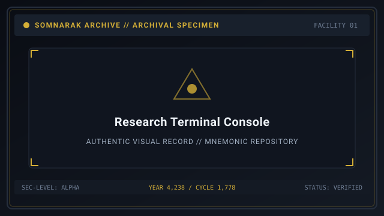
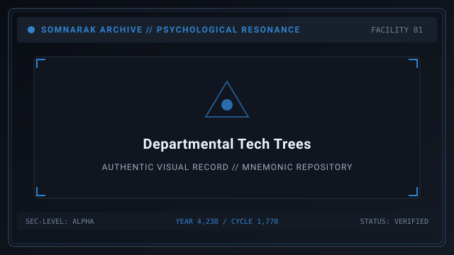

# Research

> *“Research is not idle curiosity; it is the boundary between containment and annihilation.”*

**Research**  [연구 개발]  (_Yeongu Gaebal_) represents the permanent technological and administrative advancements unlocked by the Warden within Facility 01. 

By completing departmental missions issued by the [Echo-Cores](14-Echo-Cores.md), the Directorate unlocks specialized upgrades from the nine research laboratories. These upgrades permanently enhance specialist survivability, increase [Lumen](33-Lumen.md) harvesting efficiency, and unlock advanced containment visualization.

```text
+========================================================================+
| SOMNARAK - DEPARTMENTAL RESEARCH & TECH TREES                          |
+------------------------------------------------------------------------+
| Research Authority     | Nine Departmental Laboratories                |
| Tech Tree Upgrades     | 36 Permanent Upgrades (4 Tiers per Department)|
| Upgrade Currency       | LOB Municipal Investment Credits              |
| Prerequisite Path      | Completed Operations Directives (13-Operations|
| Preservation Rule      | Retained permanently across Shift Resets      |
+========================================================================+
```

## Contents

- [1 Research Framework and LOB Investment](#1-research-framework-and-lob-investment)
- [2 The Nine Departmental Tech Trees](#2-the-nine-departmental-tech-trees)
  - [2.1 Spires Laboratory (Deployment and Logistics)](#21-spires-laboratory-deployment-and-logistics)
  - [2.2 Central Administration Laboratory (Energy and Quota)](#22-central-administration-laboratory-energy-and-quota)
  - [2.3 Maw's Keep Laboratory (Physical Armor and Barricades)](#23-maws-keep-laboratory-physical-armor-and-barricades)
  - [2.4 Extraction Hall Laboratory (Refinery and M.A.W. Crafting)](#24-extraction-hall-laboratory-refinery-and-maw-crafting)
  - [2.5 Insight Forge Laboratory (Cognitive Analysis and UI)](#25-insight-forge-laboratory-cognitive-analysis-and-ui)
  - [2.6 Border Watch Laboratory (Combat Readiness and Defense)](#26-border-watch-laboratory-combat-readiness-and-defense)
  - [2.7 Deep Vault Laboratory (Relic Stabilization and Stasis)](#27-deep-vault-laboratory-relic-stabilization-and-stasis)
  - [2.8 Shadow Corps Laboratory (Covert Security and Evasion)](#28-shadow-corps-laboratory-covert-security-and-evasion)
  - [2.9 Gate Watch Laboratory (Abyss Containment and Void Shielding)](#29-gate-watch-laboratory-abyss-containment-and-void-shielding)
- [3 Recommended Research Progression Path](#3-recommended-research-progression-path)
- [4 Permanent Retention across Mnemonic Cycles](#4-permanent-retention-across-mnemonic-cycles)
- [5 Gallery](#5-gallery)
- [6 See also](#6-see-also)

## 1 Research Framework and LOB Investment

Research upgrades are unlocked through a structured two-step process:
1. **Mission Clearance:** The Warden completes the corresponding mission issued by that floor's Echo-Core in [13-Operations.md](13-Operations.md).
2. **LOB Investment:** The unlocked technology is activated at the deployment screen using municipal LOB credits earned from daily performance evaluations.

Once unlocked, research upgrades remain active permanently and persist through shift restarts, day resets, and repository rollbacks.

## 2 The Nine Departmental Tech Trees

### 2.1 Spires Laboratory (Deployment and Logistics)
- **Tier 1 — Rapid Footwork:** Increases specialist movement speed across all corridors by +10%.
- **Tier 2 — Reinforced Uniforms:** Increases starter specialist base HP and SP by +5.
- **Tier 3 — Sidearm Calibration:** Grants all specialists a tactical sidearm dealing 3-5 🔴 Grudge damage at range.
- **Tier 4 — Rapid Deployment Hub:** Decreases specialist travel time between distant floor spires by 25%.

### 2.2 Central Administration Laboratory (Energy and Quota)
- **Tier 1 — Quota Efficiency:** Increases daily Han-Energy yield per successful work session by +5%.
- **Tier 2 — Cross-Floor Communication:** Reduces work order dispatch delay to zero latency.
- **Tier 3 — Archival Visualization:** Displays entity work success probabilities directly on the dispatch menu.
- **Tier 4 — Administrative Reserve:** Automatically retains 10% of harvested Lumen into the next shift's stockpile.

### 2.3 Maw's Keep Laboratory (Physical Armor and Barricades)
- **Tier 1 — Heavy Bulkheads:** Increases containment cell blast door resistance, delaying entity escape by 5 seconds.
- **Tier 2 — Iron Weaving:** Increases physical 🔴 Grudge resistance across all M.A.W. Suits by +0.1.
- **Tier 3 — Hydraulic Clamps:** Lowers the breach probability of heavy brute entities by 20%.
- **Tier 4 — Fortified Enclave:** Restores 10 HP to all specialists whenever an Ordeal is successfully suppressed.

### 2.4 Extraction Hall Laboratory (Refinery and M.A.W. Crafting)
- **Tier 1 — Crystal Distillation:** Increases Mnemonic Well extraction speed by 15%.
- **Tier 2 — Enhanced Weaving:** Reduces M.A.W. Weapon and Suit fabrication cost by 20% Lumen.
- **Tier 3 — Duplication Catalyst:** Increases the maximum stockpile limit of all M.A.W. equipment by +1.
- **Tier 4 — Overcharge Core:** Harvesting beyond 100% quota grants double bonus LOB points at shift evaluation.

### 2.5 Insight Forge Laboratory (Cognitive Analysis and UI)
- **Tier 1 — Visual Calibration:** Displays entity mood and current Mugenhan counter on the floor HUD.
- **Tier 2 — Behavioral Decoding:** Speeds up observation log unlocking by 50% fewer required work sessions.
- **Tier 3 — Cognitive Shielding:** Reduces specialist SP loss from fear checks by 30%.
- **Tier 4 — Total Omniscience:** Highlights entity weak points during combat, increasing damage dealt by +15%.

### 2.6 Border Watch Laboratory (Combat Readiness and Defense)
- **Tier 1 — Rapid Assembly:** Specialists muster to rally beacons 20% faster when combat is declared.
- **Tier 2 — Arm-Blade Hardening:** Increases all melee weapon damage dealt by +10%.
- **Tier 3 — Tactical Perimeter:** Specialists stationed in Border Watch hallways take 15% reduced damage from Ordeals.
- **Tier 4 — Vow of Retaliation:** When a specialist falls, nearby squadmates gain a temporary 50% attack speed buff.

### 2.7 Deep Vault Laboratory (Relic Stabilization and Stasis)
- **Tier 1 — Relic Dampening:** Reduces physiological strain from using Tool Relics by 25%.
- **Tier 2 — Stasis Preservation:** Extends safe channeling duration inside [29-The Crucible](29-The%20Crucible.md) by 10 seconds.
- **Tier 3 — Memory Lens:** Equippable relics like [30-The Debt Scale](30-The%20Debt%20Scale.md) emit an ambient SP healing aura to adjacent rooms.
- **Tier 4 — Temporal Ward:** Neutralizes temporal dilation hazards during Deep Vault meltdowns.

### 2.8 Shadow Corps Laboratory (Covert Security and Evasion)
- **Tier 1 — Silent Step:** Specialists move past agitated containment cells without triggering fear checks.
- **Tier 2 — Reflex Conditioning:** Increases specialist evasion rate against physical attacks by +10%.
- **Tier 3 — Ambush Protocol:** Attacks against escaping entities from behind inflict +25% critical strike damage.
- **Tier 4 — Null Shroud:** Prevents breaching entities from targeting auxiliaries during their initial 15 seconds of escape.

### 2.9 Gate Watch Laboratory (Abyss Containment and Void Shielding)
- **Tier 1 — Abyssal Wards:** Increases resistance against ⚪ Void damage across all suits by +0.15.
- **Tier 2 — Mind Anchor:** Increases specialist maximum SP threshold before entering panic by +15.
- **Tier 3 — Sovereign Restraint:** Extends the suppression stagger window on Rank V Sovereign entities by 3 seconds.
- **Tier 4 — Final Bastion:** The facility can endure one catastrophic breach without triggering immediate Game Over.

## 3 Recommended Research Progression Path

1. **Early Days (Days 1–10):** Prioritize Spires *Rapid Footwork* and Insight Forge *Visual Calibration* to maximize operational speed and UI clarity.
2. **Mid Days (Days 11–25):** Focus on Extraction Hall *Duplication Catalyst* and Central Admin *Archival Visualization* to mass-produce elite gear.
3. **Late Days (Days 26–50):** Maximize Gate Watch *Abyssal Wards* and Maw's Keep *Fortified Enclave* to survive Tide Watch Ordeals and Sovereign meltdowns.

## 4 Permanent Retention across Mnemonic Cycles

All researched technologies are permanently stamped into the facility's master memory core:
- Restarting a shift or rolling back to a Memory Repository checkpoint never wipes research upgrades.
- This cumulative progression ensures that even failed runs contribute permanently to ultimate facility stabilization.

## 5 Gallery

[](images/research-terminal-console.svg)
[](images/departmental-tech-trees.svg)
[](images/upgraded-specialist-squad.svg)

*Left: research laboratory upgrade console; Center: departmental tech tree; Right: fully researched squad.*
---

## 6 See also

- [13-Operations](13-Operations.md) — departmental missions required to unlock research
- [14-Echo-Cores](14-Echo-Cores.md) — director profiles and lab heads
- [09-M.A.W. Equipment](09-M.A.W.%20Equipment.md) — equipment armory enhanced by research
- [22-Departments](22-Departments.md) — department layouts and facility floors
