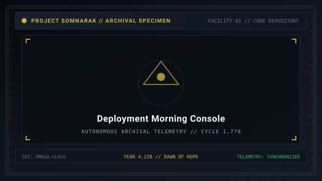
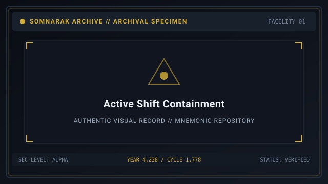
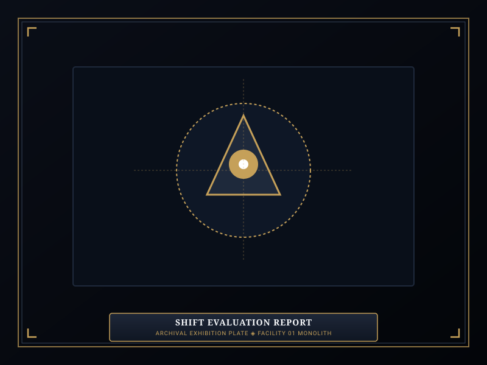

# Daily Cycle

> *“Every morning begins with an empty gauge; every evening ends with a tally of the living and the unraveled.”*

The **Daily Cycle**  [일일 주기]  (_Iril Jugi_) defines the core gameplay loop and operational progression of Facility 01. 

A single operational day represents a complete shift under the Warden's command, divided into four distinct phases: morning preparation, routine containment work, escalating crisis management, and end-of-day evaluation. Within the facility's lore, this shift was repeated **1,778 times** across six external years (Years 4,232 to 4,238) to harvest the supercritical Han-energy required for the Absolvohan engine.

```text
+========================================================================+
| SOMNARAK - OPERATIONAL SHIFT & DAILY CYCLE                             |
+------------------------------------------------------------------------+
| Cycle Architecture     | Four Phased Operational Day (Morning to Night)|
| Core Phases            | Muster - Containment & Extraction - Meltdowns |
| Time Loop Anchor       | 1,778 Mnemonic Cycles (Years 4,232 to 4,238)  |
| Hourly Schedule        | 08:00 Muster -> 12:00 Meltdowns -> 18:00 Evalu|
| Checkpoint System      | Memory Repository stamped every 5th Day       |
+========================================================================+
```

## Contents

- [1 Anatomy of an Operational Shift](#1-anatomy-of-an-operational-shift)
- [2 Phase 1: Morning Deployment and Specialist Muster](#2-phase-1-morning-deployment-and-specialist-muster)
- [3 Phase 2: Routine Containment and Energy Extraction](#3-phase-2-routine-containment-and-energy-extraction)
- [4 Phase 3: Mugenhan Overload and Ordeal Incursions](#4-phase-3-mugenhan-overload-and-ordeal-incursions)
- [5 Phase 4: Shift Evaluation and Checkpoint Repository](#5-phase-4-shift-evaluation-and-checkpoint-repository)
- [6 Hourly Operational Shift Chronology (08:00 to 18:00)](#6-hourly-operational-shift-chronology-0800-to-1800)
- [7 Memory Repository Checkpoint and Rollback Rules](#7-memory-repository-checkpoint-and-rollback-rules)
- [8 The 1,778 Mnemonic Cycles of Facility 01](#8-the-1778-mnemonic-cycles-of-facility-01)
- [9 Gallery](#9-gallery)
- [10 See also](#10-see-also)

## 1 Anatomy of an Operational Shift

Each operational shift challenges the Warden to balance energy harvesting against personnel attrition:
- **Daily Lumen Quota:** The facility must collect a specified amount of [Lumen](33-Lumen.md) energy before the shift can be formally concluded.
- **The Escalation Clock:** Every work assignment executed advances the **Mugenhan Meltdown Gauge**, inevitably triggering cell overloads and hostile [Ordeals](10-Ordeals.md).
- **Shift Termination:** Once 100% quota is gathered, the Warden can end the day immediately or remain on shift to overcharge energy and complete lingering missions.

## 2 Phase 1: Morning Deployment and Specialist Muster

Before the facility gates unlock, the Warden plans the day at the deployment console:
1. **Recruitment & Training:** Spend LOB credits to recruit new [Specialists](12-Specialists.md) or enhance primary attributes (Resilience, Clarity, Composure, Resolve).
2. **Armament Distribution:** Equip weapons and suits from the [M.A.W. Equipment](09-M.A.W.%20Equipment.md) armory, balancing squad elemental defenses.
3. **Departmental Stationing:** Assign specialists to specific departmental Main Rooms to defend against localized breaches.

## 3 Phase 2: Routine Containment and Energy Extraction

Once the shift starts, the Warden dispatches operatives into containment chambers:
- Choose from four protocols: 👁 **Viderehan**, 🤲 **Ferrehan**, 💧 **Flerehan**, or ⚔ **Pugnahan**.
- Operatives enter the cell and undergo a timed work session.
- Success yields positive Han-Energy (Lumen Units), filling the daily quota gauge.
- Failure inflicts elemental damage and produces Fracture boxes, risking operative death or panic.

## 4 Phase 3: Mugenhan Overload and Ordeal Incursions

As work accumulates, the facility destabilizes:
- **Meltdown Overloads:** The [Containment Levels](18-Containment%20Levels.md) gauge reaches thresholds (Levels 1 to 10), placing 60-second countdown glyphs on random cells. Unworked cells suffer Lumen loss and counter drops.
- **Ordeal Incursions:** At designated meltdown levels, hostile non-containment entities invade corridors across four Watches (First/Dawn, Second/Noon, Third/Dusk, Tide/Midnight).
- Wardens must scramble combat squads to suppress incursions while simultaneously maintaining containment protocols.

## 5 Phase 4: Shift Evaluation and Checkpoint Repository

Once quota is satisfied and threats are subdued, the shift concludes:
- **Evaluation Grade:** The Directorate grades the shift (S, A, B, C, F) based on auxiliary casualties, specialist deaths, and containment breaches.
- **LOB Award:** High grades grant municipal LOB credits to fund future recruitment and research.
- **Specialist Promotion:** Operatives who performed successful work earn promotions, unlocking higher ranks (Rank I to Rank V).

## 6 Hourly Operational Shift Chronology (08:00 to 18:00)

| Shift Hour | In-Universe Operational Milestone | Tactical Field Activity |
|---|---|---|
| **08:00 – 09:00** | Shift Commencement & Roll Call | Gear inspection; initial rookie training works. |
| **09:00 – 11:30** | Morning Extraction Surge | Routine harvesting; initial 50% quota accumulated. |
| **11:30 – 12:30** | Midday Meltdown Peak | Meltdown Level III; First Watch Ordeal appears. |
| **12:30 – 15:00** | Afternoon High-Risk Works | Fragment and Wail containment; Second Watch. |
| **15:00 – 16:30** | Late Shift Critical Strain | Meltdown Level VI; Third Watch Ordeals in corridors. |
| **16:30 – 17:30** | Overcharge & Quota Clearance | Emergency override unlocked; Tide Watch hazard. |
| **17:30 – 18:00** | Shift Conclusion & Debrief | Lockdown verification; LOB calculation and promotions. |

## 7 Memory Repository Checkpoint and Rollback Rules

Every 5th day (Days 1, 6, 11, 16, 21, 26, 31, 36, 41, 46), the facility stamps a hard checkpoint:
- **What is Retained on Rollback:** Unlocked observation logs, completed research upgrades, and unlocked M.A.W. equipment blueprints are permanently preserved.
- **What is Reset:** Specialist rosters, current day calendar, and equipped gear return to the exact state recorded on the repository day.
- **Tactical Utility:** Allows Wardens to safely research deadly Sovereign entities, absorb casualties for science, and roll back cleanly with full knowledge.

## 8 The 1,778 Mnemonic Cycles of Facility 01

Beneath the operational shift lies the canonical time loop:
- Facility 01 operated in a closed temporal loop lasting 1,778 cycles between Years 4,232 and 4,238.
- Each 365-day cycle distilled 0.02 tons of crystalline Han.
- At Cycle 1,778, the accumulated crystal mass achieved supercritical resonance, triggering the historic Dawn of Hope.

## 9 Gallery

[](images/deployment-morning-console.svg)
[](images/active-shift-containment.svg)
[](images/shift-evaluation-report.svg)

*Left: deployment screen; Center: real-time shift floor; Right: end-of-day evaluation screen.*
---

## 10 See also

- [18-Containment Levels](18-Containment%20Levels.md) — meltdown levels and overload timers
- [19-Lumen Surge](19-Lumen%20Surge.md) — energy harvesting and overcharging
- [10-Ordeals](10-Ordeals.md) — timed incursion events across the four watches
- [12-Specialists](12-Specialists.md) — operative management, training, and ranks
