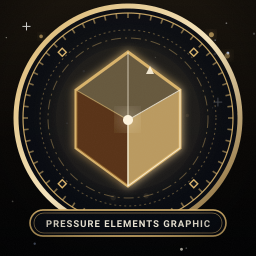
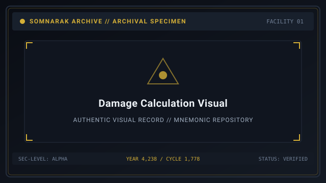
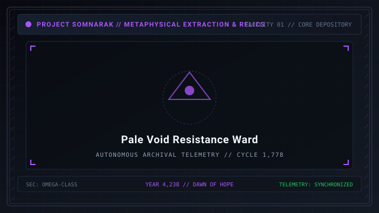

# Pressure Types

> *“Flesh burns under Grudge; the mind drowns in Lament; existence dissolves in Void; the soul is crushed under Weight.”*

**Pressure Types**  [압력 유형]  (_Amnyeok Yuhyeong_) define the elemental and metaphysical damage physics governing all containment interactions, entity attacks, and combat clashes in [[SOMNARAK-WORLD](https://github.com/Redditor008/PROJECT.SOMNARAK-WIKI/tree/arena/01a0b699-project-somnarak-wiki/SOMNARAK-WORLD "SOMNARAK-WORLD")].

Rather than relying on generic physical injury, damage in Somnarak is classified into **Four Fundamental Pressures**: 🔴 **Grudge**, 🔵 **Lament**, ⚪ **Void**, and ⚫ **Weight**. Each pressure targets a different physiological or psychological layer of the human body, demanding precise defensive preparation.

```text
+========================================================================+
| SOMNARAK - PRESSURE AND DAMAGE PHYSICS                                 |
+------------------------------------------------------------------------+
| Fundamental Pressures  | Grudge (Red) - Lament (Blue) - Void - Weight  |
| Targeted Vital Gauges  | Health (HP) - Sanity (SP) - Max Vitality      |
| Multiplier Bands       | Ineffective (<0.5) - Endured - Normal - Fatal |
| Special Mechanics      | Pale Conceptual Scaling (1% Void = 5% Max HP) |
| Mixed Pressure Rule    | Weight damages both HP and SP simultaneously  |
+========================================================================+
```

## Contents

- [1 The Four Elemental Pressures](#1-the-four-elemental-pressures)
  - [1.1 Grudge (Red Pressure)](#11-grudge-red-pressure)
  - [1.2 Lament (Blue Pressure)](#12-lament-blue-pressure)
  - [1.3 Void (Pale White Pressure)](#13-void-pale-white-pressure)
  - [1.4 Weight (Black Pressure)](#14-weight-black-pressure)
- [2 Resistance Multipliers and Defense Formula](#2-resistance-multipliers-and-defense-formula)
- [3 Pale Conceptual Scaling: The One Percent Axiom](#3-pale-conceptual-scaling-the-one-percent-axiom)
- [4 Mixed Damage and Dual-Gauge Depletion](#4-mixed-damage-and-dual-gauge-depletion)
- [5 Gallery](#5-gallery)
- [6 See also](#6-see-also)

## 1 The Four Elemental Pressures

Every attack dealt by a [Sorrow Entity](07-Sorrow%20Entities.md), [Ordeal](10-Ordeals.md), or [M.A.W. Weapon](09-M.A.W.%20Equipment.md) belongs to one of four elemental pressures:

### 1.1 Grudge (Red Pressure)
- **Korean Term:** 원한 (  원한  , *Wonhan*)
- **Target Gauge:** Directly depletes the operative's **Health Points (HP)**.
- **Physical Manifestation:** Kinetic trauma, thermal burns, lacerations, and crushing impact. If an operative's HP drops to zero, they suffer physical death.
- **Primary Sources:** Melee beasts, slashing blades, thermal furnaces (such as [29-The Crucible](29-The%20Crucible.md)), and GREY Ordeals.

### 1.2 Lament (Blue Pressure)
- **Korean Term:** 비탄 (  비탄  , *Bitan*)
- **Target Gauge:** Directly depletes the operative's **Sanity Points (SP)**.
- **Psychological Manifestation:** Auditory hallucinations, depressive weeping, existential despair, and sensory distortion. If SP reaches zero, the operative suffers a [Panic State](12-Specialists.md).
- **Primary Sources:** Acoustic instruments, wailing phantoms, and BLUE Ordeals.

### 1.3 Void (Pale White Pressure)
- **Korean Term:** 공허 (  공허  , *Gongheo*)
- **Target Gauge:** Scales conceptually against **Maximum Vital Health (Max HP)**.
- **Metaphysical Manifestation:** Erasure of historical memory, spiritual detachment, and structural unraveling.
- **Primary Sources:** Sovereign horrors, pale executioners, PALE Ordeals, and [27-The Debt Eater](27-The%20Debt%20Eater.md).

### 1.4 Weight (Black Pressure)
- **Korean Term:** 비중 (  비중  , *Bijung*)
- **Target Gauge:** Simultaneously damages **both HP and SP** in equal measure.
- **Gravitational Manifestation:** Crushing mass, suffocating gravity, and structural collapse. A single strike dealing 10 Weight damage subtracts 10 HP and 10 SP at once.
- **Primary Sources:** Colossal stone monoliths, tectonic ruptures, and BLACK Ordeals.

## 2 Resistance Multipliers and Defense Formula

The amount of damage an operative suffers when struck is determined by the **Resistance Multiplier** of their equipped M.A.W. Suit:

The standard damage formula applies:
`Damage Taken = Base Damage × Suit Resistance Multiplier`

### Standard Multiplier Bands

| Multiplier Value | Defense Classification | Practical Field Meaning |
|---|---|---|
| **0.0 to 0.4** | **Ineffective (Resistant)** | Exceptional protection. Attacks deal scratch damage. |
| **0.5 to 0.7** | **Endured** | Solid defensive rating. Recommended for frontline suppressors. |
| **0.8 to 1.2** | **Normal** | Standard baseline. Prolonged exposure causes gradual attrition. |
| **1.3 to 1.5** | **Vulnerable** | High hazard. Incoming damage is amplified by up to 50%. |
| **1.6 to 2.0+** | **Exposed** | Lethal vulnerability. Operative can suffer instant death from critical hits. |

## 3 Pale Conceptual Scaling: The One Percent Axiom

The most dangerous mechanic in Somnarak combat physics is **Pale Conceptual Scaling**:
- Unlike 🔴 **Grudge** or 🔵 **Lament**, which subtract flat numerical values, ⚪ **Void** damage calculates percentage-based erosion.
- **The Axiom:** Every 1 point of raw ⚪ **Void** damage inflicts **5% of the target's total Maximum HP**.
- Therefore, a strike dealing 20 points of unmitigated ⚪ **Void** damage strips exactly 100% of an operative's health, resulting in instantaneous death regardless of whether the operative has 50 HP or 500 HP.
- Consequently, high-tier specialists are just as vulnerable to ⚪ **Void** attacks as novice recruits unless equipped with specialized suits (such as *Debt Shroud* from [27-The Debt Eater](27-The%20Debt%20Eater.md)) or equippable protective wards (such as [30-The Debt Scale](30-The%20Debt%20Scale.md)).

## 4 Mixed Damage and Dual-Gauge Depletion

⚫ **Weight** (Black Pressure) represents a composite threat:
- Because it drains both vital health and psychological sanity simultaneously, operatives facing ⚫ **Weight** entities face twin collapse vectors.
- An operative with high physical HP but low mental Clarity will panic from ⚫ **Weight** attacks long before their physical armor fails.
- Effective suppression of ⚫ **Weight** threats requires equipping gear with balanced dual-resistance across both physical and mental spectra.

## 5 Gallery

[](images/pressure-elements-graphic.svg)
[](images/damage-calculation-visual.svg)
[](images/pale-void-resistance-ward.svg)

*Left: icons of the four fundamental pressures; Center: resistance multiplier formula; Right: Void protective warding.*
---

## 6 See also

- [09-M.A.W. Equipment](09-M.A.W.%20Equipment.md) — weapon damage values and suit resistance tables
- [12-Specialists](12-Specialists.md) — specialist stats, health pools, and panic states
- [10-Ordeals](10-Ordeals.md) — elemental incursion threats across the five colors
- [27-The Debt Eater](27-The%20Debt%20Eater.md) — specimen dossier: Void pressure specialist
