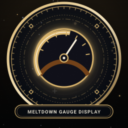
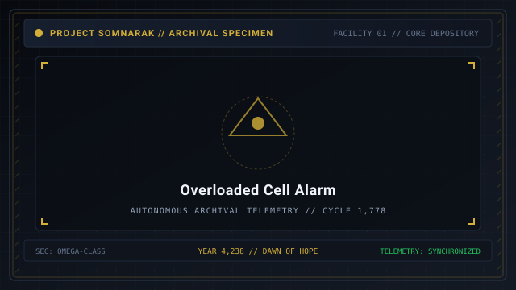
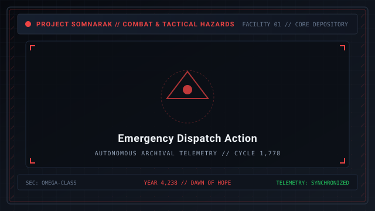

# Containment Levels

> *“The gauge does not measure time; it measures the facility's patience running out.”*

**Containment Levels**  [격리 과부하 등급]  (_Gyeokri Gwabuha Deunggeup_), commonly referred to as **Mugenhan Meltdown Levels**, represent the facility-wide stability gauge that escalates throughout an operational shift.

Every time a specialist completes a work session with a [Sorrow Entity](07-Sorrow%20Entities.md), the meltdown gauge fills by one segment. When the gauge fills completely, the facility advances to the next Meltdown Level, triggering random containment cell overloads and summoning hazardous [Ordeals](10-Ordeals.md).

```text
+========================================================================+
| SOMNARAK - CONTAINMENT & MELTDOWN LEVELS                               |
+------------------------------------------------------------------------+
| Overload Scale         | Meltdown Level I to Level X (10 Tier Gauge)   |
| Advance Mechanism      | Fills by 1 segment per completed work session |
| Hazard State           | Random Cell Overloads with 60-Second Timers   |
| Failure Penalty        | Lumen Drain & Entity Escape Counter Reduction |
| Ordeal Correlation     | First (Level II-III) - Second - Third - Tide  |
+========================================================================+
```

## Contents

- [1 The Meltdown Escalation Gauge](#1-the-meltdown-escalation-gauge)
- [2 Work Segments and Gauge Scaling by Facility Size](#2-work-segments-and-gauge-scaling-by-facility-size)
- [3 Meltdown Levels 1 through 10 Breakdown](#3-meltdown-levels-1-through-10-breakdown)
- [4 Cell Overload Mechanics and 60-Second Timers](#4-cell-overload-mechanics-and-60-second-timers)
- [5 Overload Mitigation and Dispatch Prioritization](#5-overload-mitigation-and-dispatch-prioritization)
- [6 Sacrificial Clearance Under Extreme Duress](#6-sacrificial-clearance-under-extreme-duress)
- [7 Interaction with Ordeal Incursions](#7-interaction-with-ordeal-incursions)
- [8 Gallery](#8-gallery)
- [9 See also](#9-see-also)

## 1 The Meltdown Escalation Gauge

The Meltdown Gauge is prominently displayed at the top of the Warden's HUD:
- **Work Segments:** The gauge requires a specific number of completed work sessions to advance (typically 4 to 8 works per level depending on facility size).
- **Escalating Pressure:** With each higher meltdown level, the number of simultaneous containment cell overloads increases.
- **Relic Exemption:** Tool Relics utilizing the Two-Work-Type Rule (such as [28-The Echo Compass](28-The%20Echo%20Compass.md)) do not generate meltdown overloads, though working with them still advances the gauge.

## 2 Work Segments and Gauge Scaling by Facility Size

The number of work sessions required to fill a single meltdown level scales with unlocked departments:

| Unlocked Departments | Works per Meltdown Level | Average Level Duration | Tactical Dynamic |
|---|---|---|---|
| **1 – 2 Departments (Upper)** | 4 Works | ~3 Minutes | Fast rotation; manageable overloads. |
| **3 – 5 Departments (Middle)** | 5 Works | ~4 Minutes | Balanced pacing; squad staging required. |
| **6 – 7 Departments (Deep)** | 6 Works | ~5 Minutes | High strain; multi-floor travel times. |
| **8 – 9 Departments (Full)** | 7 – 8 Works | ~6 Minutes | Massive scale; 8+ simultaneous cell alarms. |

## 3 Meltdown Levels 1 through 10 Breakdown

| Meltdown Level | Overloaded Cells | Triggered Ordeal Event | Operational Threat Level |
|---|---|---|---|
| **Level I** | 1 Cell | None | Negligible; routine orientation. |
| **Level II** | 2 Cells | First Watch Ordeal | Low; minor corridor pests. |
| **Level III** | 3 Cells | None (or Dawn on late days) | Moderate; cell management required. |
| **Level IV** | 4 Cells | Second Watch Ordeal | High; combat squads required. |
| **Level V** | 5 Cells | None | Substantial; multiple cell alarms. |
| **Level VI** | 6 Cells | Third Watch Ordeal | Critical; multi-floor breaches possible. |
| **Level VII** | 7 Cells | None | Extreme; facility near boiling point. |
| **Level VIII** | 8 Cells | Tide Watch Ordeal | Lethal; existential crisis. |
| **Level IX** | 9 Cells | Simultaneous Multi-Breaches | Catastrophic; absolute lockdown. |
| **Level X** | 10+ Cells | Total Resonance Collapse | Terminal; facility-wide cascade breach. |

## 4 Cell Overload Mechanics and 60-Second Timers

When a meltdown level triggers, crimson overload glyphs attach to random containment chambers:
1. **The 60-Second Countdown:** A glowing red timer begins ticking down from 60 seconds above the overloaded cell.
2. **Required Action:** The Warden must order a specialist into the cell before the timer expires. The moment an operative enters the chamber, the overload is cleared.
3. **Failure Penalty:** If the timer reaches zero:
   - A substantial chunk of harvested [Lumen](33-Lumen.md) energy evaporates instantly (15% to 25% of current pool).
   - The entity's **Mugenhan Escape Counter** is reduced by 1. If reduced to zero, the entity immediately breaches into the hallways.

## 5 Overload Mitigation and Dispatch Prioritization

Experienced Wardens employ several tactical doctrines to mitigate overload risks:
- **Clustered Dispatch:** Group specialists near high-risk containment cells prior to triggering the final work session that advances the meltdown gauge.
- **Work-Type Compatibility:** When clearing an overload on dangerous entities, choose the protocol with the highest success rate to prevent secondary agitation.
- **Staging in Hallways:** Station reserve operatives in hallway intersections directly between adjacent departments.

## 6 Sacrificial Clearance Under Extreme Duress

When multiple high-risk cells overload simultaneously and qualified veteran specialists are unavailable:
- **Sacrificial Clearance:** Dispatching an expendable recruit into a Sovereign or Wail chamber resets the 60-second timer instantly upon door ingress.
- Even if the recruit perishes inside from negative energy ticks, resetting the timer preserves 25% of facility Lumen and prevents a devastating hallway breach.

## 7 Interaction with Ordeal Incursions

Meltdown levels serve as the heralds for Ordeal incursions:
- Instead of random cell overloads, specific milestone levels (II/IV/VI/VIII) replace or supplement overloads with sudden Ordeal invasions.
- Wardens must quickly decide whether to dispatch personnel to clear ticking cell timers or concentrate firepower on roaming Ordeal monoliths.

## 8 Gallery

[](images/meltdown-gauge-display.svg)
[](images/overloaded-cell-alarm.svg)
[](images/emergency-dispatch-action.svg)

*Left: meltdown HUD gauge; Center: 60-second overload warning glyph; Right: emergency response dispatch.*
---

## 9 See also

- [16-Daily Cycle](16-Daily%20Cycle.md) — operational shift architecture and daily phases
- [10-Ordeals](10-Ordeals.md) — timed incursion events across the four watches
- [19-Lumen Surge](19-Lumen%20Surge.md) — energy harvesting and quota loss penalties
- [21-Game Mechanics](21-Game%20Mechanics.md) — core facility game loop
