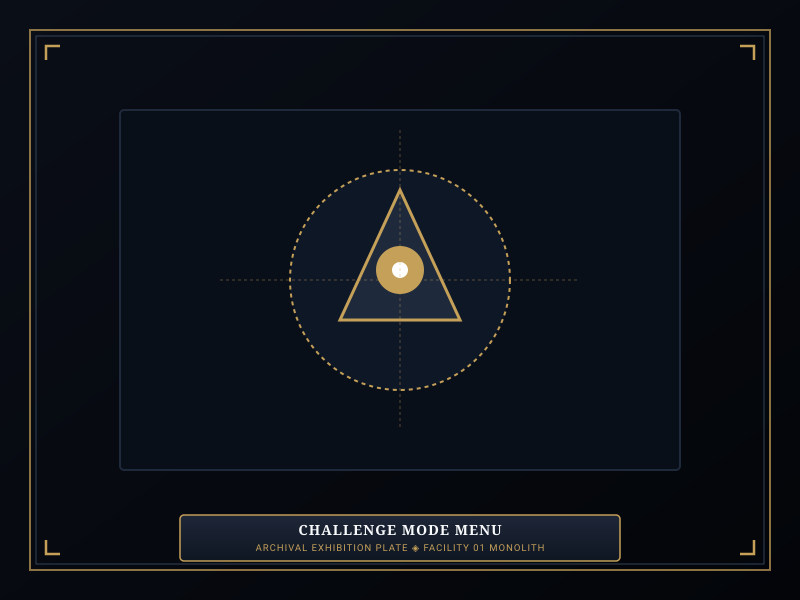
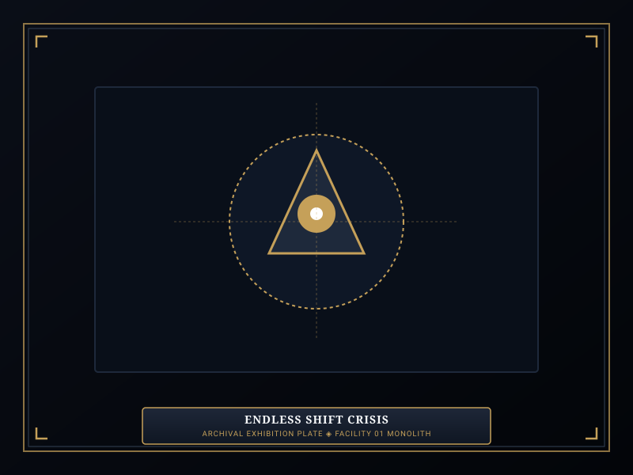
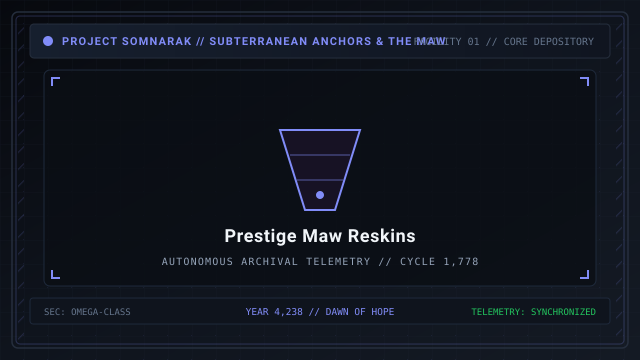

# Challenge Mode

> *“When routine containment becomes trivial, the Directorate introduces the true crucible.”*

**Challenge Mode**  [도전 모드]  (_Dojeon Mode_) represents the high-difficulty endgame simulation suite unlocked after completing the primary operational campaign of Facility 01.

Designed for veteran Wardens seeking ultimate tactical mastery, Challenge Mode strips away safety nets, introduces punishing environmental modifiers, and offers endless containment trials where the facility must survive escalating waves of high-risk [Sorrow Entities](07-Sorrow%20Entities.md) and [Ordeals](10-Ordeals.md).

```text
+========================================================================+
| SOMNARAK - OPERATIONAL CHALLENGE MODE                                  |
+------------------------------------------------------------------------+
| Mode Designation       | Post-Campaign Tactical Gauntlet & Trials      |
| Core Modifiers         | 12 Tactical Modifiers (Blind, Brittle, Swarm) |
| Trial Variants         | Endless Containment - Director Rematches      |
| Wave Progression       | Waves 1 to 20+ with Multi-Sovereign Incursions|
| Prestige Rewards       | Cosmetic M.A.W. Reskins & Veteran Badges      |
+========================================================================+
```

## Contents

- [1 Unlocking and Operational Scope](#1-unlocking-and-operational-scope)
- [2 The Twelve Tactical Modifiers](#2-the-twelve-tactical-modifiers)
- [3 Endless Containment: The Wave Progression Matrix](#3-endless-containment-the-wave-progression-matrix)
- [4 Director Rematch Trials: Dual Realizations](#4-director-rematch-trials-dual-realizations)
- [5 Scoring, Leaderboards, and Prestige Rewards](#5-scoring-leaderboards-and-prestige-rewards)
- [6 Gallery](#6-gallery)
- [7 See also](#7-see-also)

## 1 Unlocking and Operational Scope

Challenge Mode is unlocked upon stabilizing all nine departments and completing the final Day 50 campaign threshold:
- **Independent Save State:** Challenge shifts do not affect the main campaign progression or risk permanent loss of primary campaign gear.
- **Full Armory Access:** Wardens may assemble squads using any [M.A.W. Equipment](09-M.A.W.%20Equipment.md) researched throughout the campaign.
- **Customizable Difficulty:** Players can activate multiple stacked modifiers to dramatically increase score multipliers.

## 2 The Twelve Tactical Modifiers

Wardens can customize trials by enabling up to 12 distinct modifiers:

| Modifier Name | In-Game Effect | Score Bonus |
|---|---|---|
| **Blind Warden** | Obscures containment cell cameras, health bars, and meltdown timers. | +25% |
| **Brittle Flesh** | Incoming elemental damage to specialists increased by 50%. | +30% |
| **Accelerated Meltdown** | Cell overload timers tick down in 30 seconds rather than 60. | +20% |
| **Hyper-Velocity** | Simulation speed locked to 1.5x minimum; pause disabled. | +35% |
| **Hollow Armory** | Duplicate M.A.W. weapons prohibited; unique loadouts required. | +20% |
| **Sovereign Swarm** | Guarantees at least 3 Rank V Sovereign breaches during shift. | +40% |
| **Fragile Minds** | Operative maximum Sanity Points (SP) reduced by 30%. | +25% |
| **Starved Generators** | Healing Generators restore 0 HP/SP during active combat alerts. | +25% |
| **Ruptured Bulkheads** | Corridors have zero blast doors; entities move 50% faster. | +30% |
| **Ironbound Protocol** | Work can only be assigned once per entity per meltdown level. | +20% |
| **Auditory Static** | Warning sirens muted; alarms provide zero visual notification. | +15% |
| **Absolute Vacuum** | Pale ⚪ Void damage inflicts 10% Max HP per tick instead of 5%. | +50% |

## 3 Endless Containment: The Wave Progression Matrix

In **Endless Containment**, the quota gauge has no upper ceiling:
- The shift continues indefinitely until all deployed specialists are eliminated.
- Meltdown levels escalate beyond Level X into uncharted crisis tiers:

| Wave Interval | Meltdown Scale | Incursion Event | Escalating Hazard |
|---|---|---|---|
| **Waves 1 – 5** | Levels I – V | First & Second Watch Ordeals | Routine warm-up; standard cell overloads. |
| **Waves 6 – 10** | Levels VI – X | Third & Tide Watch Ordeals | High-tier Fragments breach; multi-wing combat. |
| **Waves 11 – 15** | Levels XI – XV | Back-to-Back Tide Incursions | Wail entities break containment; auxiliary wipeout. |
| **Waves 16 – 20+** | Levels XVI – XX | Simultaneous Dual Sovereigns | Absolute chaos; requires flawless shield cycling. |

## 4 Director Rematch Trials: Dual Realizations

Challenge Mode allows Wardens to re-engage the nine [Echo-Cores](14-Echo-Cores.md) in intensified boss trials:
- **Dual Meltdowns:** Fight two Echo-Cores simultaneously with combined handicaps (e.g., Majin's *Command Scramble* paired with Mellda's roaming combat form *The Red Hunt*).
- **Strict Time Limits:** Complete Stratum Realizations within strict real-time countdown limits under threat of instant facility detonation.

## 5 Scoring, Leaderboards, and Prestige Rewards

Completing Challenge Mode trials awards prestige recognition:
- **Mastery Badges:** Stamped directly onto the Warden's service record.
- **Cosmetic M.A.W. Reskins:** Unlocks ornate gold, obsidian, and glowing variants of classic suits and weapons.
- **Tactical Titles:** Unlocks prestigious titles for deployed specialist veterans (e.g., *Abyssal Vanguard*, *The Untouched*).

## 6 Gallery

[](images/challenge-mode-menu.svg)
[](images/endless-shift-crisis.svg)
[](images/prestige-maw-reskins.svg)

*Left: challenge modifier selection menu; Center: endless crisis floor; Right: prestige M.A.W. cosmetics.*
---

## 7 See also

- [11-Reverberations](11-Reverberations.md) — campaign stratum realizations and core realizations
- [16-Daily Cycle](16-Daily%20Cycle.md) — standard shift mechanics and phases
- [09-M.A.W. Equipment](09-M.A.W.%20Equipment.md) — weapons and armors used in challenge trials
- [21-Game Mechanics](21-Game%20Mechanics.md) — core mechanical formulas and systems
