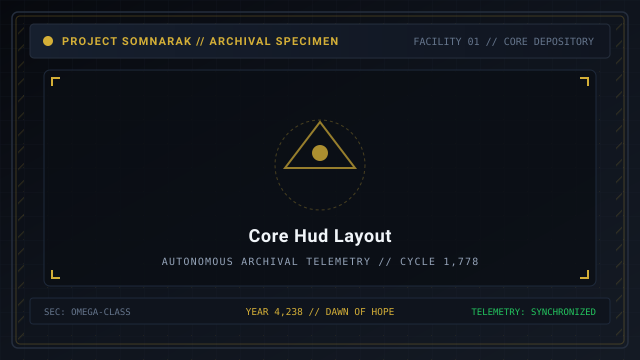
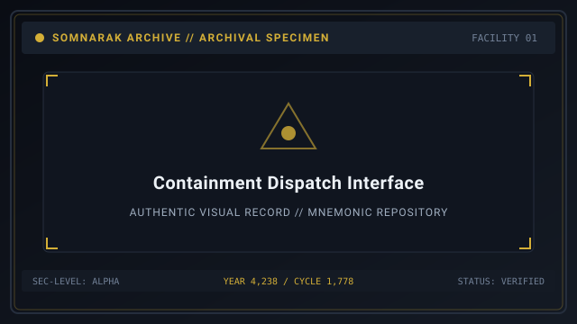
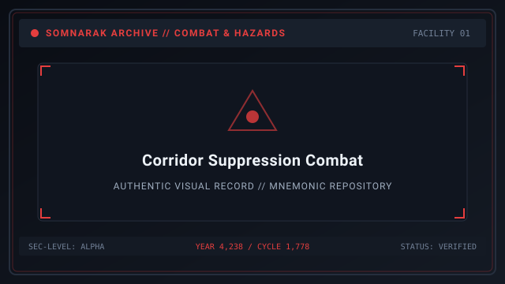

# Game Mechanics

> *“Master the four protocols, understand the four pressures, or watch your facility burn in thirty seconds.”*

**Game Mechanics**  [게임 시스템]  (_Geim Siseutem_) encompasses the foundational rules, mathematical formulas, and simulation loops that govern [[SOMNARAK-WORLD](https://github.com/Redditor008/PROJECT.SOMNARAK-WIKI/tree/arena/01a0b699-project-somnarak-wiki/SOMNARAK-WORLD "SOMNARAK-WORLD")].

As the Warden of Facility 01, the player oversees a complex management simulation: dispatching specialists into containment cells, harvesting [Lumen](33-Lumen.md) energy, subduing hostile [Ordeals](10-Ordeals.md), crafting [M.A.W. Equipment](09-M.A.W.%20Equipment.md), and navigating the psychological trauma of nine distinct departments.

```text
+========================================================================+
| SOMNARAK - CORE GAME MECHANICS & ARCHITECTURE                          |
+------------------------------------------------------------------------+
| Core Systems Hub       | Shift Management - Containment - Combat - Grow|
| Work Protocols         | Viderehan - Ferrehan - Flerehan - Pugnahan    |
| Damage Pressures       | Grudge - Lament - Void - Weight               |
| Vital Gauges           | Health Points (HP) - Sanity Points (SP)       |
| Failure States         | Specialist Death - Panic States - Facility Col|
+========================================================================+
```

## Contents

- [1 Core Architectural Loop](#1-core-architectural-loop)
- [2 The Four Containment Protocols](#2-the-four-containment-protocols)
- [3 The Complete Work Success Rate Formula](#3-the-complete-work-success-rate-formula)
- [4 Combat Clashes and Real-Time Suppression](#4-combat-clashes-and-real-time-suppression)
- [5 Mental Trauma, Dread Levels, and Panic Resolution](#5-mental-trauma-dread-levels-and-panic-resolution)
- [6 Facility Collapse and Game Over Conditions](#6-facility-collapse-and-game-over-conditions)
- [7 Strategic Advice for New Wardens](#7-strategic-advice-for-new-wardens)
- [8 Gallery](#8-gallery)
- [9 See also](#9-see-also)

## 1 Core Architectural Loop

Gameplay proceeds in a continuous loop across four interlocking layers:
1. **Strategic Deployment:** Recruit and arm specialists; allocate them to departments.
2. **Tactical Dispatch:** Send specialists into containment chambers to perform work protocols.
3. **Crisis Suppression:** Intercept escaping entities and neutralize hallway Ordeal incursions.
4. **Economic Reinvestment:** Spend harvested Lumen on research upgrades and superior equipment.

## 2 The Four Containment Protocols

Interacting with a Sorrow Entity requires selecting one of four canonical work types:
- 👁 **Viderehan (Observation):** Pure analytical observation. Trains the **Clarity** attribute (increases max SP).
- 🤲 **Ferrehan (Endurance):** Physical maintenance and sanitation. Trains the **Resilience** attribute (increases max HP).
- 💧 **Flerehan (Lamentation):** Empathetic listening and emotional communion. Trains the **Composure** attribute (increases work speed and success rate).
- ⚔ **Pugnahan (Confrontation):** Direct psychological and disciplinary suppression. Trains the **Resolve** attribute (increases weapon attack and movement speed).

*Note: Inanimate Tool Relics utilize the Two-Work-Type Rule and accept only Viderehan and Ferrehan.*

## 3 The Complete Work Success Rate Formula

When an operative performs work, the success of each individual energy tick is determined by the formula:

`Tick Success % = Base Affinity + (Specialist Composure × 0.5%) + Mood Bonus - Meltdown Penalty`

- **Base Affinity:** The entity's inherent preference percentage for that work protocol at the specialist's current rank (e.g. 60%).
- **Composure Modifier:** Every point of Composure adds +0.5% success probability.
- **Mood Bonus:** +5% if the entity is in a Docile state; -15% if Agitated.
- **Meltdown Penalty:** -5% success penalty if working in an overloaded cell.

### Final Work Outcome Tiers
At the conclusion of the session, total positive ticks are tallied:
- **Good (Green):** 70% to 100% positive ticks. Quota earned; entity mood improves.
- **Normal (Yellow):** 40% to 69% positive ticks. Standard harvest; counter stable.
- **Bad (Red):** 0% to 39% positive ticks. Operative suffers trauma; entity counter drops.

## 4 Combat Clashes and Real-Time Suppression

When an entity breaches containment or an Ordeal appears:
- **Real-Time Positioning:** The Warden orders combat squads to move through corridors and elevators to intercept the target.
- **Damage Exchange:** Operatives auto-attack based on weapon range and attack speed.
- **Pressure Matching:** Equip weapons that match the target's elemental vulnerabilities (e.g., strike 🔴 Grudge-vulnerable entities with Grudge weapons).

## 5 Mental Trauma, Dread Levels, and Panic Resolution

Specialists possess both physical Health Points (HP) and mental Sanity Points (SP):
- Taking 🔵 **Lament** or ⚫ **Weight** damage lowers SP.
- Witnessing higher-rank entities triggers an immediate **Dread Check**, draining SP instantly.
- If SP reaches 0, the specialist panics into one of four states: **Rampage**, **Self-Undoing**, **Drifting**, or **Sabotage**.
- **Sanity Recovery:** Squadmates can restore a panicked ally's sanity by striking them with 🔵 Lament or ⚪ Void weapons. Once SP refills completely, the specialist returns to normal.

## 6 Facility Collapse and Game Over Conditions

A shift terminates in immediate Catastrophic Collapse (Game Over) if:
- All deployed specialists in the facility perish or enter permanent panic.
- A Sovereign entity triggers a core detachment event.
- The Warden aborts the shift without fulfilling minimum quota requirements.

## 7 Strategic Advice for New Wardens

- Never dispatch a recruit into a cell with an unknown damage pressure without protective armor.
- Always station at least two combat-ready specialists in every departmental Command Room.
- Prioritize clearing ticking cell meltdowns over chasing low-threat First Watch pests.

## 8 Gallery

[](images/core-hud-layout.svg)
[](images/containment-dispatch-interface.svg)
[](images/corridor-suppression-combat.svg)

*Left: main facility HUD interface; Center: work selection dispatch menu; Right: corridor combat clash.*
---

## 9 See also

- [12-Specialists](12-Specialists.md) — specialist stats, attributes, and panic mechanics
- [09-M.A.W. Equipment](09-M.A.W.%20Equipment.md) — weapons, suits, and stigmas armory
- [17-Pressure Types](17-Pressure%20Types.md) — elemental damage and defense physics
- [16-Daily Cycle](16-Daily%20Cycle.md) — shift structure and checkpoint repository
