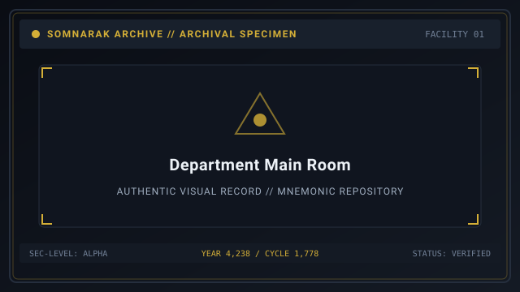
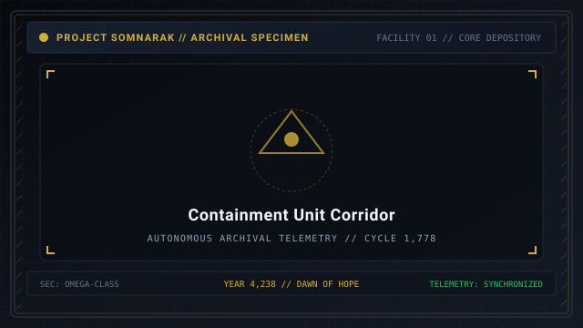
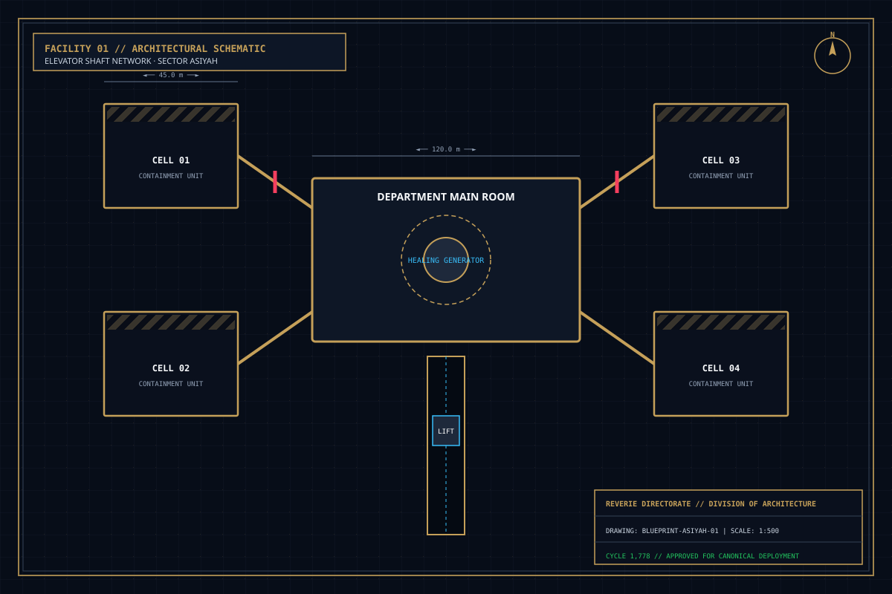

# Departments

> *“A Floor is a promise and a prison.”*

**Departments** documents the structural geography, room types, team bonuses, and operational functions of the nine sovereign floors comprising Facility 01 beneath the Alpha Tree  [알파 트리]  (_Alpa Teuri_). Each department operates under an assigned [Echo-Core](14-Echo-Cores.md), maintaining localized containment wards, specialized research branches, and vital restorative facilities.

Facility 01 does not treat departments as abstract corporate divisions; they are physical, interlocking containment strata excavated directly into the subterranean bedrock. From the uppermost spires piercing the surface daylight to the subterranean vaults guarding the lip of the **Maw**, each floor is fortified to prevent localized breaches from cascading into facility-wide collapse.

```text
+========================================================================+
| SOMNARAK - FACILITY 01 DEPARTMENTS                                     |
+------------------------------------------------------------------------+
| Total Floors           | 9 Floors (Floors 1 to 8 + Central Command)    |
| Department Partition   | Shallow Floors (1 to 4) - Deep Floors (5 to 8)|
| Standard Rooms         | Main Room - Containment (max 4) - Hall - Hub  |
| Restorative Grid       | Healing Generator (6 HP/SP Base - 12 Max)     |
+========================================================================+
```

## Contents

- [1 Architectural Structure and Room Types](#1-architectural-structure-and-room-types)
  - [1.1 The Main Room and Healing Generator](#11-the-main-room-and-healing-generator)
  - [1.2 Containment Units](#12-containment-units)
  - [1.3 Corridors and Hallways](#13-corridors-and-hallways)
  - [1.4 Elevator Hubs](#14-elevator-hubs)
- [2 Departmental Directory and Team Bonuses](#2-departmental-directory-and-team-bonuses)
- [3 Shallow Floors vs Deep Floors](#3-shallow-floors-vs-deep-floors)
- [4 Departmental Missions and Research Trees](#4-departmental-missions-and-research-trees)
- [5 Department Meltdowns and Reverberations](#5-department-meltdowns-and-reverberations)
- [6 Gallery](#6-gallery)
- [7 See also](#7-see-also)

## 1 Architectural Structure and Room Types


Every department within Facility 01 is engineered according to a standardized architectural modular layout designed to compartmentalize cognitive hazards:

| Room Type | Count per Floor | Core Function | Hazard Note |
|---|---|---|---|
| Main Room | 1 | Command, rest, Healing Generator (6 HP/SP) | Generator dies if hostiles enter |
| Containment Units | Up to 4 | Entity housing behind Han lattice | Each breach threatens the floor |
| Corridors | 2 wings | Transit and suppression battleground | Primary clash terrain |
| Elevator Hubs | 2 shafts | Vertical transit between floors | Sealed during Reverberations |

### 1.1 The Main Room and Healing Generator

The **Main Room** serves as the central command atrium and resting quarters for all specialists stationed on that floor. It is equipped with tactical briefing consoles, equipment racks, and direct comms lines to the floor's Echo-Core.

Crucially, every Main Room houses a **Departmental Healing Generator** — an acoustic resonance coil that continually emits stabilizing harmonics. 
- While stationed inside the Main Room, all resting personnel recover **6 HP and 6 SP** per pulse.
- Through departmental research unlocked at [15-Research](15-Research.md), this output can be upgraded to **12 HP and 12 SP** per pulse.
- **Fail-Safe Shutdown:** If a hostile sorrow entity, rogue specialist, or Ordeal incursion breaches into the Main Room, the Healing Generator immediately shuts down, depriving personnel of restorative regeneration until the room is purged of threats.

### 1.2 Containment Units

Each department contains up to **four Containment Units** (cells) dedicated to housing individual sorrow entities. Each unit is constructed from reinforced basalt and shielded with a localized **Han-Energy lattice** that dampens metaphysical radiation. 

The front of each unit features an armored viewing port, an airlock entry door, and an external **Sorrow Gauge** console indicating the entity's current agitation level, Positive Box yield, and activation threshold.

### 1.3 Corridors and Hallways

Reinforced transit tunnels connecting the Main Room to individual containment cells. Corridors are equipped with automated sprinkler systems, acoustic baffles, and blast doors. Hallways serve as the primary battleground where suppression squads intercept and engage mobile, breaching Subject entities.

### 1.4 Elevator Hubs

Vertical transit shafts positioned at the perimeter of each wing. Elevator platforms allow rapid vertical transit between adjacent floors, enabling rapid deployment of emergency response squads during multi-floor containment crises.

## 2 Departmental Directory and Team Bonuses

Somnarak fields nine operational departments across eight descending levels plus Central Administration. Operatives permanently stationed within a department receive a specialized **Team Bonus** reflecting the director's cognitive aptitude:

| Floor Level | Department Name | Sovereign Director | Assigned Mandate | Permanent Team Bonus |
|---|---|---|---|---|
| **Floor 1 (Upper)** | Spires | Majin  [마진] | Threshold security and facility command | Movement Speed +5% · Weapon Damage +5% |
| **Floor 1 (Central)** | Central Administration | Seiyon  [세이연] | Archival ledgers and floor coordination | Work Success Rate +5% · Daily Energy Quota +5% |
| **Floor 2** | Maw's Keep | Dekan  [데칸] | Heavy physical containment and barricades | Maximum HP +10 · 🔴 **Grudge** Defense +0.1 |
| **Floor 3** | Extraction Hall | Zyrak  [지락] | Mnemonic well drilling and Lumen refining | Maximum SP +10 · Lumen Energy Yield +10% |
| **Floor 4** | Insight Forge | Ayshuk  [아이숙] | Cognitive analysis and research synthesis | Work Execution Speed +10% · Clarity +5 |
| **Floor 5** | Border Watch | Mellda  [멜다] | Frontier quarantine and heavy suppression | Damage Resistance +0.15 against all Pressures |
| **Floor 6** | Deep Vault | Marjuk  [마주크] | Deep storage of volatile relics and unknowns | Relic Mental Strain reduced by 25% |
| **Floor 7** | Shadow Corps | Ishall  [이샬] | Covert tactical deployment and intervention | Evade Rate +10% · Critical Strike Chance +5% |
| **Floor 8 (Lower)** | Gate Watch | Xyan  [시안] | Subterranean sentry duty at the lip of the Maw | Panic Breakdown threshold delayed by 20 SP |

## 3 Shallow Floors vs Deep Floors

A critical operational distinction divides the facility along its vertical axis:
- **Shallow Floors (Floors 1 through 4):** Characterized by intense, rapid operational tempo. Containment cells here house volatile, highly active Subject entities requiring frequent routine interactions to satisfy daily energy quotas. Breaches occur frequently, and suppression teams must remain on constant standby.
- **Deep Floors (Floors 5 through 8):** Characterized by profound acoustic silence and thick bedrock insulation. These lower depths house ancient relic entities, temporal anomalies, and unclassified horrors. While daily work is less frequent, failures on deep floors threaten structural catastrophe, potentially rupturing the bedrock barrier separating the facility from the **Maw**.

## 4 Departmental Missions and Research Trees

To expand facility capabilities, each Echo-Core issues a series of four progressive **Departmental Missions** to the Warden:
1. **Initial Assessment:** Execute a designated quota of standard work sessions within the department.
2. **Work Diversity:** Successfully conduct work across all four canonical protocols (👁 **Viderehan**, 🤲 **Ferrehan**, 💧 **Flerehan**, ⚔ **Pugnahan**).
3. **Incursion Defense:** Suppress a breaching entity or an active Ordeal incursion using departmental specialists.
4. **Resonance Mastery:** Complete a full operational shift without a single containment failure or panic event on the floor.

Completing a mission permanently unlocks a major research perk from [15-Research](15-Research.md), such as upgrading the Healing Generator output, fabricating specialized execution bullets, or reinforcing containment lattice integrity.

## 5 Department Meltdowns and Reverberations

When an Echo-Core's emotional stability collapses under accumulated trauma, the department enters a state of **Reverberation** (detailed at [11-Reverberations.md](11-Reverberations.md)). 

During a Reverberation crisis:
- The department's Healing Generator immediately shuts down.
- Containment units on that floor undergo spontaneous agitation, halving their breach thresholds.
- Environmental distortions afflict all stationed personnel, reversing sensory inputs or draining vital energy.
- To resolve the crisis, the Warden must direct specialists to undergo a **Floor Realization** trial, confronting the Echo-Core's manifestation and restoring harmonic balance to the department.

## 6 Gallery

| Command Atrium | Containment Corridor |
|---|---|
| [](images/department-main-room.svg) | [](images/containment-unit-corridor.svg) |
| *Main Room with restorative generator* | *Cell corridor and airlock gates* |

| Vertical Transit | Facility Blueprint |
|---|---|
| [](images/elevator-shaft-network.svg) | [](images/the-hand-facility-layout.svg) |
| *Elevator shaft network* | *Full Facility 01 architectural schematic* |
---

## 7 See also

- [01-Main Page](01-Main%20Page.md) — central wiki portal
- [06-Personnel](06-Personnel.md) — directors, specialists, and companies
- [14-Echo-Cores](14-Echo-Cores.md) — individual director dossiers and mechanics
- [15-Research](15-Research.md) — departmental research tree upgrades
- [11-Reverberations](11-Reverberations.md) — department meltdown crises and floor realizations
