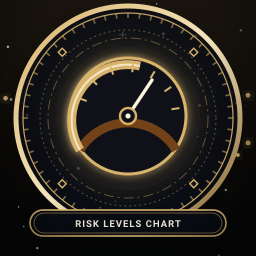
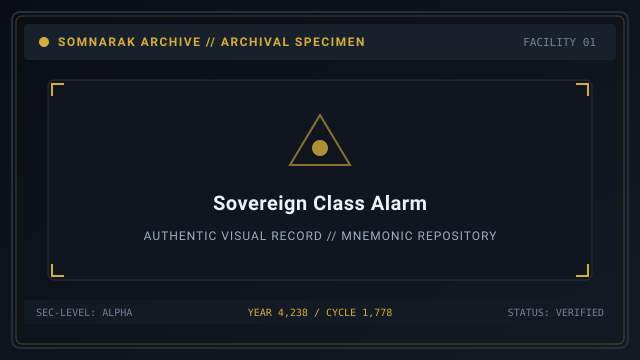
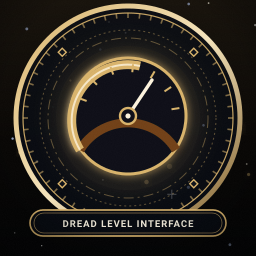

# Risk Levels

> *“Risk is how loudly the sorrow remembers.”*

**Risk Levels**  [위험 등급]  (_Wiheom Deunggeup_) classify [Sorrow Entities](07-Sorrow%20Entities.md) according to the magnitude of physical and psychological danger they pose to Facility 01, as well as the potency of the [M.A.W. Equipment](09-M.A.W.%20Equipment.md) extracted from their containment cores.

In Somnarak nomenclature, risk is framed as an audible metaphor: from the quietest **Residue** to the deafening, catastrophic presence of a **Sovereign**.

```text
+========================================================================+
| SOMNARAK - RISK LEVELS AND THREAT TAXONOMY                             |
+------------------------------------------------------------------------+
| Classification Scale   | Rank I (Residue) to Rank V (Sovereign)        |
| Residue (Rank I)       | 46 Entities - Docile & Rookie Training        |
| Echo (Rank II)         | 70 Entities - Moderate Hazard & Early Gear    |
| Fragment (Rank III)    | 82 Entities - High Hazard & Specialized Suits |
| Entity (Rank IV)       | 80 Entities - Severe Threat & Lethal Breaches |
| Sovereign (Rank V)     | 10 Entities - Catastrophic Municipal Threat   |
+========================================================================+
```

## Contents

- [1 The Philosophy of Risk in Somnarak](#1-the-philosophy-of-risk-in-somnarak)
- [2 Rank I: Residue Entities](#2-rank-i-residue-entities)
- [3 Rank II: Echo Entities](#3-rank-ii-echo-entities)
- [4 Rank III: Fragment Entities](#4-rank-iii-fragment-entities)
- [5 Rank IV: Entity-Rank Dossiers](#5-rank-iv-entity-rank-dossiers)
- [6 Rank V: Sovereign Entities](#6-rank-v-sovereign-entities)
- [7 Non-Ranked Tool Relics and Time Hazards](#7-non-ranked-tool-relics-and-time-hazards)
- [8 Dread Checks and Rank Discrepancy Multipliers](#8-dread-checks-and-rank-discrepancy-multipliers)
- [9 Gallery](#9-gallery)
- [10 See also](#10-see-also)

## 1 The Philosophy of Risk in Somnarak

Risk does not merely signify combat difficulty; it reflects the depth of human grief crystallized within the entity:
- A low-risk entity embodies a passing personal regret or quiet bereavement.
- A high-risk entity embodies collective historical trauma, mass industrial deaths, or existential dread.
- Higher risk entities yield greater quantities of [Lumen](33-Lumen.md) per work session, but inflict severe psychological penalties upon unprepared specialists.

## 2 Rank I: Residue Entities
- **Archive Count:** 46 entities.
- **Operational Hazard:** Minimal. Residue entities rarely breach, produce docile moods, and have generous work success rates across all protocols.
- **Field Utility:** Ideal for training novice Rank I recruits in the fundamentals of 👁 **Viderehan** and 🤲 **Ferrehan**.
- **Yield:** 10–12 Max LU; basic starter stigmas and low-tier defensive gear.

## 3 Rank II: Echo Entities
- **Archive Count:** 70 entities.
- **Operational Hazard:** Moderate. If assigned incorrect work protocols or neglected during meltdowns, Echoes may inflict moderate 🔵 **Lament** trauma or stage brief corridor breaches.
- **Field Utility:** Provides excellent attribute training for Rank II operatives stepping into frontline duties.
- **Yield:** 14–16 Max LU; reliable early-game weapons and specialized elemental resistances.

## 4 Rank III: Fragment Entities
- **Archive Count:** 82 entities.
- **Operational Hazard:** Substantial. Fragments possess distinct behavioral conditions and lethal breach potential. Novice operatives sent to work with Fragments without adequate armor face immediate panic or physical death.
- **Specimen Example:** [27-The Debt Eater](27-The%20Debt%20Eater.md) (`SE-C-IIIβ-014`), which demands strict ⚔ **Pugnahan** work and punishes mistakes with ⚪ **Void** damage.
- **Yield:** 16–20 Max LU; versatile mid-game M.A.W. sets.

## 5 Rank IV: Entity-Rank Dossiers
- **Archive Count:** 79 entities.
- **Operational Hazard:** Severe. Entity-rank entities possess complex escape conditions, multi-room area attacks, and aggressive breach triggers (such as auxiliary deaths or facility meltdown spikes).
- **Field Utility:** Required for harvesting elite-grade armaments needed to survive late-game [Ordeals](10-Ordeals.md).
- **Yield:** 24–30 Max LU; high-stat weapons and fortified suits capable of enduring intense elemental pressures.

## 6 Rank V: Sovereign Entities
- **Archive Count:** 10 entities (plus 1 Outside Sovereign: `SE-O-Vγ-003 Wilderness Tide`).
- **Operational Hazard:** Catastrophic. Sovereigns represent existential facility crises. A breach by a Sovereign typically results in mass auxiliary slaughter, department destruction, and instant panic among nearby low-rank staff.
- **Suppression Requirements:** Demands fully assembled, elite Rank V squads armed with complementary M.A.W. weaponry and precise shield rotations.
- **Yield:** 32–36 Max LU; the most powerful suits and weapons in the game, granting near-immunity to specific pressures.

## 7 Non-Ranked Tool Relics and Time Hazards

Five entities within the facility lack fixed risk ranks:
- These are inanimate artifacts governed by the **Two-Work-Type Rule** (Viderehan and Ferrehan only).
- Risk is determined by the duration or frequency of human use rather than inherent hostility (e.g., [28-The Echo Compass](28-The%20Echo%20Compass.md), [29-The Crucible](29-The%20Crucible.md), and [30-The Debt Scale](30-The%20Debt%20Scale.md)).

## 8 Dread Checks and Rank Discrepancy Multipliers

When a specialist enters a chamber or confronts a breaching entity, their rank is compared against the entity's risk tier:

| Operative Rank vs Entity Risk | Dread Assessment | Composure Point (SP) Penalty |
|---|---|---|
| Specialist Rank > Entity Risk | **Composed** | No SP loss. Operative is fully composed. |
| Specialist Rank == Entity Risk | **Unnerved** | Minor SP drain (5% of max SP). |
| Specialist Rank +1 < Entity Risk | **Shaken** | Moderate SP drain (25% of max SP). |
| Specialist Rank +2 < Entity Risk | **Grief-struck** | Severe SP drain (50% of max SP). |
| Specialist Rank +3+ < Entity Risk | **Shattered** | **Instant Panic**. ego collapse on sight. |

## 9 Gallery

[](images/risk-levels-chart.svg)
[](images/sovereign-class-alarm.svg)
[](images/dread-level-interface.svg)

*Left: risk tier comparison chart; Center: Sovereign breach warning alarm; Right: fear check HUD gauge.*
---

## 10 See also

- [07-Sorrow Entities](07-Sorrow%20Entities.md) — master bestiary framework
- [08-Sorrow List](08-Sorrow%20List.md) — complete catalog of all 291 entities
- [12-Specialists](12-Specialists.md) — specialist ranks and panic mechanics
- [27-The Debt Eater](27-The%20Debt%20Eater.md) — specimen dossier: Rank III Fragment
