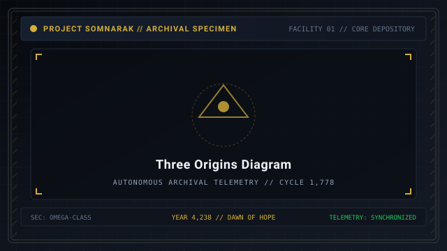
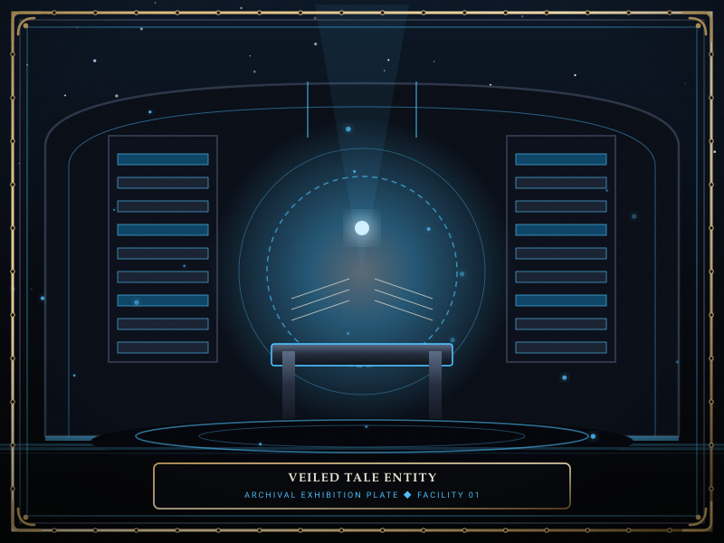
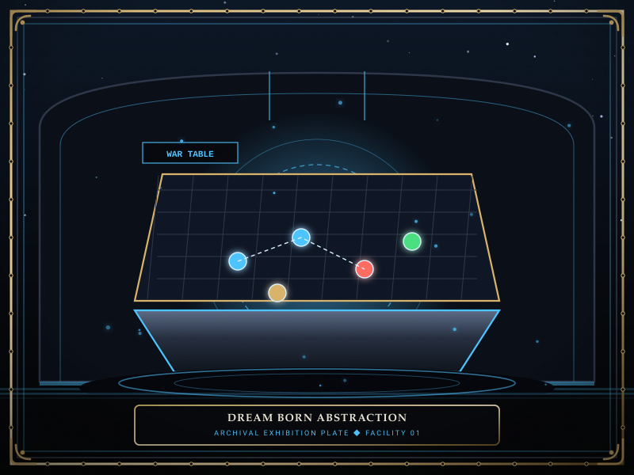

# Origins

> *“Every sorrow has an address where the tears first fell.”*

**Origins**  [기원 분류]  (_Giwon Bunryu_) classify [Sorrow Entities](07-Sorrow%20Entities.md) according to the psychological and metaphysical genesis that gave them physical form in [[SOMNARAK-WORLD](https://github.com/Redditor008/PROJECT.SOMNARAK-WIKI/tree/arena/01a0b699-project-somnarak-wiki/SOMNARAK-WORLD "SOMNARAK-WORLD")].

Within the Reverie Directorate's archival doctrine, sorrow is not homogeneous. An entity's behavior, work affinities, and [Pressure Types](17-Pressure%20Types.md) are directly shaped by whether it coalesced from collective municipal folklore, sharp personal trauma, or the deep unconscious abyss.

```text
+========================================================================+
| SOMNARAK - THE THREE ENTITY ORIGINS                                    |
+------------------------------------------------------------------------+
| Origin Taxonomy        | Veiled Tale - Scarred Memory - Dream Born     |
| Veiled Tale (City)     | 159 Entities - Collective Urban Myths & Folk  |
| Scarred Memory (Inner) | 72 Entities - Individual Trauma & Bereavement |
| Dream Born (Outside)   | 61 Entities - Subconscious Nightmares & Void  |
| Metaphysical Well      | Mnemonic Wells fed by the Primordial Weeping  |
+========================================================================+
```

## Contents

- [1 The Tripartite Genesis of Sorrow](#1-the-tripartite-genesis-of-sorrow)
- [2 Veiled Tale (City Sorrow)](#2-veiled-tale-city-sorrow)
- [3 Scarred Memory (Inner Sorrow)](#3-scarred-memory-inner-sorrow)
- [4 Dream Born (Outside Sorrow)](#4-dream-born-outside-sorrow)
- [5 Work Protocol Affinities by Origin](#5-work-protocol-affinities-by-origin)
- [6 Facility Floor Resonance and Department Placement](#6-facility-floor-resonance-and-department-placement)
- [7 Cross-Origin Resonances and Fusion Hazards](#7-cross-origin-resonances-and-fusion-hazards)
- [8 Gallery](#8-gallery)
- [9 See also](#9-see-also)

## 1 The Tripartite Genesis of Sorrow

All 291 cataloged sorrow entities originate from one of three distinct psychological strata:
- **Veiled Tale (159 entities):** Born from shared civic mythos, societal gossip, and urban legends circulating through the city's spires and slums.
- **Scarred Memory (72 entities):** Crystallized from acute personal agony, betrayal, bereavement, or solitary death.
- **Dream Born (61 entities):** Formed from raw subconscious reveries, surreal nightmares, and primeval fears drifting up from the subterranean [Maw](41-Frontiers.md).

## 2 Veiled Tale (City Sorrow)
- **Metaphysical Anchor:** Collective social memory.
- **Characteristics:** Highly structured, often taking the shape of fairy tales, historical archetypes, or urban superstitions (e.g., cursed gramophones, singing choir children, or mechanical executioners).
- **Behavioral Logic:** Veiled Tales obey narrative rules. They expect specialists to act out specific roles during containment sessions, rewarding adherence to protocol and severely punishing improvisations.
- **Common Pressures:** Balanced across 🔴 **Grudge** and 🔵 **Lament**.

## 3 Scarred Memory (Inner Sorrow)
- **Metaphysical Anchor:** Individual human anguish.
- **Characteristics:** Intensely emotional, visceral, and personal (e.g., shattered family relics, wedding gowns steeped in ash, or hospital instruments).
- **Behavioral Logic:** Highly sensitive to specialist psychological states. Working with Scarred Memories often drains nerve, requiring operatives with high **Composure** who can endure empathetic communion via 💧 **Flerehan**.
- **Common Pressures:** Heavily concentrated in 🔵 **Lament** and ⚫ **Weight**.

## 4 Dream Born (Outside Sorrow)
- **Metaphysical Anchor:** Primeval unconscious and the subterranean void.
- **Characteristics:** Abstract, shifting, grotesque geometries that defy conventional biological anatomy (e.g., hovering acoustic compasses, floating monolithic scales, or formless pale voids).
- **Behavioral Logic:** Unpredictable and volatile. Dream Born entities often alter their work affinities based on external facility conditions, such as current meltdown levels or the time of day.
- **Common Pressures:** Predominantly ⚪ **Void** and ⚫ **Weight**.

## 5 Work Protocol Affinities by Origin

| Origin Classification | Preferred Protocol | Secondary Protocol | Dangerous Protocol |
|---|---|---|---|
| **Veiled Tale** | 👁 **Viderehan** (Observation) | ⚔ **Pugnahan** (Discipline) | 💧 **Flerehan** (Distorts narrative) |
| **Scarred Memory** | 💧 **Flerehan** (Lamentation) | 🤲 **Ferrehan** (Endurance) | ⚔ **Pugnahan** (Agitates trauma) |
| **Dream Born** | 🤲 **Ferrehan** (Endurance) | 👁 **Viderehan** (Observation) | 💧 **Flerehan** (Psychic drowning) |

## 6 Facility Floor Resonance and Department Placement

To maintain psychological equilibrium across Facility 01:
- **Veiled Tales** are housed in Upper Spires and Central Administration where bureaucratic structure keeps their folkloric narratives stable.
- **Scarred Memories** are assigned to Insight Forge and Maw's Keep for specialized psychological dampening.
- **Dream Born** horrors are locked deep within the Vault and Gate Watch, isolated behind thick abyssal lead bulkheads.

## 7 Cross-Origin Resonances and Fusion Hazards

Certain entities originating from the same mythos or trauma pool exhibit dangerous resonance:
- **The Three Birds:** Housing *the Observing Bird* (SE-031), *the Weighting Bird* (SE-032), and *the Guarding Bird* (SE-033) in adjacent cells increases their breach frequency by 300%.
- If all three breach simultaneously, they merge into the apocalyptic Sovereign entity *the Convergence*.

## 8 Gallery

[](images/three-origins-diagram.svg)
[](images/veiled-tale-entity.svg)
[](images/dream-born-abstraction.svg)

*Left: diagram of the three origin strata; Center: Veiled Tale folkloric entity; Right: Dream Born abstract horror.*
---

## 9 See also

- [07-Sorrow Entities](07-Sorrow%20Entities.md) — master bestiary framework
- [25-Types](25-Types.md) — structural entity taxonomy: Subject, Object, Place, Time
- [32-Genesis](32-Genesis.md) — the Weeping and Mnemonic Wells
- [38-Classification Code](38-Classification%20Code.md) — SECC origin code markers
