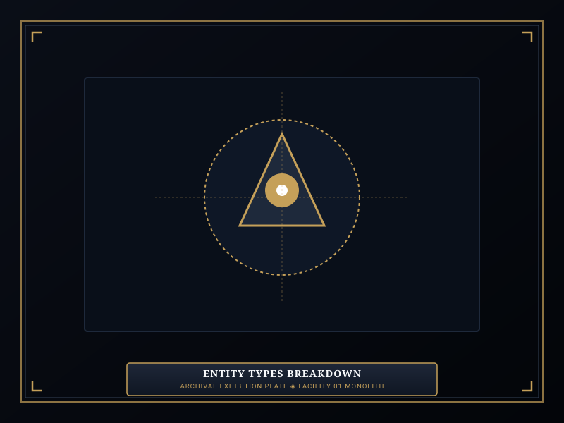
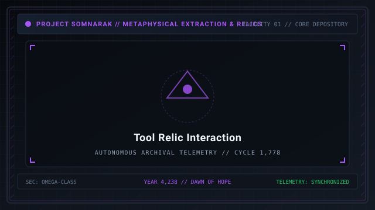
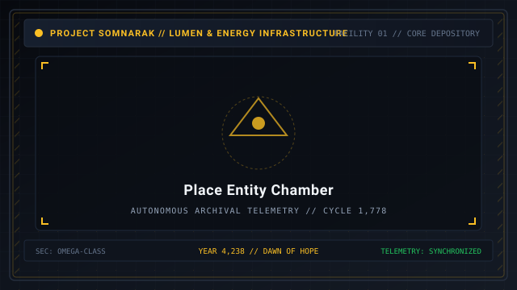

# Types

> *“Sorrow takes any shape it pleases: a beast with teeth, a book that burns, a room that forgets its doors, or an hour that refuses to strike.”*

**Types**  [개체 유형]  (_Gaeche Yuhyeong_) define the structural and ontological form of [Sorrow Entities](07-Sorrow%20Entities.md) contained within Facility 01.

Entities in Somnarak do not share a single physical mold. Depending on how their underlying grief solidified, they manifest as sentient living creatures (**Subjects**), inanimate artifacts (**Objects** / **Tool Relics**), localized spatial disruptions (**Places**), or shifting temporal phenomena (**Time/Hazard**).

```text
+========================================================================+
| SOMNARAK - ENTITY ONTOLOGICAL TYPES                                    |
+------------------------------------------------------------------------+
| Ontological Taxa       | Subject - Object (Tool Relics) - Place - Time |
| Subject Taxon          | Living / Humanoid Horrors (All 4 Work Protocol|
| Object Taxon           | Inanimate Tool Relics (Two-Work-Type Rule Only|
| Place Taxon            | Spatial / Room Anomalies with Physics Distorti|
| Time / Hazard          | Temporal Loops, Clocks & Abstract Phenotypes  |
+========================================================================+
```

## Contents

- [1 Ontological Taxonomy Overview](#1-ontological-taxonomy-overview)
- [2 Subject Entities (Sentient Horrors)](#2-subject-entities-sentient-horrors)
- [3 Object Entities (Tool Relics)](#3-object-entities-tool-relics)
  - [3.1 The Two-Work-Type Rule](#31-the-two-work-type-rule)
  - [3.2 The Three Relic Sub-Types](#32-the-three-relic-sub-types)
- [4 Place Entities (Spatial Anomalies)](#4-place-entities-spatial-anomalies)
- [5 Time and Hazard Entities (Abstract Anomalies)](#5-time-and-hazard-entities-abstract-anomalies)
- [6 Master Ontological Comparison Table](#6-master-ontological-comparison-table)
- [7 Breach Mechanics Across Types](#7-breach-mechanics-across-types)
- [8 Gallery](#8-gallery)
- [9 See also](#9-see-also)

## 1 Ontological Taxonomy Overview

Every contained entity is cataloged under one of four broad structural categories:
- **Subject:** Possesses autonomous motility, sentience, or predatory instinct.
- **Object (Tool Relic):** Stationary physical items interacted with by specialists.
- **Place:** Environmental or architectural anomalies embedded into the facility's geometry.
- **Time/Hazard:** Fluid, temporal, or atmospheric phenomena lacking permanent boundary lines.

## 2 Subject Entities (Sentient Horrors)
- **Work Rule:** Accepts all four canonical protocols: 👁 **Viderehan**, 🤲 **Ferrehan**, 💧 **Flerehan**, and ⚔ **Pugnahan**.
- **Breach Capability:** Possesses a physical body that roams corridors when its **Mugenhan Escape Counter** reaches zero.
- **M.A.W. Extraction:** Yields both weapons, defensive suits, and wearable cosmetic stigmas.
- **Representative Specimen:** [27-The Debt Eater](27-The%20Debt%20Eater.md).

## 3 Object Entities (Tool Relics)

### 3.1 The Two-Work-Type Rule
Inanimate Tool Relics do not possess minds or emotions. Therefore, attempting 💧 **Flerehan** (empathetic communion) or ⚔ **Pugnahan** (physical confrontation) is mechanically prohibited. Operatives may only execute:
- 👁 **Viderehan (Observation):** Scanning dials, calibrating needles, reading inscriptions.
- 🤲 **Ferrehan (Endurance):** Physical channeling, handling, polishing, and carrying.

### 3.2 The Three Relic Sub-Types
Tool Relics are further divided into three functional operational modes:
1. **Single-Use (Instantaneous):** Operative enters, triggers immediate effect, and departs (e.g., [28-The Echo Compass](28-The%20Echo%20Compass.md)).
2. **Channeled Use (Sustained):** Operative channels continuously inside the unit, trading personal health for continuous facility buffs; exceeds safe timer at penalty of death (e.g., [29-The Crucible](29-The%20Crucible.md)).
3. **Equippable (Carried):** Operative carries the relic out into facility corridors, gaining mobile auras and stat conversions (e.g., [30-The Debt Scale](30-The%20Debt%20Scale.md)).

## 4 Place Entities (Spatial Anomalies)
- **Containment Chamber Integration:** The containment cell *becomes* the entity. Stepping across the threshold transitions the operative into a localized pocket dimension (such as an endless train carriage, a flooded cemetery, or an abandoned bell tower).
- **Work Mechanics:** Works are executed by exploring the pocket dimension. Failure causes the room geometry to collapse, trapping or ejecting the operative.
- **Containment Doctrine:** Place entities cannot physically leave their chambers; instead, breaches manifest as expanding spatial distortions that swallow adjacent hallways.

## 5 Time and Hazard Entities (Abstract Anomalies)
- **Fluid Mechanics:** Entities that distort facility clocks, alter simulation speeds, or manipulate historical timelines.
- **Hazard Containment:** Requires constant cognitive dampening and periodic stasis pulses to prevent temporal desynchronization.
- **Unranked Nature:** Five entities in the archive lack fixed numerical ranks because their hazard depends purely on interaction duration.

## 6 Master Ontological Comparison Table

| Ontological Type | Motility | Permitted Work | Breach Behavior | Extraction Yield |
|---|---|---|---|---|
| **Subject** | Active autonomous roaming | All 4 Protocols | Corridors stalking; combat clashes | Weapons, Suits, Stigmas |
| **Object (Tool)** | Inanimate stationary | Viderehan & Ferrehan | Overuse backlash pulse; zero roaming | Facility buffs; auras |
| **Place** | Structural chamber expansion | Viderehan & Flerehan | Room swallows adjacent hallways | Dimensional relics |
| **Time/Hazard** | Abstract temporal drift | Viderehan & Ferrehan | Distorts simulation clock / speed | Chronos dampeners |

## 7 Breach Mechanics Across Types

- **Subject Breaches:** Require mobile combat squads to engage in real-time clashes.
- **Relic Overuse:** Requires immediate quarantine and 40-second stasis cooling.
- **Place Ruptures:** Demands sealing corridor bulkheads and deploying chemical stasis foam.
- **Temporal Desyncs:** Requires recalibrating the deep temporal anchors in Lead Marjuk's Deep Vault.

## 8 Gallery

[](images/entity-types-breakdown.svg)
[](images/tool-relic-interaction.svg)
[](images/place-entity-chamber.svg)

*Left: comparison of the four structural taxa; Center: specialist channeling tool relic; Right: spatial place chamber.*
---

## 9 See also

- [07-Sorrow Entities](07-Sorrow%20Entities.md) — master bestiary framework
- [24-Origins](24-Origins.md) — psychological genesis: Veiled Tale, Scarred Memory, Dream Born
- [27-The Debt Eater](27-The%20Debt%20Eater.md) — specimen dossier: Subject taxon
- [37-Relic Entities](37-Relic%20Entities.md) — dedicated hub for Object/Tool Relics
