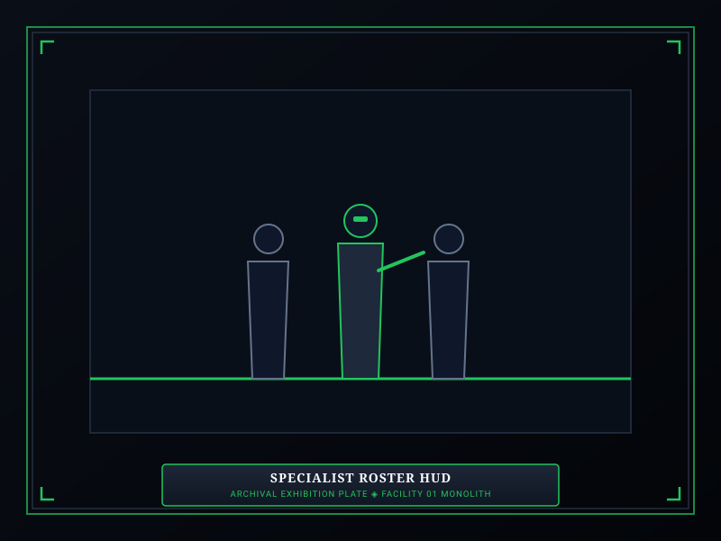
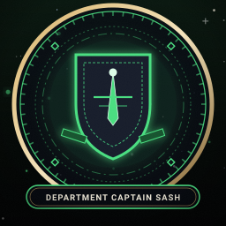
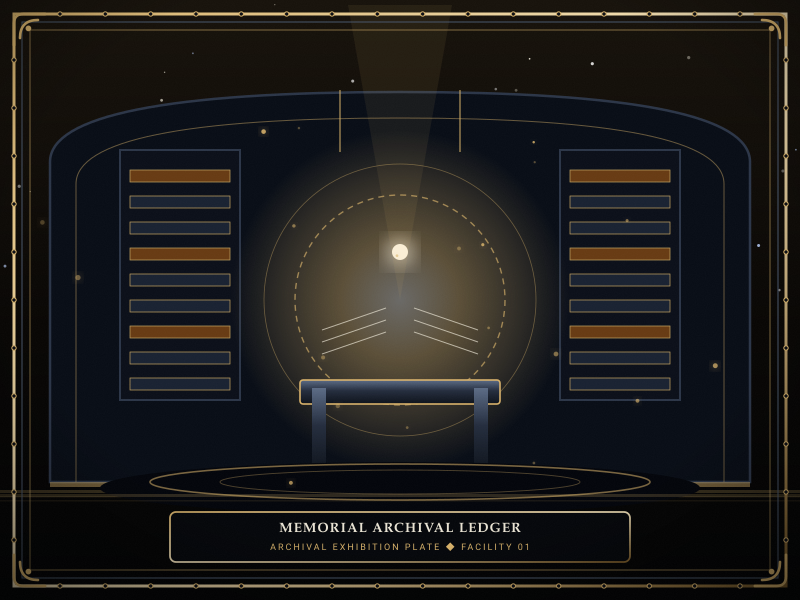

# Personnel Dossiers

> *“A number on a badge, a coat woven from nightmares, and an oath to hold the line until evening.”*

**Personnel Dossiers**  [인사 기록부]  (_Insa Girokbu_) document the human workforce operating within Facility 01. 

From frontline [Specialists](12-Specialists.md) who confront eldritch sorrow within containment chambers to the unarmored [Auxiliaries](12-Specialists.md) who maintain administrative ledgers, human personnel form the lifeblood of the Reverie Directorate's containment apparatus.

```text
+========================================================================+
| SOMNARAK - PERSONNEL DOSSIERS & SPECIALIST CADRES                      |
+------------------------------------------------------------------------+
| Personnel Hierarchy    | Specialists (Directable) - Auxiliaries        |
| Specialist Ranks       | Rank I (Recruit) to Rank V (Veteran) + EX-Elit|
| Attribute Training     | Resilience (HP) - Clarity (SP) - Composure - R|
| Department Officers    | Captain Badges & Aura Field Command Perks     |
| Casualty Archiving     | Memorial Ledger of the 1,778 Mnemonic Cycles  |
+========================================================================+
```

## Contents

- [1 Personnel Hierarchy and Classification](#1-personnel-hierarchy-and-classification)
- [2 Specialist Ranks and Attribute Thresholds](#2-specialist-ranks-and-attribute-thresholds)
- [3 Attribute Stat Point Progression Matrix](#3-attribute-stat-point-progression-matrix)
- [4 Departmental Captains and Officer Designations](#4-departmental-captains-and-officer-designations)
- [5 Auxiliaries and Auxiliary Support Systems](#5-auxiliaries-and-auxiliary-support-systems)
- [6 Operative Customization and Lineages](#6-operative-customization-and-lineages)
- [7 Casualty Protocols and Memorial Archiving](#7-casualty-protocols-and-memorial-archiving)
- [8 Gallery](#8-gallery)
- [9 See also](#9-see-also)

## 1 Personnel Hierarchy and Classification

Personnel within Facility 01 are strictly segregated into two functional classes:
- **Specialists:** Directable combat operatives equipped with [M.A.W. Equipment](09-M.A.W.%20Equipment.md). They execute containment protocols, intercept breaching horrors, and subdue Ordeals.
- **Auxiliaries:** Non-directable logistical personnel stationed across departmental spires. Their continued survival projects positive morale auras across each floor.

## 2 Specialist Ranks and Attribute Thresholds

An operative's rank dictates their authority, equipment eligibility, and resistance to mental fear checks:

| Specialist Rank | Title Designation | Required Attribute Sum | Maximum Stat Cap | Fear Immunity Tier |
|---|---|---|---|---|
| **Rank I** | Recruit Operative | 100–129 Points | Tier 1 (30 Max) | Whisper only |
| **Rank II** | Junior Specialist | 130–169 Points | Tier 2 (45 Max) | Murmur |
| **Rank III** | Senior Specialist | 170–219 Points | Tier 3 (65 Max) | Fragment |
| **Rank IV** | Lead Operative | 220–279 Points | Tier 4 (85 Max) | Wail |
| **Rank V** | Master Specialist | 280–330 Points | Tier 5 (100 Max) | Sovereign |
| **EX-Rank** | Facility Vanguard | 331+ Points (Over-trained) | EX-Tier (120+ Max) | Total Fear Immunity |

## 3 Attribute Stat Point Progression Matrix

Operatives improve their base attributes through repetitive containment work:

| Attribute | Vital Function | Stat Progression Range | Primary Training Protocol |
|---|---|---|---|
| **Resilience** | Determines Maximum HP pool | 20 to 100 (120+ EX) | 🤲 **Ferrehan** (Endurance) |
| **Clarity** | Determines Maximum SP pool | 20 to 100 (120+ EX) | 👁 **Viderehan** (Observation) |
| **Composure** | Increases Work Success & Speed | 20 to 100 (120+ EX) | 💧 **Flerehan** (Lamentation) |
| **Resolve** | Increases Attack Speed & Movement | 20 to 100 (120+ EX) | ⚔ **Pugnahan** (Confrontation) |

## 4 Departmental Captains and Officer Designations

When an operative remains stationed within a single department for multiple consecutive shifts, they earn departmental seniority:
- **Officer Badges:** Awarded after 3 consecutive shifts in one wing (+5 Max HP/SP).
- **Department Captain:** The highest-ranking veteran becomes the floor's Captain, wearing an ornate departmental sash.
- **Aura Field Buff:** The Captain emits an active aura that grants +10% Movement Speed and +5 HP/SP recovery to all squadmates in the same room.

## 5 Auxiliaries and Auxiliary Support Systems

Though fragile, Auxiliaries play a vital role in facility stability:
- **Morale Aura:** As long as 100% of a department's auxiliaries are alive, all specialists in that department receive passive stat buffs (+5% Work Success, +5% Movement Speed).
- **The Panicked Auxiliary Threat:** If auxiliary casualties exceed 50%, remaining auxiliaries begin suffering mass panic, wandering hallways and agitating nearby containment units.
- **Breach Bait:** High-threat Wail and Sovereign entities often prioritize slaughtering auxiliaries, giving combat squads precious seconds to position heavy weapons.

## 6 Operative Customization and Lineages

Wardens can customize recruited specialists:
- **Visual Appearance:** Hairstyle, facial features, uniform tailoring, and eye coloration.
- **Codename & Lore:** Assigning codenames and memorializing veteran lineages across consecutive cycles.
- **M.A.W. Gift Stacking:** Operatives can wear up to six distinct gifts across designated anatomical slots (Head, Eye, Face, Neck, Chest, Hand).

## 7 Casualty Protocols and Memorial Archiving

Specialist deaths represent heavy financial and tactical losses:
- Equipped M.A.W. gear is lost and must be re-extracted using harvested Lumen.
- Fallen operatives are recorded in the facility's **Memorial Ledger**.
- Over the 1,778 Mnemonic Cycles leading to the Dawn of Hope, tens of thousands of specialists laid down their lives to anchor the facility against the Maw.

## 8 Gallery

[](images/specialist-roster-hud.svg)
[](images/department-captain-sash.svg)
[](images/memorial-archival-ledger.svg)

*Left: specialist squad management roster; Center: department captain sash; Right: facility memorial ledger.*
---

## 9 See also

- [12-Specialists](12-Specialists.md) — comprehensive specialist gameplay mechanics
- [06-Personnel](06-Personnel.md) — master personnel hub, directors, and cadres
- [09-M.A.W. Equipment](09-M.A.W.%20Equipment.md) — equipment armory and weapon stats
- [22-Departments](22-Departments.md) — departmental layouts and captain stationing
