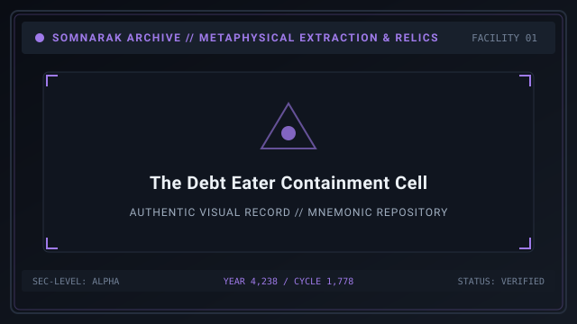
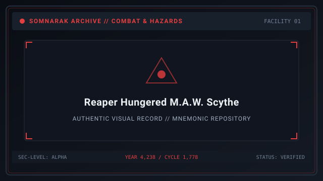
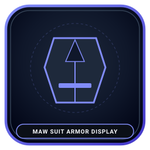
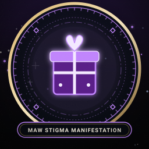
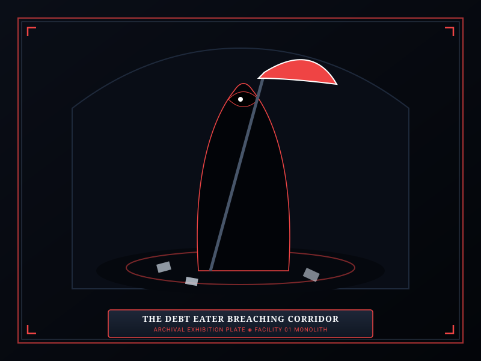

# The Debt Eater

> *“Fifty of us swore we owed nothing — and something in the dark grew hungry to agree.”*

**The Debt Eater (SE-C-IIIβ-014)**  [빚을 먹는 자]  (_Biteul Meokneun Ja_) is a Rank III (Fragment) Moderate (β) Class **Subject** [Sorrow Entity](07-Sorrow%20Entities.md) contained within Sector C-01 of Facility 01. The Debt Eater is one of the earliest urban sorrows cataloged by the Reverie Directorate, representing the metaphysical weight of unpayable municipal obligations and broken fiscal covenants.

The Debt Eater is mobile and capable of breaching containment if its operational requirements are neglected. Unlike stationary relic entities, it responds to all four standard containment protocols — 👁 **Viderehan**  [비데레한]  (_Biderehan_), 🤲 **Ferrehan**  [페레한]  (_Perehan_), 💧 **Flerehan**  [플레레한]  (_Pellerehan_), and ⚔ **Pugnahan**  [푸그나한]  (_Pugeunahan_) — exhibiting a profound affinity for sorrowful resonance and an intense aversion to violent suppression.

```text
+========================================================================+
| SOMNARAK - SE-C-III-014 THE DEBT EATER                                 |
+------------------------------------------------------------------------+
| Designation          | SE-C-III-014 [VS] (Subject - Can Breach)        |
| Risk Tier            | Rank III: Fragment - Potency Beta (Moderate)    |
| Primary Pressure     | Void (Pale White - 1% = 5% Max HP)              |
| Valid Work-Types     | Viderehan - Ferrehan - Flerehan - Pugnahan      |
| Paired Relic         | SE-C-III-015 The Debt Scale (Equippable Tool)   |
+========================================================================+
```

## Contents

- [1 Appearance](#appearance)
- [2 Ability](#ability)
- [3 Details](#details)
  - [3.1 Basic Information](#basic-information)
  - [3.2 Work Preferences](#work-preferences)
- [4 Management Guidelines](#management-guidelines)
- [5 M.A.W. Equipment](#maw-equipment)
  - [5.1 Weapon: Reaper Hungered](#weapon-reaper-hungered)
  - [5.2 Suit: Debt Shroud](#suit-debt-shroud)
  - [5.3 Stigma: Creditor's Mark](#stigma-creditors-mark)
- [6 Observation Story](#observation-story)
- [7 Flavor Text and Trivia](#flavor-text-and-trivia)
- [8 Gallery](#8-gallery)
- [9 See also](#see-also)

## Appearance



The Debt Eater manifests as an organic, hunched humanoid scarcely a meter tall, draped in paper-thin, dry parchment skin that is nearly translucent — the color of aged, moisture-stained municipal tax ledgers. Beneath its skin, the dull white luster of its ribcage and skull remains perpetually visible.

The creature possesses no jaw or lips; its facial surface terminates abruptly into an open, hollow throat that radiates the distinct scent of dry dust, aged wax, and iron gall ink. Its arms are disproportionately elongated, terminating in soft, cold, faintly adhesive palms that resemble clay-handling tools. When agitated, small flakes of powdered skin drift from its wrists and dissolve into faint ⚪ **Void** mist before touching the containment floor.

## Ability

The Debt Eater's primary containment hazard is governed by its **Sorrow Gauge** (starting capacity 506 HP, baseline threshold 35–50%). Every successful work session extracts between 12 and 18 units of **Han-Energy** while adjusting the gauge based on the specialist's execution.

If an operative completes work with a **Bad** result or if the specialist possesses lower than Level II Composure, the Sorrow Gauge increases sharply. When the Sorrow Gauge reaches 60% or higher, The Debt Eater breaches its containment cell and enters the department corridors.

Upon breaching, the entity walks upright at a measured speed of 1.80 m/s. It is drawn to personnel bearing personal debt tokens or those exhibiting mental fatigue, delivering rapid strikes of ⚪ **Void** (Pale White) damage (8–19 damage per strike). Because ⚪ **Void** damage scales against total health (where 1% Void inflicts 5% of maximum vital endurance), unprotected specialists can undergo rapid collapse. Suppression teams must intercept the entity with 🔴 **Grudge** or ⚫ **Weight** weaponry before it reaches the departmental main room.

The Debt Eater shares a symbiotic and hazardous resonance with [The Debt Scale](30-The%20Debt%20Scale.md) (`SE-C-IIIβ-015`). If an operative wearing the scale enters The Debt Eater's unit during high agitation, the entity immediately breaches regardless of its current gauge.

| Breach Phase | Trigger | Entity Behavior | Warden Countermeasure |
|---|---|---|---|
| Agitation | Gauge above 40% | Pacing; throat aperture dilates | Assign 💧 Flerehan veterans only |
| Rupture | Gauge at 60% | Cell door warps; entity walks out upright | Clear auxiliaries from adjacent corridors |
| Hunt | Personnel nearby | Seeks debt tokens at 1.80 m/s | Intercept with 🔴 Grudge squads |
| Feast | Contact with victim | Rapid ⚪ Void strikes (8–19 damage) | Rotate wounded out; never swarm |
| Re-boxing | HP depleted | Collapses into parchment pile | Resume work within 30 seconds |

## Details

### Basic Information

| Statistic | Parameter Value |
|---|---|
| **Designation Code** | `SE-C-IIIβ-014` |
| **Risk Classification** | Rank III: Fragment |
| **Potency Subtype** | β (Moderate Resonance) |
| **Work Reprisal Type** | ⚪ **Void** (8–19 damage per strike) |
| **Base Work Duration** | 33.3 seconds (0.30 Han-Energy per second) |
| **Work Cooldown** | 10.0 seconds |
| **Max Han-Energy Output** | 18 Energy Units |
| **Good Outcome Range** | 14–18 Han-Energy |
| **Normal Outcome Range** | 8–13 Han-Energy |
| **Bad Outcome Range** | 0–7 Han-Energy |

### Work Preferences

| Work Protocol | Level I | Level II | Level III | Level IV | Level V |
|---|---|---|---|---|---|
| 👁 **Viderehan** (Observation) | Common (50%) | High (70%) | High (70%) | Common (50%) | Common (50%) |
| 🤲 **Ferrehan** (Endurance) | Common (40%) | Common (40%) | Low (30%) | Low (30%) | Low (20%) |
| 💧 **Flerehan** (Lamentation) | High (70%) | High (70%) | High (70%) | High (70%) | High (70%) |
| ⚔ **Pugnahan** (Confrontation) | Common (40%) | Low (30%) | Low (20%) | Low (10%) | Low (10%) |

## Management Guidelines

1. Work performed with 💧 **Flerehan**  [플레레한]  (_Pellerehan_) yielded the highest rate of positive resonance. The entity visibly relaxes its posture when personnel acknowledge historical grievances.
2. Operatives assigned to 👁 **Viderehan**  [비데레한]  (_Biderehan_) must maintain at least Level II Clarity. Novice personnel often experience mild ⚪ **Void** erosion from staring directly into the open throat aperture.
3. If an operative with Composure below Level II conducts work, the result is consistently **Bad**, triggering an immediate 15% increase to the Sorrow Gauge.
4. When the Sorrow Gauge crosses 60%, the entity initiates a containment breach. Corridors must be cleared of civilian auxiliaries immediately to prevent mass debt-harvesting.
5. Under no circumstances should an operative carrying [The Debt Scale](30-The%20Debt%20Scale.md) enter Sector C-01 while The Debt Eater's gauge is above 40%. The resulting feedback immediately triggers a simultaneous breach and overload.
6. During suppression, spread operatives across both corridor wings. The entity fixates on a single target at a time, so a lone bait with high Composure can kite it while flanking squads strike safely.
7. After re-boxing, the first work session within 30 seconds gains +15% success rate. Exploit this calm window with a Level III 💧 **Flerehan** specialist to push the gauge back below 20%.

## M.A.W. Equipment

### Weapon: Reaper Hungered



- **Grade:** Fragment (Rank III)
- **Damage Profile:** ⚪ **Void** (11–17 Damage)
- **Attack Speed:** Normal (1.5s interval)
- **Range:** Long (Scythe reach)
- **Special Effect:** *Debt Reclamation* — On critical strike, restores 3 SP to the wielding operative by consuming the target's lingering Han.

### Suit: Debt Shroud



- **Grade:** Fragment (Rank III)
- **Resistances:**
  - 🔴 **Grudge** (Physical): 1.0 (Normal)
  - 🔵 **Lament** (Mental): 0.8 (Warded)
  - ⚪ **Void** (Conceptual): 0.6 (Resistant)
  - ⚫ **Weight** (Crushing): 1.2 (Vulnerable)
- **Requirement:** Composure Level II, Clarity Level II

### Stigma: Creditor's Mark



- **Slot:** Face (Marking over left temple)
- **Bonus:** +3 Composure, +2 Clarity, +5 SP Maximum
- **Drop Rate:** 5% chance upon completing a **Good** work session

## Observation Story

> **Observation Log 014-A (Cycle 1,412):**  
> "Fifty men of the Eastern Ward signed their names upon the vellum sheet, swearing by the Alpha Roots that the debt was paid in blood and steel. But paper remembers what blood forgets. When the ledger was burned in the winter furnace, the ash did not rise — it fell downward through the floorboards into Zone C. By spring, the workers heard scratching behind the stone cistern. When the menders breached the brickwork, they did not find gold or contracts. They found this thing, sitting upon a mound of charred parchment, gently smoothing out the burned scraps with its damp, gray palms."

> **Observation Log 014-C (Cycle 1,655):**
> "Junior Auxiliary Han brought his personal wage chit into the observation gallery against standing orders. The entity pressed its throat aperture flat against the viewing port and did not move for six hours. When the chit was confiscated and burned, the gauge fell eleven points in a single minute. Conclusion: the Eater can read. Recommendation: no paper of any kind within twenty meters of Sector C-01."

## Flavor Text and Trivia

- *“It does not eat bread or flesh. It dines solely on the agreements we break when dusk falls.”*
- The Debt Eater is one of only seven entities in Facility 01 whose vocal tract is entirely replaced by a physical vacuum.
- In early Directorate records, this entity was provisionally designated *The Pale Auxiliary* before its appetite for broken promises was systematically recorded.
- The flakes shed from its wrists, if collected before dissolving, burn with a pale violet flame and are used by the Insight Forge as calibration samples for Void-resistance testing.
- No operative who has survived three consecutive Good sessions with The Debt Eater has ever been recorded defaulting on a personal debt afterward; the Directorate Personnel Office declines to comment on why.

## 8 Gallery

| Contained | Breaching | Reaper Hungered |
|---|---|---|
| [](images/the-debt-eater-containment-cell.svg) | [](images/the-debt-eater-breaching-corridor.svg) | [](images/reaper-hungered-maw-scythe.svg) |
| *Cell interior, Sector C-01* | *Upright breach movement* | *M.A.W. scythe profile* |
---

## See also

- [07-Sorrow Entities](07-Sorrow%20Entities.md) — master entity bestiary
- [30-The Debt Scale](30-The%20Debt%20Scale.md) — paired equippable relic
- [17-Pressure Types](17-Pressure%20Types.md) — damage and resistance physics
- [09-M.A.W. Equipment](09-M.A.W.%20Equipment.md) — armament catalog
