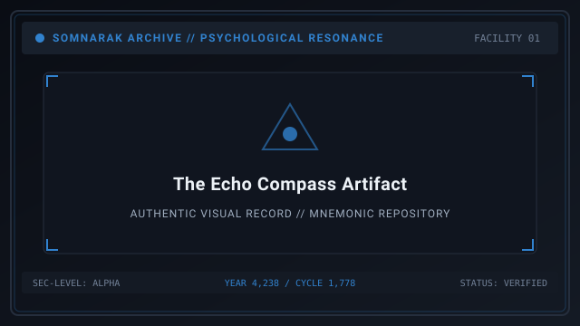
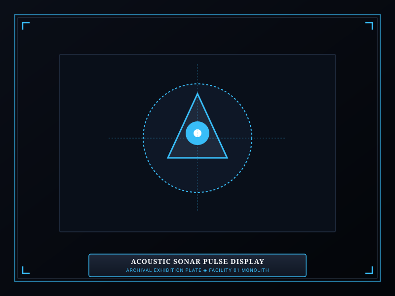
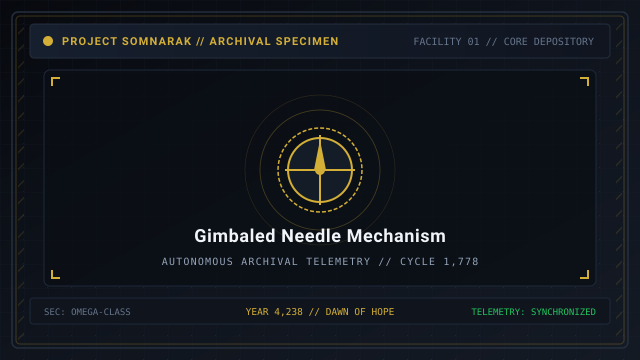

# The Echo Compass

> *“Turn the bronze needle toward the silence; it will tell you which room holds the scream.”*

**The Echo Compass**  [메아리 나침반]  (_Meari Nachimban_), cataloged under the Somnarak Entity Classification Code as **`SE-T-Iα-001`**, is a **Rank I (Whisper)** Tool Relic of the **Single-Use** functional sub-type.

Discovered in the abandoned subterranean observation posts of the early Sorrow Extraction Division, this ornate brass apparatus consists of a gimbaled magnetic dish housing a vibrating acoustic needle. Unlike sentient [Subject Entities](07-Sorrow%20Entities.md), The Echo Compass possesses no living flesh, appetite, or breach motility. Governed strictly by the **Two-Work-Type Rule**, specialists interact with it solely through 👁 **Viderehan** and 🤲 **Ferrehan** to project resonant sonar sweeps across Facility 01.

```text
+========================================================================+
| SECC: SE-T-Ia-001 | THE ECHO COMPASS                                   |
+------------------------------------------------------------------------+
| Nomenclature Code      | SE-T-Ia-001 (Whisper Tool Relic)              |
| Functional Subtype     | Single-Use Relic (Instantaneous Discharge)    |
| Containment Protocols  | Two-Work-Type Rule: Viderehan & Ferrehan      |
| Primary Function       | Facility-Wide Acoustic Sonar Pulse            |
| Cooldown & Hazard      | 30s Cooldown; Overuse Inflicts Lament Trauma  |
+========================================================================+
```

## Contents

- [1 General Information](#1-general-information)
- [2 Tool Relic Classification: Single-Use Mechanics](#2-tool-relic-classification-single-use-mechanics)
- [3 Operational Protocols: The Two-Work-Type Rule](#3-operational-protocols-the-two-work-type-rule)
- [4 Managerial Guidelines and Tactical Utility](#4-managerial-guidelines-and-tactical-utility)
- [5 Log and Method Archival Unlock Progression](#5-log-and-method-archival-unlock-progression)
- [6 Observation Logs and Field Transcripts](#6-observation-logs-and-field-transcripts)
- [7 Metaphysical Origin and Story](#7-metaphysical-origin-and-story)
- [8 Gallery](#8-gallery)
- [9 See also](#9-see-also)

## 1 General Information

- **Entity Designation:** The Echo Compass  [메아리 나침반] 
- **SECC Code:** `SE-T-Iα-001`
- **Risk Classification:** Rank I — Whisper
- **Ontological Type:** Object / Tool Relic (Single-Use)
- **Primary Pressure Output:** 🔵 **Lament** (Mental / Resonance Pulse)
- **Safe Activation Limit:** 1 activation per 30 seconds per department.

## 2 Tool Relic Classification: Single-Use Mechanics

As a **Single-Use Tool Relic**, The Echo Compass operates on an instantaneous interaction cycle:
- **Instantaneous Dispatch:** When a specialist is ordered to work with The Echo Compass, they enter the chamber, manipulate the gimbaled dials, and trigger the device immediately.
- **Immediate Departure:** The specialist does not linger inside the cell. Upon triggering the acoustic pulse, the specialist automatically exits and returns to their assigned Main Room.
- **Active Sonar Field:** The resulting acoustic chime sweeps through all corridors on the floor, temporarily illuminating concealed entity locations, revealing ticking meltdown timers in dark zones, and granting +10% Work Success to all adjacent containment chambers for 45 seconds.

## 3 Operational Protocols: The Two-Work-Type Rule

In accordance with Directorate safety doctrine for inanimate artifacts, 💧 **Flerehan** (Lamentation) and ⚔ **Pugnahan** (Confrontation) are strictly prohibited:

| Protocol | Permitted? | Execution Dynamics | Specialist Result |
|---|---|---|---|
| 👁 **Viderehan** (Observation) | **YES** | Specialist aligns the brass astrolabe markings and calibrates the needle. | Safe activation; projects acoustic floor map; trains Clarity (+SP). |
| 🤲 **Ferrehan** (Endurance) | **YES** | Specialist manually turns the heavy pneumatic base crank to wind the spring. | Safe activation; projects extended sonar wave; trains Resilience (+HP). |
| 💧 **Flerehan** (Lamentation) | **PROHIBITED** | Inanimate artifact possesses no emotional psyche to receive empathetic communion. | Interface command disabled; attempted communion causes cognitive void. |
| ⚔ **Pugnahan** (Confrontation) | **PROHIBITED** | Physical assault on calibrated brass dials causes permanent structural misfire. | Interface command disabled; violent contact fractures acoustic core. |

## 4 Managerial Guidelines and Tactical Utility

1. **Managerial Tip 1:** When a specialist completes work on The Echo Compass, an acoustic chime resonates across the department. For the next 45 seconds, all specialists in that department gain a +10% bonus to work success rates and corridor movement speed.
2. **Managerial Tip 2:** The Echo Compass requires at least 30 seconds of cooldown between activations. If an operative is sent to activate the compass while the brass needle is still vibrating from a previous pulse, the apparatus emits a dissonant screech, inflicting 15–20 🔵 **Lament** damage to the operative.
3. **Managerial Tip 3:** During [Ordeal](10-Ordeals.md) incursions, activating The Echo Compass reveals the exact movement vectors and ambush coordinates of approaching Ordeal horrors across the floor HUD.
4. **Managerial Tip 4:** Novice operatives with Clarity below Level II should not activate the compass repeatedly, as prolonged exposure to its high-frequency hum induces persistent auditory hallucinations.

## 5 Log and Method Archival Unlock Progression

Unlike Subject entities whose codices unlock via raw energy box count, Tool Relic archives unlock based on cumulative **Number of Uses**:

| Unlock Tier | Required Uses | Archival Information Unlocked |
|---|---|---|
| **Level 1** | 1 Successful Use | Basic identification, SECC code, and single-use operational definition. |
| **Level 2** | 3 Successful Uses | Managerial Tips 1 and 2, cooldown rules, and Lament backlash warnings. |
| **Level 3** | 6 Successful Uses | Managerial Tips 3 and 4, Ordeal detection mechanics, and department buff timers. |
| **Level 4** | 10 Successful Uses | Complete metaphysical origin story, field debrief transcript, and flavor text. |

## 6 Observation Logs and Field Transcripts

### Log 001-A (Lead Ayshuk, Insight Forge)
> *“The needle does not point north. In fact, true magnetic north does not exist within Facility 01. The needle aligns itself with the nearest concentration of unharvested Han gas. When an entity in an adjacent wing prepares to breach, the brass dial hums at 440 Hertz. It is the cheapest early-warning radar we possess.”*

### Log 001-B (Junior Specialist Min)
> *“I touched the casing before the bronze had stopped shivering. The sound didn't hit my ears—it hit the inside of my teeth. For three hours afterward, every word spoken by my squadmates sounded like it was being underwatered in cold grease. Always let the needle rest.”*

## 7 Metaphysical Origin and Story

The Echo Compass was recovered from Borehole 12 during the early excavations of the Sorrow Extraction Division (SED). It belonged to Chief Surveyor Jonathan Vance, who spent nineteen weeks descending through the upper strata of the [Maw](41-Frontiers.md) attempting to chart subterranean air currents.

Vance's survey team never returned to the surface. When recovery crews finally breached Cavern 7B three years later, they found only this gimbaled compass resting atop a mound of pulverized shale. The survey team's corpses were never found, but their voices—whispering topographical coordinates and prayers for daylight—remain trapped inside the compass's hollow bronze sphere.

Whenever the needle is spun, those forgotten voices chime in unison, guiding the living away from the dark places where the survey team fell.

## 8 Gallery

[](images/the-echo-compass-artifact.svg)
[](images/acoustic-sonar-pulse-display.svg)
[](images/gimbaled-needle-mechanism.svg)

*Left: The Echo Compass apparatus; Center: acoustic pulse radiating on HUD; Right: close-up of vibrating needle.*
---

## 9 See also

- [37-Relic Entities](37-Relic%20Entities.md) — comprehensive Tool Relics hub
- [29-The Crucible](29-The%20Crucible.md) — specimen dossier: Channeled Use Relic
- [30-The Debt Scale](30-The%20Debt%20Scale.md) — specimen dossier: Equippable Relic
- [09-M.A.W. Equipment](09-M.A.W.%20Equipment.md) — armaments and specialist loadouts
