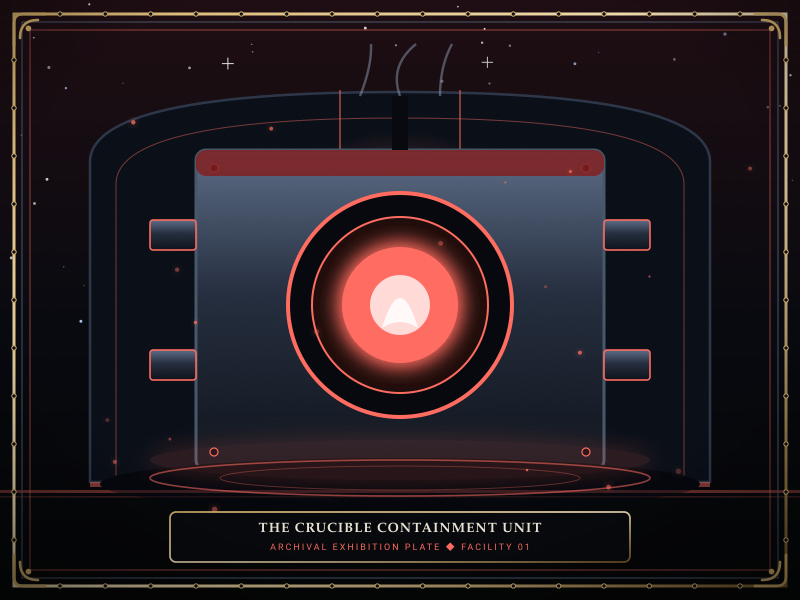
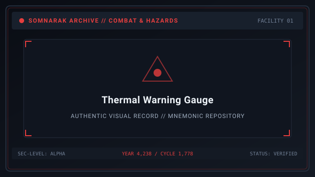
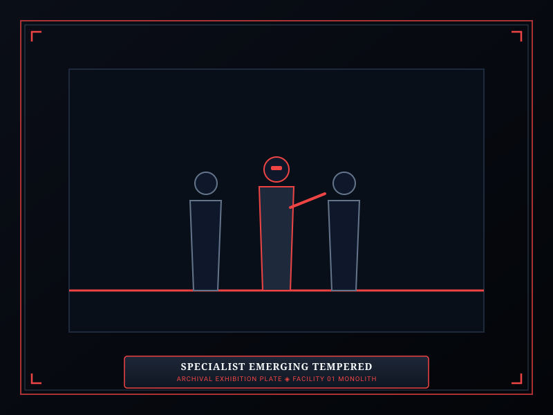

# The Crucible

> *“Step inside and let the fire cook the weakness from your marrow; stay one breath too long, and only ash will walk out.”*

**The Crucible**  [시련의 도가니]  (_Siryeon-ui Dogani_), cataloged under the Somnarak Entity Classification Code as **`SE-T-IIβ-002`**, is a **Rank II (Murmur)** Tool Relic of the **Channeled Use** functional sub-type.

Manufactured during the height of the Unified Containment Directorate (UCD) as an experimental thermodynamic distillation pod, The Crucible is an upright cylindrical iron furnace lined with ceramic coils and pressurized glass observation ports. Governed by the **Two-Work-Type Rule**, specialists enter its interior chamber to channel physical stamina into concentrated [Lumen](33-Lumen.md) energy, balancing rapid production against the furnace's lethal 30-second thermal ceiling.

```text
+========================================================================+
| SECC: SE-T-IIb-002 | THE CRUCIBLE                                      |
+------------------------------------------------------------------------+
| Nomenclature Code      | SE-T-IIb-002 (Murmur Tool Relic)              |
| Functional Subtype     | Channeled Use Relic (Continuous Chamber)      |
| Containment Protocols  | Two-Work-Type Rule: Viderehan & Ferrehan      |
| Primary Function       | High-Yield Han Distillation & Bonus Lumen     |
| Lethal Threshold       | Strict 30-Second Limit; Instant Incineration  |
+========================================================================+
```

## Contents

- [1 General Information](#1-general-information)
- [2 Tool Relic Classification: Channeled Use Mechanics](#2-tool-relic-classification-channeled-use-mechanics)
- [3 Operational Protocols: The Two-Work-Type Rule](#3-operational-protocols-the-two-work-type-rule)
- [4 The 30-Second Thermal Ceiling and Damage Scaling](#4-the-30-second-thermal-ceiling-and-damage-scaling)
- [5 Managerial Guidelines and Emergency Extraction](#5-managerial-guidelines-and-emergency-extraction)
- [6 Log and Method Archival Unlock Progression](#6-log-and-method-archival-unlock-progression)
- [7 Metaphysical Origin and Story](#7-metaphysical-origin-and-story)
- [8 Gallery](#8-gallery)
- [9 See also](#9-see-also)

## 1 General Information



- **Entity Designation:** The Crucible  [시련의 도가니] 
- **SECC Code:** `SE-T-IIβ-002`
- **Risk Classification:** Rank II — Murmur
- **Ontological Type:** Object / Tool Relic (Channeled Use)
- **Primary Pressure Output:** 🔴 **Grudge** (Thermal / Physical Burn)
- **Maximum Safe Channeling Window:** Exactly 29 seconds. Fatal at 30.0 seconds.

## 2 Tool Relic Classification: Channeled Use Mechanics

Unlike Single-Use artifacts that trigger instantaneously, **Channeled Use Tool Relics** require prolonged physical stationing:
- **Chamber Ingress:** The specialist steps through the heavy iron hatchway, which seals automatically behind them.
- **Continuous Channeling:** Once sealed inside, the specialist cannot move or perform other duties. The furnace initiates continuous distillation, generating +2 [Lumen Units (LU)](33-Lumen.md) directly into the daily quota gauge every 5 seconds.
- **Dynamic Heating:** For every second the operative remains inside, internal temperature rises. At designated thresholds, the furnace releases thermal pulses that grant facility-wide defense buffs to all deployed squads.
- **Manual Egress:** The Warden must issue an explicit order to cancel work and recall the specialist before the thermal threshold triggers.

## 3 Operational Protocols: The Two-Work-Type Rule

In accordance with Directorate safety doctrine, The Crucible permits only observation and physical endurance:

| Protocol | Permitted? | Execution Dynamics | Specialist Result |
|---|---|---|---|
| 👁 **Viderehan** (Observation) | **YES** | Specialist monitors external thermal dials and calibrates pressure gauges. | Generates minor Lumen safely; trains Clarity (+SP). |
| 🤲 **Ferrehan** (Endurance) | **YES** | Specialist enters the iron pod and physically channels the thermal furnace coils. | Core channeled mode; massive Lumen harvest; trains Resilience (+HP). |
| 💧 **Flerehan** (Lamentation) | **PROHIBITED** | Ceramic coils and iron plates possess no emotional capacity for shared weeping. | Interface command disabled; mental feedback causes static. |
| ⚔ **Pugnahan** (Confrontation) | **PROHIBITED** | Striking pressurized thermal pipes triggers explosive steam backflow. | Interface command disabled; violent impact ruptures boiler. |

## 4 The 30-Second Thermal Ceiling and Damage Scaling

Channeling inside The Crucible is governed by an unyielding mathematical curve:

| Elapsed Time | Pod Temperature | Specialist Effect | Facility Benefit |
|---|---|---|---|
| **0 – 10 seconds** | 100°C – 250°C | None. Comfortable thermal aura. | +4 Lumen Units harvested. |
| **11 – 20 seconds** | 251°C – 500°C | Suffers 2 🔴 Grudge damage per second. | +8 LU; Squads gain +5% attack speed. |
| **21 – 25 seconds** | 501°C – 800°C | Suffers 6 🔴 Grudge damage per second. | +12 LU; Squads gain +10% attack speed. |
| **26 – 29 seconds** | 801°C – 1,199°C | Suffers 12 🔴 Grudge damage per second. | +16 LU; Pod flashes crimson alert. |
| **30.0+ seconds** | **1,200°C (Critical)** | **Instant Combustion**. Operative reduced to ash. | **Catastrophic Failure**: 25 LU drained. |

## 5 Managerial Guidelines and Emergency Extraction

1. **Managerial Tip 1:** Specialists performing 🤲 **Ferrehan** channeling inside The Crucible produce 2 Lumen Units every 5 seconds. Operatives with high **Resilience** (Fortitude) and fire-resistant M.A.W. Suits can endure the thermal escalation longer.
2. **Managerial Tip 2:** The Warden must manually click the containment chamber to recall the specialist. There is no automated safety ejector; if the operative remains inside for 30 consecutive seconds, the furnace incinerates them instantly, destroying all equipped gear.
3. **Managerial Tip 3:** If an operative is extracted between 20 and 29 seconds, they emerge with the *Tempered Core* buff, granting +15 Max HP and +0.1 physical defense for the remainder of the shift.
4. **Managerial Tip 4:** After an operative exits, The Crucible requires a 40-second cool-down cycle. Sending another specialist into the pod while steam is still venting doubles the heat accumulation rate.

## 6 Log and Method Archival Unlock Progression

Observation logs for Channeled Relics unlock based on cumulative **Time of Use**:

| Unlock Tier | Required Time | Archival Information Unlocked |
|---|---|---|
| **Level 1** | 10 Seconds Cumulative | Basic identification, SECC code, and channeled use mechanics. |
| **Level 2** | 30 Seconds Cumulative | Managerial Tips 1 and 2, temperature curve, and 30-second fatality limit. |
| **Level 3** | 60 Seconds Cumulative | Managerial Tips 3 and 4, Tempered Core buff, and cooldown timings. |
| **Level 4** | 120 Seconds Cumulative | Complete historical engineering logs, UCD factory origin, and trivia. |

## 7 Metaphysical Origin and Story

The Crucible was engineered during Cycle 814 of the UCD era by master foundryman David Karr. Faced with crippling energy shortages in the facility's lower sectors, Karr designed a thermodynamic chamber capable of converting the biological heat and willpower of human operatives into clean, distilled Han vapor.

Karr tested the prototype himself. In his personal ledger, he wrote: *“The heat is not painful; it is pure. For the first twenty seconds, you feel the grief burning out of your blood like slag from iron. After twenty-five seconds, you realize that without your grief, there is almost nothing left of you to burn.”*

On the final test run, Karr refused to pull the emergency release latch. When recovery teams pried the hatch open, they found no body—only a perfect, violet-tinted crystal ingot weighing exactly 0.02 tons and an iron pod that has remained warm to the touch ever since.

## 8 Gallery

[](images/the-crucible-containment-unit.svg)
[](images/thermal-warning-gauge.svg)
[](images/specialist-emerging-tempered.svg)

*Left: The Crucible iron cylindrical unit; Center: thermal escalation gauge; Right: operative emerging with Tempered Core.*
---

## 9 See also

- [37-Relic Entities](37-Relic%20Entities.md) — comprehensive Tool Relics hub
- [28-The Echo Compass](28-The%20Echo%20Compass.md) — specimen dossier: Single-Use Relic
- [30-The Debt Scale](30-The%20Debt%20Scale.md) — specimen dossier: Equippable Relic
- [19-Lumen Surge](19-Lumen%20Surge.md) — energy quotas and overcharge harvesting
