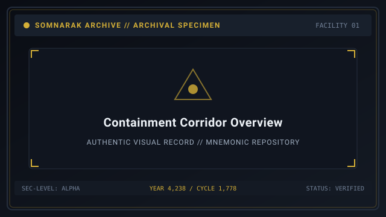
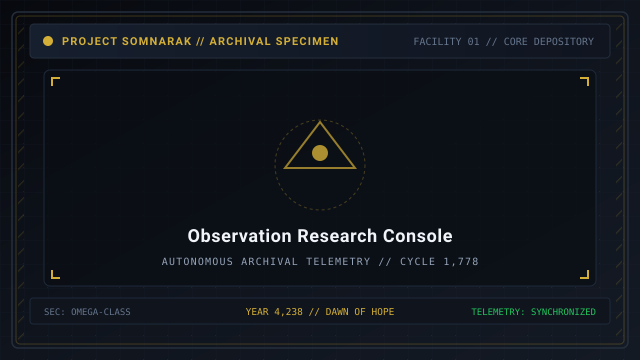
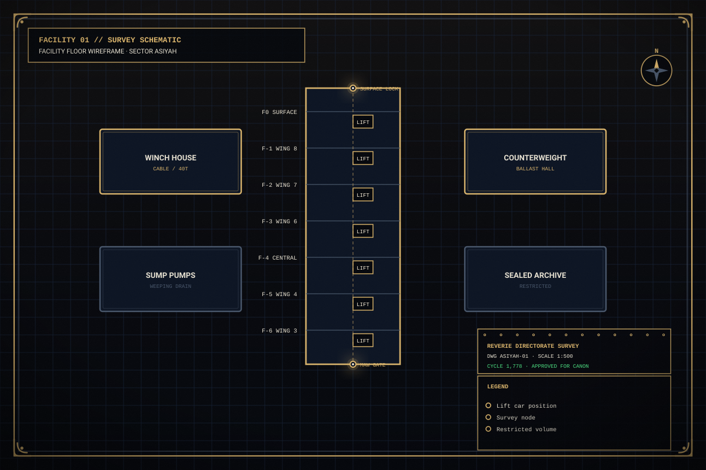

# Overview

> *“To step into Facility 01 is to realize that the universe is made of grief, and our task is to keep the lights on.”*

The **Sorrow Encyclopedia Overview**  [슬픔 백과사전 개요]  (_Seulpeum Baekgwasajeon Gaeyo_) introduces the structural framework, philosophy, and administrative guidelines governing the containment of [Sorrow Entities](07-Sorrow%20Entities.md).

Within the somber halls of Facility 01, humanity does not wage war against monsters; it tends to living manifestations of historical and personal grief. This overview serves as the essential primer for Wardens assuming operational command.

```text
+========================================================================+
| SOMNARAK - SORROW ENCYCLOPEDIA MASTER OVERVIEW                         |
+------------------------------------------------------------------------+
| Archival Foundation    | Comprehensive Taxonomy of Contained Sorrows   |
| Scope of Depository    | 291 Entities across Nine Operational Floors   |
| Chamber Engineering    | Pneumatic Bulkheads & Resonance Lead Glass    |
| Containment Axiom      | Weep with the Sorrow, but never become it     |
| Authority              | Reverie Directorate - Facility 01 Archival Bur|
+========================================================================+
```

## Contents

- [1 The Municipal Mission of Facility 01](#1-the-municipal-mission-of-facility-01)
- [2 Containment Chamber Engineering Specifications](#2-containment-chamber-engineering-specifications)
- [3 Departmental Containment Allocation Matrix](#3-departmental-containment-allocation-matrix)
- [4 The Four Comprehension Levels and Codex Progression](#4-the-four-observation-levels-and-codex-progression)
- [5 The Four Protocols in Administrative Practice](#5-the-four-protocols-in-administrative-practice)
- [6 The Ethical Philosophy of Han Harvesting](#6-the-ethical-philosophy-of-han-harvesting)
- [7 The Warden's Oath and Command Guidelines](#7-the-wardens-oath-and-command-guidelines)
- [8 Gallery](#8-gallery)
- [9 See also](#9-see-also)

## 1 The Municipal Mission of Facility 01

Facility 01 was constructed above the subterranean boundary of the [Maw](41-Frontiers.md) with three vital directives:
1. **Isolation:** Quarantining volatile sorrow entities away from civilian populations.
2. **Extraction:** Refining dangerous Han gas into stable [Lumen](33-Lumen.md) energy to sustain municipal civilization.
3. **Ascension:** Accumulating supercritical resonance to fuel the Absolvohan engine and bring forth the Dawn of Hope.

## 2 Containment Chamber Engineering Specifications

Each containment chamber is an engineering marvel designed to isolate metaphysical trauma:
- **Resonance Dampening Bulkheads:** Reinforced walls lined with lead and acoustic foam that prevent emotional spillover into adjacent hallways.
- **Hydraulic Airlocks:** Double-sealed pneumatic blast doors that seal automatically upon breach detection.
- **Observation Aperture:** One-way polarized lead-glass allowing specialists to execute 👁 **Viderehan** protocols without triggering psychic feedback.
- **Automated Reclamping Systems:** Robotic ceiling cranes that secure subdued entities after successful combat suppressions.

## 3 Departmental Containment Allocation Matrix

To prevent catastrophic multi-wing breaches, entities are allocated across vertical strata:

| Facility Layer | Departments Included | Assigned Risk Tiers | Strategic Containment Objective |
|---|---|---|---|
| **Upper (Shallow)** | Spires & Central Admin | Whisper (I) & Murmur (II) | Rookie training; reliable energy baseline. |
| **Middle Layer** | Maw's Keep & Extraction | Fragment (III) & Early Wail (IV) | Heavy gear fabrication; defense testing. |
| **Lower (Deep)** | Vault, Shadow, Gate Watch | High Wail (IV) & Sovereign (V) | High security quarantine; abyssal defense. |

## 4 The Four Comprehension Levels and Codex Progression

Interacting with an entity unlocks its archival dossier across four progressive tiers:
- **Comprehension Level 1 (Basic Parameters):** Unlocks entity name, SECC code, risk level, damage pressure, and base energy capacity.
- **Comprehension Level 2 (Warden Tips):** Unlocks specific behavioral guidelines, agitation triggers, and escape conditions.
- **Comprehension Level 3 (Work Preference Matrix):** Displays the exact percentage affinity for all four containment protocols across specialist ranks I to V.
- **Comprehension Level 4 (M.A.W. Extraction & Story):** Unlocks the ability to fabricate M.A.W. Weapons and Suits, alongside the entity's complete psychological backstory and municipal origin.

## 5 The Four Protocols in Administrative Practice

Every routine interaction requires careful selection of work protocols:
- 👁 **Viderehan (Observation):** Safe analytical scanning; low risk, steady yield; trains **Clarity**.
- 🤲 **Ferrehan (Endurance):** Physical maintenance; cleanses toxic secretions; trains **Resilience**.
- 💧 **Flerehan (Lamentation):** Emotional resonance; listens to the entity's grief; trains **Composure**.
- ⚔ **Pugnahan (Confrontation):** Direct disciplinary force; suppresses dangerous impulses; trains **Resolve**.

## 6 The Ethical Philosophy of Han Harvesting

The Directorate's founding creed states: *“To research sorrow is to give it a name.”*
- Sorrow cannot be destroyed; attempting to eradicate an entity merely causes it to dissolve into the groundwater and reform elsewhere.
- By providing structured containment and listening to its grief, the facility transforms raw trauma into illumination.

## 7 The Warden's Oath and Command Guidelines

Upon assuming command of Facility 01, every Warden recites the solemn oath:
- *“I shall not avert my eyes from the dark; I shall not spend a life without purpose; I shall hold the walls until the dawn arrives.”*

## 8 Gallery

[](images/containment-corridor-overview.svg)
[](images/observation-research-console.svg)
[](images/facility-floor-wireframe.svg)

*Left: main containment hallway; Center: observation terminal; Right: facility structural wireframe.*
---

## 9 See also

- [07-Sorrow Entities](07-Sorrow%20Entities.md) — master bestiary hub incorporating the codex
- [08-Sorrow List](08-Sorrow%20List.md) — master catalog of all 291 entities
- [21-Game Mechanics](21-Game%20Mechanics.md) — core simulation and gameplay rules
- [39-Archival Codex](39-Archival%20Codex.md) — the 18 standard dossier sections
