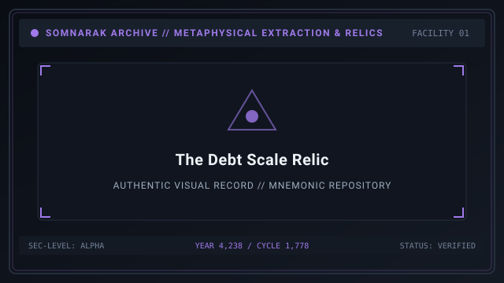
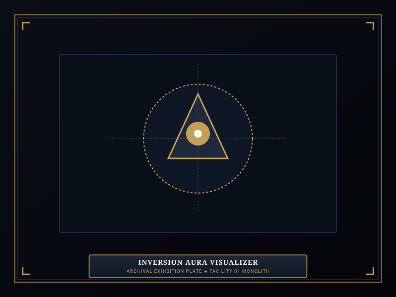
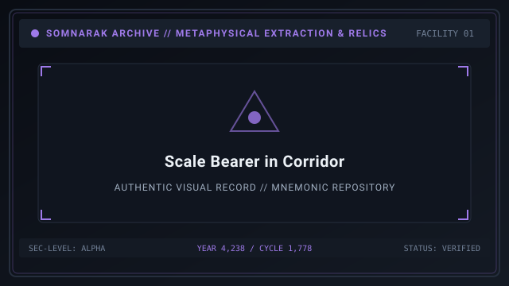

# The Debt Scale

> *“Carry the ledger upon your palm; it will balance what you owe against what the world took from you.”*

**The Debt Scale**  [부채의 저울]  (_Buchae-ui Jeoul_), cataloged under the Somnarak Entity Classification Code as **`SE-T-IIIγ-003`**, is a **Rank III (Fragment)** Tool Relic of the **Equippable** functional sub-type.

Recovered from the municipal vaults of the Old Commercial Syndicate, The Debt Scale is a handheld balance fashioned from blackened iron and pale bone, bearing miniature pans that sway perpetually without physical air currents. Governed strictly by the **Two-Work-Type Rule**, an operative interacts with the scale to carry it directly into facility corridors, gaining potent mobile support auras and metaphysical damage inversions while accepting severe vulnerability to physical trauma.

```text
+========================================================================+
| SECC: SE-T-IIIg-003 | THE DEBT SCALE                                   |
+------------------------------------------------------------------------+
| Nomenclature Code      | SE-T-IIIg-003 (Fragment Tool Relic)           |
| Functional Subtype     | Equippable Relic (Carried Field Artifact)     |
| Containment Protocols  | Two-Work-Type Rule: Viderehan & Ferrehan      |
| Primary Function       | Passive SP Healing & Void Damage Inversion    |
| Defense Tradeoff       | Grants 0.3 Void Defense; Weakens Grudge to 1.8|
+========================================================================+
```

## Contents

- [1 General Information](#1-general-information)
- [2 Tool Relic Classification: Equippable Mechanics](#2-tool-relic-classification-equippable-mechanics)
- [3 Operational Protocols: The Two-Work-Type Rule](#3-operational-protocols-the-two-work-type-rule)
- [4 The Inversion Aura and Defensive Trade-Offs](#4-the-inversion-aura-and-defensive-trade-offs)
- [5 Resonance Pairing with The Debt Eater](#5-resonance-pairing-with-the-debt-eater)
- [6 Managerial Guidelines and Retrieval Rules](#6-managerial-guidelines-and-retrieval-rules)
- [7 Log and Method Archival Unlock Progression](#7-log-and-method-archival-unlock-progression)
- [8 Metaphysical Origin and Story](#8-metaphysical-origin-and-story)
- [9 Gallery](#9-gallery)
- [10 See also](#10-see-also)

## 1 General Information



- **Entity Designation:** The Debt Scale  [부채의 저울] 
- **SECC Code:** `SE-T-IIIγ-003`
- **Risk Classification:** Rank III — Fragment
- **Ontological Type:** Object / Tool Relic (Equippable)
- **Primary Pressure Manipulation:** ⚪ **Void** (Pale) vs 🔴 **Grudge** (Physical)
- **Safe Carrying Limit:** Must be returned to chamber before shift evaluation.

## 2 Tool Relic Classification: Equippable Mechanics

As an **Equippable Tool Relic**, The Debt Scale leaves its containment cell:
- **Field Carrying:** An assigned specialist enters the cell, retrieves the scale, and carries it in their secondary weapon hand.
- **Mobile Support Aura:** As the specialist walks through corridors, elevators, and Command Rooms, the scale radiates a restorative pulse every 3 seconds, restoring 4–6 Sanity Points (SP) to all squadmates within a 5-meter radius.
- **Combat Participation:** The bearer can still wield a one-handed primary M.A.W. weapon, functioning as an agile combat medic during suppression clashes.

## 3 Operational Protocols: The Two-Work-Type Rule

In accordance with Directorate safety doctrine, The Debt Scale permits only observation and physical handling:

| Protocol | Permitted? | Execution Dynamics | Specialist Result |
|---|---|---|---|
| 👁 **Viderehan** (Observation) | **YES** | Specialist calibrates the counterweights and reads the bone pans. | Safely prepares relic; checks balance; trains Clarity (+SP). |
| 🤲 **Ferrehan** (Endurance) | **YES** | Specialist picks up the scale and carries it out into the facility. | Equips relic for field deployment; trains Resilience (+HP). |
| 💧 **Flerehan** (Lamentation) | **PROHIBITED** | Inanimate iron pans cannot respond to emotional grief or tears. | Interface command disabled; attempted communion causes silence. |
| ⚔ **Pugnahan** (Confrontation) | **PROHIBITED** | Forcible impact unbalances the calibrated bone counterweights. | Interface command disabled; violent contact causes psychic backlash. |

## 4 The Inversion Aura and Defensive Trade-Offs

Carrying The Debt Scale fundamentally alters the bearer's metaphysical defense matrix:
- **Pale Void Inversion:** The bearer's resistance against ⚪ **Void** damage becomes **0.3 (Highly Resistant)**. When struck by percentage-based Void attacks, the bearer absorbs only a fraction of damage, and 50% of the absorbed damage is converted into an immediate party-wide health heal.
- **Physical Grudge Penalty:** In exchange, the bearer's resistance against physical 🔴 **Grudge** damage collapses to **1.8 (Fatal Vulnerability)**. Kinetic slashes, beast claws, and blunt weapons inflict devastating damage.

## 5 Resonance Pairing with The Debt Eater

The Debt Scale shares a direct metaphysical resonance with [27-The Debt Eater](27-The%20Debt%20Eater.md) (`SE-C-IIIβ-014`):
- **Synergy:** When an operative carrying The Debt Scale enters The Debt Eater's containment chamber to execute ⚔ **Pugnahan** work, all Void damage dealt by The Debt Eater is reduced to 0.
- **Bonus Yield:** Completing work under this pairing yields an additional +4 Lumen Units and grants the bearer the temporary *Absolved Debtor* combat buff.

## 6 Managerial Guidelines and Retrieval Rules

1. **Managerial Tip 1:** An operative carrying The Debt Scale emits an aura that heals 5 SP to nearby allies every 3 seconds, making them invaluable for escorting panicked squadmates to safety.
2. **Managerial Tip 2:** The bearer takes 80% increased damage from 🔴 **Grudge** attacks. Never position the scale-bearer in front of brute beasts or GREY Ordeal incursions.
3. **Managerial Tip 3:** The scale must be returned to its chamber before the Warden concludes the daily shift. If the shift ends while an operative is still carrying the scale, the scale claims its debt, draining 50% of the operative's maximum HP permanently.
4. **Managerial Tip 4:** If the bearer perishes while holding the scale, the relic remains on the corridor floor. Any adjacent specialist can pick it up. Bearer doctrine for corridor deployment:

| Doctrine | Bearer Loadout Rule | Reason |
|---|---|---|
| Pair with | Void-warded vanguard and ranged Grudge cover | Bearer heals while cover kills |
| Equip | One-handed M.A.W. plus movement-speed charm | Bearer must never stand still |
| Avoid | Frontline anchor duty against brute beasts | 1.8 Grudge weakness is fatal |
| Avoid | Carrying past shift evaluation | The scale collects 50% max HP |

Any adjacent specialist can pick it up by interacting with it via 🤲 **Ferrehan**.

## 7 Log and Method Archival Unlock Progression

Observation logs for Equippable Relics unlock based on cumulative **Equipped Duration**:

| Unlock Tier | Required Duration | Archival Information Unlocked |
|---|---|---|
| **Level 1** | 30 Seconds Equipped | Basic identification, SECC code, and equippable mechanic rules. |
| **Level 2** | 60 Seconds Equipped | Managerial Tips 1 and 2, Void inversion defense, and Grudge vulnerability. |
| **Level 3** | 120 Seconds Equipped | Managerial Tips 3 and 4, return rules, and Debt Eater resonance synergy. |
| **Level 4** | 300 Seconds Equipped | Complete commercial syndicate lore, archival debrief, and flavor text. |

## 8 Metaphysical Origin and Story

The Debt Scale was originally the property of Magistrate Yoon of the Third Municipal District during the pre-Dawn era. Yoon presided over the liquidation of bankrupt families, determining which citizens would be sold into subterranean mining contracts to settle outstanding municipal debts.

It is recorded that Yoon kept this balance upon his cedar desk for forty years, weighing promissory notes against drops of the debtor's blood. When the Third District collapsed into civil unrest during the Hungry Winter of Year 4,219, Yoon was found dead in his chambers, having swallowed his own iron weights.

The scale survived the fire intact. When placed upon a table, its pans never rest level; one side always hangs lower, waiting for someone to offer a sacrifice heavy enough to satisfy forty years of uncollected interest.

> *Recovered ledger fragment, Magistrate Yoon's hand: “They wept and called me cruel. But every weight I hung was owed. When the city burns, let it be recorded that the scales were never wrong — only the men who read them.”*

## 9 Gallery

| The Artifact | Inversion Aura | Corridor Bearer |
|---|---|---|
| [](images/the-debt-scale-relic.svg) | [](images/inversion-aura-visualizer.svg) | [](images/scale-bearer-in-corridor.svg) |
| *Iron and bone balance* | *Restorative aura field* | *Bearer escorting a squad* |
---

## 10 See also

- [37-Relic Entities](37-Relic%20Entities.md) — comprehensive Tool Relics hub
- [28-The Echo Compass](28-The%20Echo%20Compass.md) — specimen dossier: Single-Use Relic
- [29-The Crucible](29-The%20Crucible.md) — specimen dossier: Channeled Use Relic
- [27-The Debt Eater](27-The%20Debt%20Eater.md) — specimen Subject: paired debt resonance
The Crucible](29-The%20Crucible.md) — specimen dossier: Channeled Use Relic
- [27-The Debt Eater](27-The%20Debt%20Eater.md) — specimen Subject: paired debt resonance
