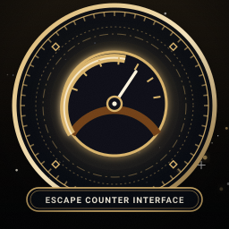
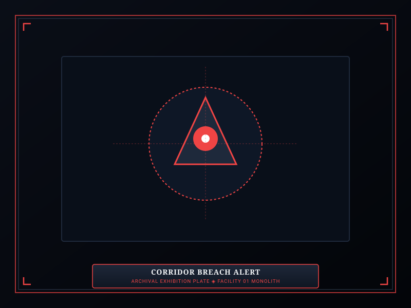
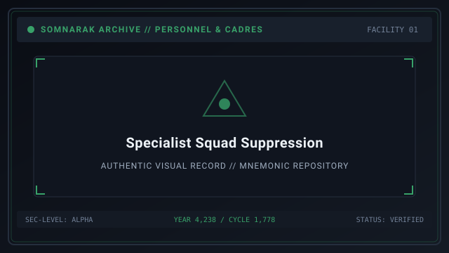

# Behavior

> *“An entity does not sleep; it waits for your attention to slip.”*

**Behavior**  [격리 개체 행동 양식]  (_Gyeokri Gaeche Haengdong Yangsik_) governs the psychological states, mood shifts, and breach mechanics of [Sorrow Entities](07-Sorrow%20Entities.md) contained within Facility 01.

Every entity operates under strict algorithmic and emotional laws. Understanding what calms an entity, what provokes its rage, and how it navigates facility hallways during a breach is the central discipline of tactical containment.

```text
+========================================================================+
| SOMNARAK - CONTAINMENT BEHAVIOR & BREACH DYNAMICS                      |
+------------------------------------------------------------------------+
| Behavioral States      | Docile - Agitated - Breaching - Suppressed    |
| Escape Counter         | Mugenhan Clamping Value (0 = Immediate Breach)|
| Agitation Vectors      | 10 Primary Failure Triggers (Bad Work, Casualt|
| Movement Patterns      | Hallway Roaming - Ambush - Teleportation      |
| Suppression Loop       | Combat Interception -> Damage Stagger -> Recla|
+========================================================================+
```

## Contents

- [1 The Four Containment States and Mood Multipliers](#1-the-four-containment-states-and-mood-multipliers)
- [2 The Mugenhan Escape Counter Mechanics](#2-the-mugenhan-escape-counter-mechanics)
- [3 The Ten Primary Agitation Triggers](#3-the-ten-primary-agitation-triggers)
- [4 Breach Dynamics and Hallway Pathfinding AI](#4-breach-dynamics-and-hallway-pathfinding-ai)
- [5 Suppression Protocols and Reclamping Recovery](#5-suppression-protocols-and-reclamping-recovery)
- [6 Post-Suppression Behavioral Resets](#6-post-suppression-behavioral-resets)
- [7 Gallery](#7-gallery)
- [8 See also](#8-see-also)

## 1 The Four Containment States and Mood Multipliers

During routine operations, an entity exists in one of four states:
1. **Docile (Green):** The entity is calm. Work success rates are at baseline or elevated (+5% bonus). Damage dealt during work ticks is reduced by 10%.
2. **Agitated (Yellow):** The entity is restless. Work success rates drop by 15%, and elemental damage dealt during work ticks increases by 25%.
3. **Breaching (Red):** The entity has broken its containment seals and entered the facility hallways, attacking any personnel it encounters.
4. **Suppressed (Blue):** The entity has been incapacitated by combat squads and is undergoing automatic hydraulic reclamping back into its cell.

## 2 The Mugenhan Escape Counter Mechanics

Every breaching entity is regulated by an **Escape Counter** displayed above its cell door:
- **Baseline Values:** Typically ranges from 1 to 3 depending on entity risk tier (Whispers possess none; Sovereigns possess 1–2).
- **Counter Depletion:** Reaching 0 causes an immediate catastrophic breach.
- **Counter Recovery:** Successfully completing a Good work outcome often restores the counter by +1 up to its maximum ceiling.

## 3 The Ten Primary Agitation Triggers

The escape counter drops under specific conditions detailed in the entity's managerial tips:
1. **Bad Work Outcome:** Generating mostly Fracture boxes during a work session.
2. **Protocol Dislike:** Assigning a work protocol the entity abhors (e.g., ⚔ **Pugnahan** on a gentle grieving entity).
3. **Meltdown Timeout:** Allowing a 60-second cell overload timer to expire without dispatching staff.
4. **Auxiliary Casualties:** High-threat Wail and Sovereign entities drop counters whenever 5 or more auxiliaries die on the floor.
5. **Specialist Panic:** If an operative panics inside the containment chamber, the counter drops instantly to 0.
6. **Incompatible Attribute Rank:** Sending an operative whose Resilience or Clarity is below the entity's required threshold.
7. **Shift Duration Fatigue:** Working with the same entity more than 5 times in a single shift.
8. **Adjacent Wing Breaches:** Localized tectonic tremors from nearby escaping horrors agitate fragile cells.
9. **Ordeal Emergence:** Certain entities react violently whenever a Violet or Black Ordeal manifests.
10. **Direct Provocation:** Equipping weapons derived from an entity's natural predator.

## 4 Breach Dynamics and Hallway Pathfinding AI

Once an entity breaches, its artificial intelligence dictates movement:
- **Hallway Roamers:** Move along standard corridors, attacking any auxiliaries or specialists in their path.
- **Teleporters:** Disappear from view and instantly reappear in populated departmental Main Rooms.
- **Ambush Predators:** Cling to elevator ceilings, dropping onto passing combat squads.
- **Aura Emitters:** Remain stationary in hallway intersections while radiating massive pulses of 🔵 **Lament** or ⚫ **Weight** damage across entire wings.

## 5 Suppression Protocols and Reclamping Recovery

To subdue a breaching entity, Wardens orchestrate real-time combat:
1. **Quarantine:** Evacuate vulnerable recruits and unarmored auxiliaries from the target corridor.
2. **Squad Muster:** Assemble specialists armed with M.A.W. weapons matching the entity's elemental weakness.
3. **Clash Engagement:** Intercept the entity in a wide hallway or Main Room, utilizing frontline tanks equipped with resistant suits to absorb blows.
4. **Stagger & Subdue:** Reducing the entity's health bar to zero forces it into a collapsed state, triggering robotic recovery drones that transport it back into containment.

## 6 Post-Suppression Behavioral Resets

After being reclamped into its cell:
- The entity enters a 60-second recovery cooldown during which no work can be assigned.
- The Mugenhan Escape Counter resets to its default starting value.
- Harvester drones extract any stray Han gas leaked during the breach, restoring environmental stability.

## 7 Gallery

[](images/escape-counter-interface.svg)
[](images/corridor-breach-alert.svg)
[](images/specialist-squad-suppression.svg)

*Left: cell escape counter HUD; Center: emergency breach warning siren; Right: specialist squad engaging hostile entity.*
---

## 8 See also

- [21-Game Mechanics](21-Game%20Mechanics.md) — core containment and clash formulas
- [18-Containment Levels](18-Containment%20Levels.md) — meltdown levels and cell overloads
- [09-M.A.W. Equipment](09-M.A.W.%20Equipment.md) — weapon damage profiles and suit resistances
- [10-Ordeals](10-Ordeals.md) — non-containment hallway incursion threats
