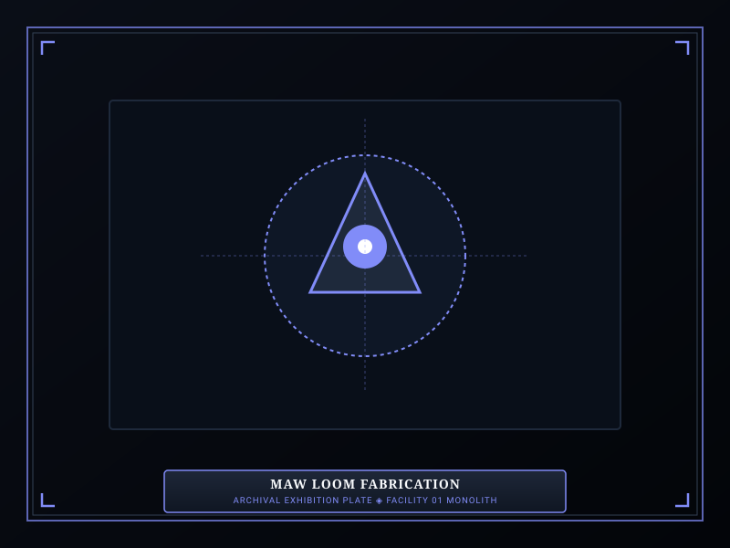
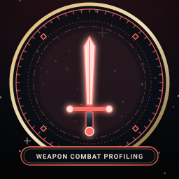

# M.A.W. Equipment

> *“We wear their sorrow so we do not drown in our own.”*

**M.A.W. Equipment**  [기억 무장 직조]  (_Gieok Mujang Jikjo_ — Mnemonic Armament Weave) represents the specialized offensive and defensive gear synthesized directly from the containment cores of [Sorrow Entities](07-Sorrow%20Entities.md).

Human steel and standard kevlar shatter under the metaphysical pressures of the Maw. To survive encounters with high-threat entities and subdue wandering [Ordeals](10-Ordeals.md), specialists must be clad in equipment woven from the very sorrow they combat.

```text
+========================================================================+
| SOMNARAK - M.A.W. EXTRACTION AND FABRICATION                           |
+------------------------------------------------------------------------+
| Armament Classification | M.A.W. (Mnemonic Armament Weave)             |
| Equipment Categories   | Weapons (Offense) - Suits (Defense) - Gifts   |
| Extraction Formula     | Observation Points + Harvested Lumen Units    |
| Stockpile Cap          | 1 to 5 Duplicate Pieces per Researched Entity |
| Permanent Loss Rule    | Equipped pieces vanish upon Specialist Death  |
+========================================================================+
```

## Contents

- [1 Theory of M.A.W. Extraction](#1-theory-of-maw-extraction)
- [2 Extraction Formulas and Observation Point Costs](#2-extraction-formulas-and-observation-point-costs)
- [3 Weapon Synthesis and Combat Profiling](#3-weapon-synthesis-and-combat-profiling)
- [4 Suit Weaving and Multi-Pressure Armor](#4-suit-weaving-and-multi-pressure-armor)
- [5 Spontaneous Gift Manifestation and Body Slots](#5-spontaneous-gift-manifestation-and-body-slots)
- [6 Set Resonance Bonuses](#6-set-resonance-bonuses)
- [7 Armory Logistics and Stockpile Limits](#7-armory-logistics-and-stockpile-limits)
- [8 Gallery](#8-gallery)
- [9 See also](#9-see-also)

## 1 Theory of M.A.W. Extraction

M.A.W. equipment is fabricated in Lead Zyrak's Extraction Hall:
- By completing work sessions, specialists harvest observation points that decode the entity's molecular blueprint.
- Once Observation Level 4 is reached, the Directorate's resonant looms weave fluid Lumen around the entity's core frequency.
- The resulting weapons and suits embody the entity's physical traits, elemental pressures, and psychological memories.

## 2 Extraction Formulas and Observation Point Costs

Fabricating M.A.W. gear requires spending accumulated observation points and raw Lumen:

| Entity Risk Rank | Weapon Cost (Points / LU) | Suit Cost (Points / LU) | Maximum Stockpile |
|---|---|---|---|
| **Whisper (Rank I)** | 10 Points / 15 LU | 10 Points / 20 LU | 5 Copies |
| **Murmur (Rank II)** | 20 Points / 30 LU | 20 Points / 40 LU | 3 Copies |
| **Fragment (Rank III)** | 35 Points / 50 LU | 35 Points / 65 LU | 2 Copies |
| **Wail (Rank IV)** | 55 Points / 80 LU | 55 Points / 100 LU | 1 Copy |
| **Sovereign (Rank V)** | 80 Points / 130 LU | 80 Points / 160 LU | 1 Copy |

## 3 Weapon Synthesis and Combat Profiling

M.A.W. Weapons convert the bearer's will into focused elemental damage:
- **Pressure Specialization:** Each weapon deals one of the four canonical pressures: 🔴 **Grudge** (physical/kinetic), 🔵 **Lament** (mental/SP), ⚪ **Void** (max HP percentage), or ⚫ **Weight** (dual HP+SP drain).
- **Speed & Range Metrics:** Weapons range from *Very Fast* rapid daggers to *Very Slow* colossal scythes, and from *Very Short* fist wraps to *Very Long* beam rifles.
- **Sanity Restorers:** Weapons dealing 🔵 Lament or ⚪ Void damage can strike panicked allies to restore their sanity.

## 4 Suit Weaving and Multi-Pressure Armor

M.A.W. Suits project protective resonance barriers around specialists:
- **Resistance Multipliers:** Suits feature distinct defense multipliers across all four pressures.
- **The Multiplier Scale:** Multipliers below 0.5 provide near-immunity (*Ineffective*), while multipliers above 1.5 represent fatal vulnerability (*Fatal*).
- Wardens must tailor squad armor distributions before engaging specific entities or Ordeal incursions.

## 5 Spontaneous Gift Manifestation and Body Slots

During exceptional work sessions, an entity may bestow a **M.A.W. Gift** upon an operative:
- **Anatomical Slots:** Up to 6 gifts can be worn simultaneously across Head, Eye, Face, Neck, Chest, and Hand.
- **Stat Modifications:** Gifts grant permanent passive bonuses (e.g., +5 Max HP, +3 Attack Speed, or +5% Work Success).
- **Overwrite Rule:** Gifts cannot be manually unequipped. Earning a new gift for an occupied slot permanently replaces the previous gift.

## 6 Set Resonance Bonuses

Equipping matching weapon and suit sets from the same entity unlocks **Set Resonance**:
- Enhances weapon attack speed by +15%.
- Reduces incoming elemental damage by an additional 10%.
- Unlocks special combat animations or passive defensive auras.

## 7 Armory Logistics and Stockpile Limits

The Directorate enforces strict municipal stockpile regulations:
- Each researched entity can yield a limited number of weapons and suits (typically 1 to 5 copies depending on risk rank).
- **Loss on Death:** If a specialist carrying M.A.W. gear perishes or enters permanent unrecoverable panic, their equipped gear is destroyed and must be re-fabricated using fresh Lumen.

## 8 Gallery

[](images/maw-loom-fabrication.svg)
[](images/weapon-combat-profiling.svg)
[](images/maw-suit-armor-display.svg)

*Left: resonant loom fabricating M.A.W. suit; Center: weapon profile testing; Right: equipped specialist showcase.*
---

## 9 See also

- [09-M.A.W. Equipment](09-M.A.W.%20Equipment.md) — comprehensive weapon, suit, and gift armory
- [17-Pressure Types](17-Pressure%20Types.md) — damage calculations and resistance bands
- [12-Specialists](12-Specialists.md) — equipping gear and managing panic states
- [27-The Debt Eater](27-The%20Debt%20Eater.md) — specimen M.A.W. set: *Reaper Hungered* & *Debt Shroud*
