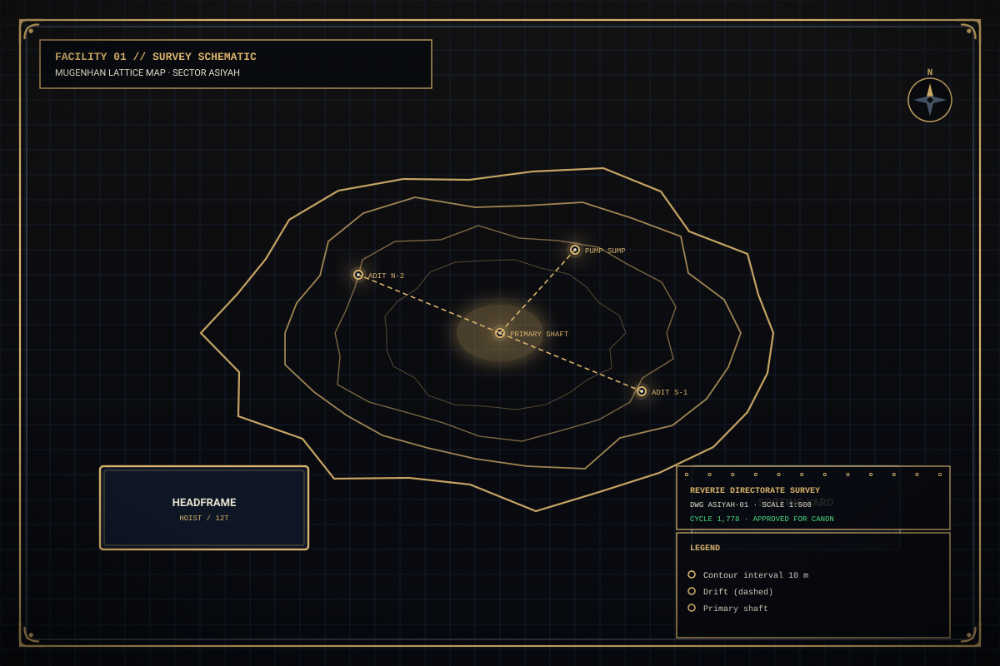
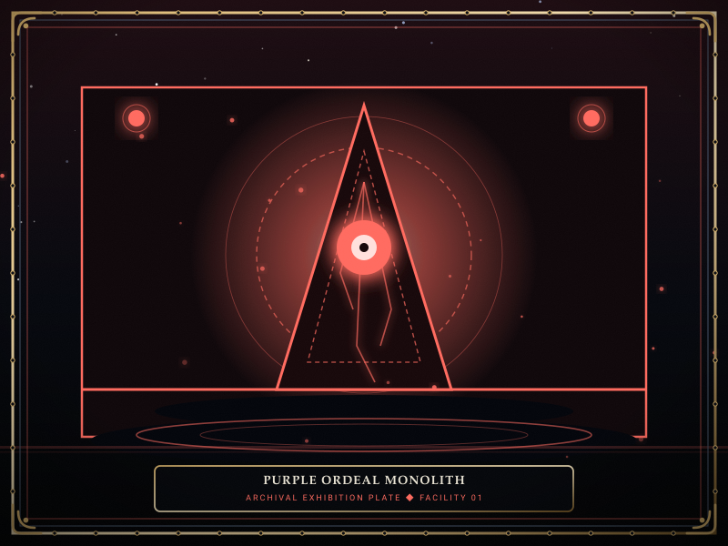

# Mugenhan and Ordeals

> *“The lattice bends until the world breaks; when the clock strikes, the Ordeal enters without knocking.”*

**Mugenhan and Ordeals**  [무한한 격자와 시련]  (_Mugenhan Gyeokja-wa Siryeon_) details the metaphysical interaction between the planetary energy lattice and the catastrophic incursion events known as [Ordeals](10-Ordeals.md).

Within the world of [[SOMNARAK-WORLD](https://github.com/Redditor008/PROJECT.SOMNARAK-WIKI/tree/arena/01a0b699-project-somnarak-wiki/SOMNARAK-WORLD "SOMNARAK-WORLD")], Facility 01 does not exist in an isolated vacuum. It is anchored directly into the **Mugenhan Lattice**, a complex subterranean matrix that groans under the strain of contained sorrow, periodically releasing violent shockwaves into the corridors.

```text
+========================================================================+
| SOMNARAK - MUGENHAN LATTICE & ORDEAL CRISES                            |
+------------------------------------------------------------------------+
| Environmental Grid     | Mugenhan Planetary Lattice (27 Strata)        |
| Lattice Strata         | 15 Mundane - 6 Infused - 6 Mortal Layers      |
| Crisis Events          | 60 Ordeals (5 Colors x 4 Watches Matrix)      |
| Color Axes             | Ashen - Blue - Grey - Obsidian - Purple       |
| Watch Tiers            | First - Second - Third - Tide                 |
+========================================================================+
```

## Contents

- [1 The Mugenhan Planetary Lattice: 27 Subterranean Strata](#1-the-mugenhan-planetary-lattice-27-subterranean-strata)
- [2 Lattice Strain Dynamics and Tectonic Accumulation](#2-lattice-strain-dynamics-and-tectonic-accumulation)
- [3 The Five Color Axes of Ordeals](#3-the-five-color-axes-of-ordeals)
- [4 The Four Watches and Tactical Timing](#4-the-four-watches-and-tactical-timing)
- [5 Master 5x4 Ordeals Tactical Response Matrix](#5-master-5x4-ordeals-tactical-response-matrix)
- [6 Tactical Suppression Doctrines for Complex Incursions](#6-tactical-suppression-doctrines-for-complex-incursions)
- [7 Gallery](#7-gallery)
- [8 See also](#8-see-also)

## 1 The Mugenhan Planetary Lattice: 27 Subterranean Strata

The Mugenhan Lattice represents the metaphysical tectonic framework underlying the continent, cataloged into 27 discrete strata:

| Lattice Tier | Strata Depth | Geological / Metaphysical State | Tectonic Function |
|---|---|---|---|
| **Mundane (15 Layers)** | 0m to -1,500m | Dense surface basalt, granite, and coal beds | Structural foundation for surface spires; absorbs minor vibrations. |
| **Infused (6 Layers)** | -1,500m to -4,500m | Han-saturated shale, liquid crystal veins, weeping aquifers | Conducts emotional currents; primary source of Mnemonic Well dredging. |
| **Mortal (6 Layers)** | -4,500m to -7,200m | Abyssal bedrock, raw Weeping currents, void fractures | High-density metaphysical pressure; boundary of the deep Maw. |

Facility 01 acts as a giant structural anchor driven through these 27 layers, harvesting energy while keeping subterranean tectonic fissures pinned shut.

## 2 Lattice Strain Dynamics and Tectonic Accumulation

As specialists perform routine containment work, the lattice accumulates strain:
- **Work Strain:** Every completed work session increases localized tectonic tension.
- **Breach Multiplier:** An active entity breach or unworked meltdown overload causes a violent spike in lattice friction.
- **Strain Discharge:** When strain exceeds the facility's dampening capacity, the lattice discharges excess energy by manifesting **Ordeals** directly inside corridors.

## 3 The Five Color Axes of Ordeals

Ordeals embody distinct philosophical and elemental catastrophes:
- **GREY (🔴 Grudge):** Mechanical automatons, clockwork grinders, and industrial drones dealing physical kinetic damage.
- **RED (🔴 Grudge / Bleed):** Visceral flesh mutations, swarming vermin, and predatory beasts.
- **VIOLET (🔵 Lament / ⚪ Void):** Alien obelisks, acoustic bells, and hovering monoliths projecting heavy composure-draining auras.
- **BLACK (⚫ Weight):** Tectonic crushers and gravitational monoliths damaging both HP and SP simultaneously.
- **PALE (⚪ Void):** Spectral executioners and grim reapers dealing conceptual percentage damage against Maximum HP.

## 4 The Four Watches and Tactical Timing

Ordeals manifest according to the facility's shift clock:
- **First Watch:** Early shift alert (Meltdown Level II–III); minor nuisances easily handled by single specialists.
- **Second Watch:** Mid-shift challenge (Meltdown Level IV–V); robust constructs requiring coordinated departmental squads.
- **Third Watch:** Late-shift crisis (Meltdown Level VI–VII); massive multi-segment monsters that split into smaller horrors upon destruction.
- **Tide Watch:** Final existential trial (Meltdown Level VIII+); colossal city-destroying phenomena capable of wiping out entire floors if not countered with full facility mobilization.

## 5 Master 5x4 Ordeals Tactical Response Matrix

| Color Axis | First Watch | Second Watch | Third Watch | Tide Watch |
|---|---|---|---|---|
| **GREY** | *Doubtful Cog* (Solo Red) | *Clockwork Sentry* (Squad Red) | *Automaton Colossus* (Kiting) | *World Machine* (Floor Focus) |
| **RED** | *Crawling Grief* (Rapid Gash) | *Devouring Pack* (Choke Trap) | *Crimson Maw* (Shield Rotate) | *Beast of the Abyss* (Vanguard) |
| **VIOLET** | *Wailing Needle* (Mental Ward) | *Hollow Obelisk* (Melee Swarm) | *Acoustic Shroud* (White Beam) | *Chorus of Emptiness* (Stagger) |
| **OBSIDIAN** | *Heavy Pebble* (Dual Defense) | *Gravity Monolith* (Spread Out) | *Tectonic Crusher* (Dual Ranged) | *The Fallen Spire* (Total Mobilize) |
| **ASHEN** | *Faint Phantom* (Void Mantle) | *Pale Reaper* (Void Sniper) | *Threshold Judge* (Scale Invert) | *The Final Sentence* (Absolute) |

## 6 Tactical Suppression Doctrines for Complex Incursions

1. **Preemptive Muster:** Position combat squads in central hallway intersections before triggering the work session that advances the meltdown gauge to an Ordeal threshold.
2. **Elemental Matching:** Match weapon pressures against Ordeal vulnerabilities (e.g., engage GREY Ordeals with Black/Weight weapons; strike VIOLET monoliths with Red/Grudge arms).
3. **Auxiliary Evacuation:** Order non-combat auxiliaries into fortified Command Rooms to prevent mass slaughter and cascading panic breakdowns.
4. **Relic Synchronization:** Deploy [28-The Echo Compass](28-The%20Echo%20Compass.md) to track stealth incursions, or equip [30-The Debt Scale](30-The%20Debt%20Scale.md) to neutralize PALE executioners.

## 7 Gallery

[](images/mugenhan-lattice-map.svg)
[](images/purple-ordeal-monolith.svg)
[](images/tide-watch-incursion-battle.svg)

*Left: geological map of the Mugenhan lattice; Center: Purple Ordeal obelisk; Right: Tide Watch suppression.*
---

## 8 See also

- [10-Ordeals](10-Ordeals.md) — comprehensive Ordeals hub and 5x4 master grid
- [18-Containment Levels](18-Containment%20Levels.md) — meltdown levels and overload gauges
- [17-Pressure Types](17-Pressure%20Types.md) — elemental pressures and damage physics
- [41-Frontiers](41-Frontiers.md) — outlying frontiers and the Maw
