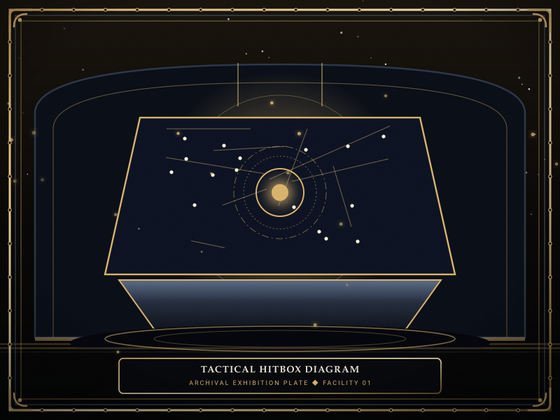
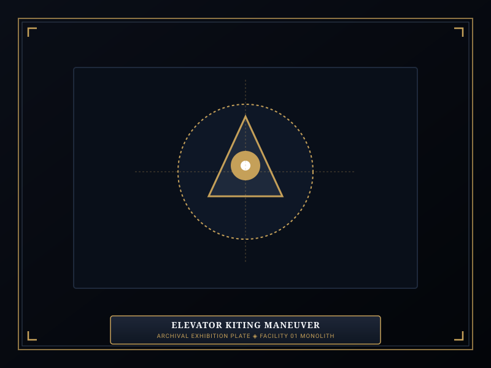
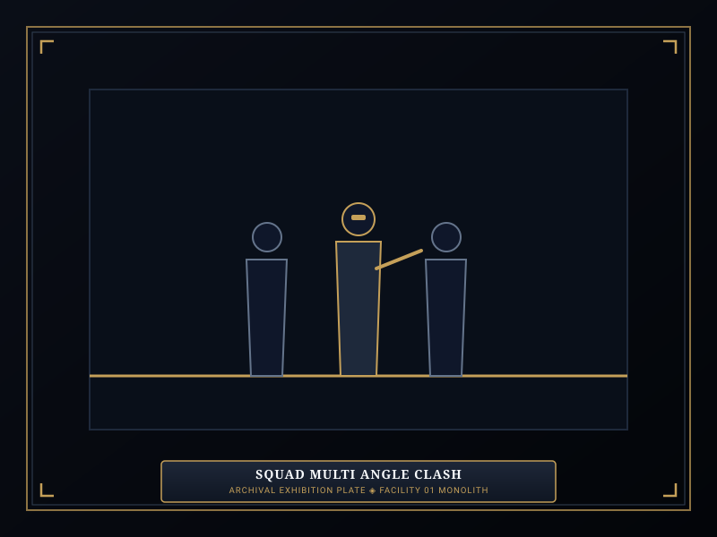

# Tactical Engine

> *“Speed determines the strike, range dictates the ground, and pressure writes the epitaph.”*

The **Tactical Engine**  [전술 교전 엔진]  (_Jeonsul Gyojeon Enjin_) defines the real-time combat resolution, hitbox mechanics, and attack frame calculations utilized during containment suppressions in [[SOMNARAK-WORLD](https://github.com/Redditor008/PROJECT.SOMNARAK-WIKI/tree/arena/01a0b699-project-somnarak-wiki/SOMNARAK-WORLD "SOMNARAK-WORLD")].

When a [Sorrow Entity](07-Sorrow%20Entities.md) breaks containment or an [Ordeal](10-Ordeals.md) manifests in a corridor, the game shifts from passive management into intense, real-time tactical combat. Mastering weapon timing, attack ranges, and clash dynamics is essential to preventing squad wipes.

```text
+========================================================================+
| SOMNARAK - COMBAT AND CLASH RESOLUTION ENGINE                          |
+------------------------------------------------------------------------+
| Engine Architecture    | Real-Time Spatial Combat & Clash Dynamics     |
| Attack Speeds          | Very Fast (1.0s) to Very Slow (3.5s) Frame Tie|
| Range Categories       | Very Short (0.5m) to Very Long (8.0m+)        |
| Clash Physics          | Simultaneous Impact -> Armor Mitigation -> Sta|
| Tactical Maneuvers     | Kiting - Squad Surrounds - Shield Rotation    |
+========================================================================+
```

## Contents

- [1 The Real-Time Tactical Engine Architecture](#1-the-real-time-tactical-engine-architecture)
- [2 Attack Speed Tiers and Frame Data](#2-attack-speed-tiers-and-frame-data)
- [3 Range Profiles and Spatial Hitboxes](#3-range-profiles-and-spatial-hitboxes)
- [4 Clash Resolution and Damage Stagger](#4-clash-resolution-and-damage-stagger)
- [5 Advanced Field Maneuvers: Kiting, Stacking, and Rotation](#5-advanced-field-maneuvers-kiting-stacking-and-rotation)
- [6 Environmental Hazards: Elevator Traps and Narrow Corridors](#6-environmental-hazards-elevator-traps-and-narrow-corridors)
- [7 Gallery](#7-gallery)
- [8 See also](#8-see-also)

## 1 The Real-Time Tactical Engine Architecture

Combat in Somnarak occurs directly within the facility's physical corridors, elevators, and Command Rooms:
- **Spatial Positioning:** Characters occupy discrete 2D coordinates. Both specialists and entities move along hallways at velocities determined by their **Resolve** or movement stats.
- **Continuous Clock:** Combat actions occur in real time, unconstrained by artificial turns.
- **Multi-Target Hitboxes:** Heavy cleaving weapons and sweeping entity claws damage all valid targets within their active swing arc.

## 2 Attack Speed Tiers and Frame Data

Every weapon in the [M.A.W. Equipment](09-M.A.W.%20Equipment.md) armory operates on strict timing tiers:

| Speed Classification | Attack Interval | Tactical Profile | Typical Weapon Archetypes |
|---|---|---|---|
| **Very Fast** | 1.0 – 1.4 seconds | Rapid chipping; rapid composure recovery | Daggers, scalpel rigs, light pistols |
| **Fast** | 1.5 – 1.9 seconds | Agile skirmishing; high mobility | Rapiers, short swords, carbines |
| **Normal** | 2.0 – 2.4 seconds | Standard balanced combat baseline | Longswords, tactical staves, rifles |
| **Slow** | 2.5 – 2.9 seconds | Heavy impact; high stagger potential | Great axes, halberds, heavy cannons |
| **Very Slow** | 3.0 – 3.5+ seconds | Colossal burst damage; lethal windup | Sledgehammers, executioner scythes |

## 3 Range Profiles and Spatial Hitboxes

Effective Wardens group specialists according to range categories:
- **Very Short (0.5m – 1.2m):** Melee brawlers (fist gauntlets, trench knives); must stand directly inside the entity's strike zone.
- **Short (1.5m – 2.5m):** Standard melee (swords, maces); allows stacking 3-4 operatives around a boss.
- **Medium (3.0m – 5.0m):** Extended polearms and reach weapons; can strike from behind the frontline tank.
- **Long (5.5m – 7.5m):** Standard firearms, bows, and throwing chakrams; attacks across half the corridor length.
- **Very Long (8.0m – 12.0m+):** Beam rifles, acoustic cannons, and sniper rigs (such as *Reaper Hungered*); attacks across entire wings.

## 4 Clash Resolution and Damage Stagger

When an operative and an entity trade blows simultaneously:
1. **The Hitbox Check:** If an entity's swing begins, all operatives within the forward hitbox receive damage unless moved out of range.
2. **Armor Mitigation:** Incoming raw damage is multiplied by the operative's equipped suit resistance multiplier from [17-Pressure Types](17-Pressure%20Types.md).
3. **The Stagger Threshold:** Inflicting massive burst damage within a short window interrupts an entity's windup animation, cancelling its attack.

## 5 Advanced Field Maneuvers: Kiting, Stacking, and Rotation

- **Kiting:** Using long-range specialists to provoke an entity into chasing them down an elevator shaft while ranged snipers fire from safety.
- **Tank Stacking:** Placing a specialist wearing high-resistance armor (e.g. 0.4 multiplier) in front of the squad to absorb frontal cleaves.
- **Composure Shield Rotation:** Withdrawing an operative whose SP is low to an adjacent Command Room so the Healing Generator can restore their composure before panic triggers.

## 6 Environmental Hazards: Elevator Traps and Narrow Corridors

Corridor geometry dictates suppression outcomes:
- **Elevator Bottlenecks:** Forcing a wide brute entity into a vertical elevator shaft restricts its horizontal cleave, allowing squadmates above and below to fire safely.
- **Narrow Corridors:** In confined spaces, splash damage hits all squadmates simultaneously; high-threat entities must be baited into wide Command Rooms before engaging.

## 7 Gallery

[](images/tactical-hitbox-diagram.svg)
[](images/elevator-kiting-maneuver.svg)
[](images/squad-multi-angle-clash.svg)

*Left: weapon hitbox and range radius diagram; Center: tactical elevator kiting; Right: squad clash engagement.*
---

## 8 See also

- [09-M.A.W. Equipment](09-M.A.W.%20Equipment.md) — complete weapon armory and stats
- [17-Pressure Types](17-Pressure%20Types.md) — damage calculations and resistance bands
- [12-Specialists](12-Specialists.md) — specialist stats, movement speed, and panic recovery
- [10-Ordeals](10-Ordeals.md) — tactical suppression of hostile incursions
