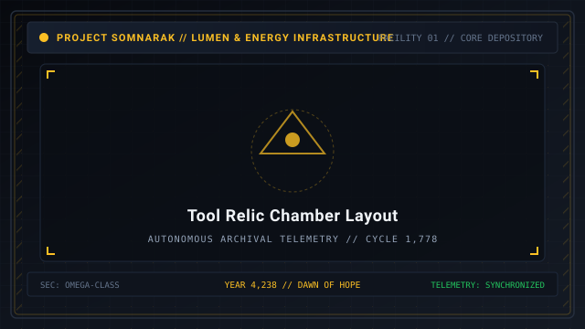
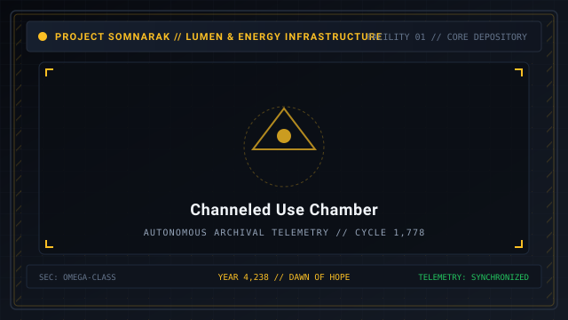
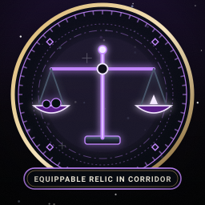

# Relic Entities

> *“Tools do not possess malice, yet their silence kills with geometric precision.”*

**Relic Entities**  [유물 및 도구 개체]  (_Yumul mit Dogu Gaeche_), also designated as **Tool Relics**, represent the inanimate artifacts, mystical contraptions, and metaphysical apparatuses contained within Facility 01.

Unlike sentient [Subject Entities](07-Sorrow%20Entities.md) that possess living bodies and wandering breach behaviors, Relics remain anchored inside their containment chambers. They cannot be disciplined or consoled; instead, they are utilized by specialists to manipulate facility physics, restore personnel, or harvest refined energy.

```text
+========================================================================+
| SOMNARAK - RELIC AND TOOL ENTITIES HUB                                 |
+------------------------------------------------------------------------+
| Entity Category        | Object & Relic Taxon (Non-Living Artifacts)   |
| Core Restriction       | The Two-Work-Type Rule (Viderehan & Ferrehan) |
| Three Sub-Types        | Single-Use - Channeled Use - Equippable       |
| Facility Relics        | Five Cataloged Relics across Facility 01      |
| Specimen Models        | Echo Compass - The Crucible - The Debt Scale  |
+========================================================================+
```

## Contents

- [1 The Nature of Inanimate Sorrow Relics](#1-the-nature-of-inanimate-sorrow-relics)
- [2 The Two-Work-Type Rule](#2-the-two-work-type-rule)
- [3 Complete Catalog of the Five Facility Relics](#3-complete-catalog-of-the-five-facility-relics)
- [4 The Three Functional Relic Sub-Types](#4-the-three-functional-relic-sub-types)
  - [4.1 Single-Use Relics (Instantaneous Activation)](#41-single-use-relics-instantaneous-activation)
  - [4.2 Channeled Use Relics (Continuous Stationing)](#42-channeled-use-relics-continuous-stationing)
  - [4.3 Equippable Relics (Carried Artifacts)](#43-equippable-relics-carried-artifacts)
- [5 Relic Overuse Hazards and Backlash Pulses](#5-relic-overuse-hazards-and-backlash-pulses)
- [6 Log and Method Archival Progression](#6-log-and-method-archival-progression)
- [7 Gallery](#7-gallery)
- [8 See also](#8-see-also)

## 1 The Nature of Inanimate Sorrow Relics

Relics coalesce when acute sorrow crystallizes around an object rather than a biological consciousness:
- Examples include ancient astronomical compasses, alchemical alembics, cursed ledgers, and ritual scales.
- Relics possess neither biological hunger nor predatory malice.
- However, their metaphysical mechanisms operate under unyielding physical laws: exceeding safe parameters results in instantaneous death or facility-wide debuffs.

## 2 The Two-Work-Type Rule

Because Relic Entities possess neither sentience nor emotions:
- 💧 **Flerehan (Lamentation)** and ⚔ **Pugnahan (Confrontation)** are strictly prohibited and mechanically disabled on the dispatch interface.
- Specialists may only perform:
  - 👁 **Viderehan (Observation):** Scanning inscriptions, reading dials, studying energy harmonics.
  - 🤲 **Ferrehan (Endurance):** Physical handling, cranking valves, carrying artifacts, or stepping inside channeling chambers.

## 3 Complete Catalog of the Five Facility Relics

| SECC Code | Relic Name | Subtype | Primary Function | Hazard Limit |
|---|---|---|---|---|
| `SE-T-Iα-001` | [The Echo Compass](28-The%20Echo%20Compass.md) | Single-Use | Facility acoustic radar sweep | 30s Cooldown |
| `SE-T-IIβ-002` | [The Crucible](29-The%20Crucible.md) | Channeled | Distills bonus Lumen from stamina | 29s Fatal Ceiling |
| `SE-T-IIIγ-003` | [The Debt Scale](30-The%20Debt%20Scale.md) | Equippable | Inverts Void defense & heals SP | Return before shift end |
| `SE-T-IIα-004` | Hourglass of Stasis | Channeled | Freezes meltdown timer by 60s | Drains 5 HP/sec |
| `SE-T-Iβ-005` | Archival Monocle | Single-Use | Reveals work affinities on next work | 45s Cooldown |

## 4 The Three Functional Relic Sub-Types

### 4.1 Single-Use Relics (Instantaneous Activation)
- **Mechanic:** Specialist enters the cell, activates the artifact, triggers an immediate facility-wide or local effect, and exits.
- **Specimen:** [28-The Echo Compass](28-The%20Echo%20Compass.md) (`SE-T-Iα-001`). Emits an acoustic radar pulse revealing hidden entities and boosting department accuracy.
- **Risk:** Rapid repeated activations within the same watch cause mental disorientation.

### 4.2 Channeled Use Relics (Continuous Stationing)
- **Mechanic:** Specialist steps inside the unit and channels continuously. As time passes, the relic generates escalating benefits (e.g., mass Lumen generation or facility shielding).
- **Specimen:** [29-The Crucible](29-The%20Crucible.md) (`SE-T-IIβ-002`). Generates surplus Lumen while slowly heating up.
- **The Fail-Safe Timer:** Exceeding the strict 30-second safe threshold triggers immediate combustion and fatal incineration of the occupant.

### 4.3 Equippable Relics (Carried Artifacts)
- **Mechanic:** Specialist enters the chamber, picks up the relic, and carries it out into the corridors.
- **Specimen:** [30-The Debt Scale](30-The%20Debt%20Scale.md) (`SE-T-IIIγ-003`). Heals nearby squadmates' SP and converts Void damage, but inverts physical vulnerability.
- **Risk:** Dropping the relic or keeping it equipped across shift boundaries inflicts severe backlash trauma.

## 5 Relic Overuse Hazards and Backlash Pulses

While Relics do not stage conventional hallway breaches:
- **Resonance Backlash:** Ignoring safe thresholds triggers a shockwave that deals heavy 🔵 **Lament** or ⚫ **Weight** damage to everyone on the floor.
- **Meltdown Exemption:** Relic chambers never suffer random meltdown overloads, making them safe haven assignments during crisis moments.

## 6 Log and Method Archival Progression

Observation logs for Tool Relics unlock differently from Subjects:
- **Single-Use:** Unlocked by total **Number of Uses** (1, 3, 5, 10 uses).
- **Channeled Use:** Unlocked by cumulative **Time of Use** (10s, 30s, 60s, 120s).
- **Equippable:** Unlocked by total **Equipped Duration** (30s, 60s, 120s, 300s).

## 7 Gallery

[](images/tool-relic-chamber-layout.svg)
[](images/channeled-use-chamber.svg)
[](images/equippable-relic-in-corridor.svg)

*Left: standard tool relic containment chamber; Center: specialist channeling inside unit; Right: operative carrying equippable relic.*
---

## 8 See also

- [25-Types](25-Types.md) — structural entity taxonomy: Subject vs Object
- [28-The Echo Compass](28-The%20Echo%20Compass.md) — specimen dossier: Single-Use Relic
- [29-The Crucible](29-The%20Crucible.md) — specimen dossier: Channeled Use Relic
- [30-The Debt Scale](30-The%20Debt%20Scale.md) — specimen dossier: Equippable Relic
