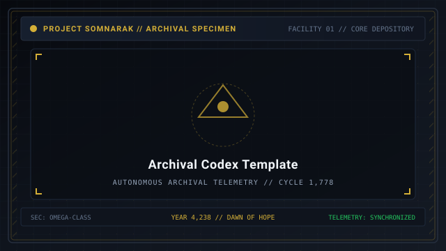
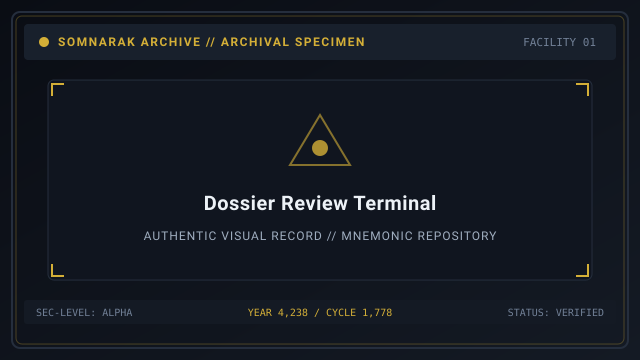
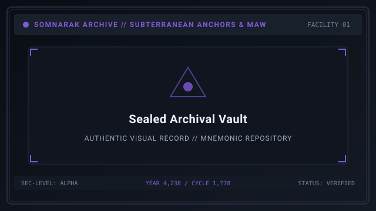

# Archival Codex

> *“A dossier is not finished when the ink dries; it is finished when the entity can no longer surprise the grave.”*

The **Archival Codex**  [기록 보관소 편람]  (_Girok Bogwanso Pyeonram_) establishes the standardized 18-section architectural blueprint used to document every [Sorrow Entity](07-Sorrow%20Entities.md) in Facility 01.

To ensure consistency across 292 dossiers, archival researchers follow a rigorous sequence of sections. This standardized framework guarantees that every contained sorrow is thoroughly mapped from its basic parameters to its deepest narrative origins.

```text
+========================================================================+
| SOMNARAK - THE 18 ARCHIVAL CODEX SECTIONS                              |
+------------------------------------------------------------------------+
| Archival Standard      | Master 18-Section Dossier Framework           |
| Section Wings          | Identification - Parameters - Combat - Story  |
| Comprehension Levels   | Level 1 (Basic) to Level 4 (M.A.W. & Full Lore|
| Integrity Audit        | Zero Seams - 74-Col Symmetry - Pan-Repo Sync  |
| Supervising Body       | Directorate Archival Curation Division        |
+========================================================================+
```

## Contents

- [1 Standard Dossier Anatomy](#1-standard-dossier-anatomy)
- [2 Sections 1 through 6: Operational Baseline](#2-sections-1-through-6-operational-baseline)
- [3 Sections 7 through 12: Tactical Dynamics and Equipment](#3-sections-7-through-12-tactical-dynamics-and-equipment)
- [4 Sections 13 through 18: Narrative Lore and Archival Records](#4-sections-13-through-18-narrative-lore-and-archival-records)
- [5 Archival Review and Committee Approval Workflow](#5-archival-review-and-committee-approval-workflow)
- [6 Field Documentation Protocols During Breaches](#6-field-documentation-protocols-during-breaches)
- [7 Archival Verification and Seam Auditing](#7-archival-verification-and-seam-auditing)
- [8 Gallery](#8-gallery)
- [9 See also](#9-see-also)

## 1 Standard Dossier Anatomy

Every comprehensive entity dossier is structured into 18 standardized sections:
1. **SECC Designation:** Official alphanumeric identifier.
2. **Parameters & Energy:** Maximum Lumen capacity and box thresholds.
3. **Combat Profile:** Primary attack pressure and damage values.
4. **Physical Appearance:** Sensory description of form and geometry.
5. **Origin Strata:** Veiled Tale, Scarred Memory, or Dream Born.
6. **Containment Behavior:** Docile vs agitated mood shifts.
7. **Breach Conditions:** Mugenhan counter triggers and escape mechanics.
8. **M.A.W. Armaments:** Extractable weapons, suits, and stigmas.
9. **Comprehension Levels:** Progressive unlocks across Levels 1 through 4.
10. **Canonical Story:** Primary narrative log of the entity.
11. **Final Observation:** Senior researcher's conclusive containment assessment.
12. **Flavor Text:** Poetic or atmospheric reflections.
13. **Interactions:** Resonances with other entities or relics.
14. **Veiled Tale:** In-depth historical mythos of its birth.
15. **Witness Testimony:** Firsthand accounts from surviving specialists.
16. **Archival Record:** Historical incidents and casualty counts.
17. **Trivia:** Mechanical quirks and design trivia.
18. **Cross-References:** Links to related entities, wings, and research pages.

## 2 Sections 1 through 6: Operational Baseline

These opening sections provide the immediate data required for routine containment:
- Clear identification of risk tiers (Whisper to Sovereign).
- Exact energy yield (e.g. 16 LU for Fragment entities).
- Primary damage pressure (🔴 Grudge, 🔵 Lament, ⚪ Void, or ⚫ Weight).
- Accurate description of physical geometry to assist specialist visual confirmation upon entry.

## 3 Sections 7 through 12: Tactical Dynamics and Equipment

These sections govern combat, crisis handling, and resource extraction:
- Specific conditions that cause the **Mugenhan Escape Counter** to drop.
- Complete stat tables for extractable M.A.W. Weapons and Suits.
- Work affinity tables detailing success rates for Viderehan, Ferrehan, Flerehan, and Pugnahan across specialist ranks I to V.
- Progressive unlock thresholds based on accumulated positive energy boxes.

## 4 Sections 13 through 18: Narrative Lore and Archival Records

The concluding sections preserve the human story behind the grief:
- Documenting the municipal tragedies or personal bereavements that gave birth to the horror.
- Archiving specialist logs, psychological debriefs, and commemorative testimonies.
- Listing confirmed historical incidents, casualties, and facility repair logs.

## 5 Archival Review and Committee Approval Workflow

Before an entity's dossier is finalized in the master library, it passes through a 3-stage review:
1. **Field Collation:** Containment specialists record raw work data and damage logs.
2. **Insight Forge Appraisal:** Lead Ayshuk verifies behavioral formulas and preference percentages.
3. **Directorate Curation:** The Central Administration Archival Board stamps the official SECC code and enters the file into the municipal registry.

## 6 Field Documentation Protocols During Breaches

Archival researchers embedded with combat squads record live combat telemetry:
- Attack swing frames and movement velocities are measured via acoustic sensors.
- Armor mitigation values are verified by telemetry receivers woven into specialist M.A.W. suits.
- In the event of researcher death, black-box data cubes automatically transmit telemetry to Central Administration.

## 7 Archival Verification and Seam Auditing

All dossiers must satisfy three strict repository checks:
- **Geometric Symmetry:** 74-character ASCII box border alignment.
- **Lexical Purity:** Zero foreign intellectual property terms.
- **Historical Continuity:** Flawless alignment with the Year 4,238 / Cycle 1,778 temporal anchor.

## 8 Gallery

[](images/archival-codex-template.svg)
[](images/dossier-review-terminal.svg)
[](images/sealed-archival-vault.svg)

*Left: 18-section dossier layout blueprint; Center: archival review workstation; Right: sealed archival ledger vault.*
---

## 9 See also

- [07-Sorrow Entities](07-Sorrow%20Entities.md) — master bestiary hub incorporating the codex
- [38-Classification Code](38-Classification%20Code.md) — SECC nomenclature system
- [27-The Debt Eater](27-The%20Debt%20Eater.md) — specimen dossier embodying the codex structure
- [04-Help](04-Help.md) — contributor style manual and formatting standards
