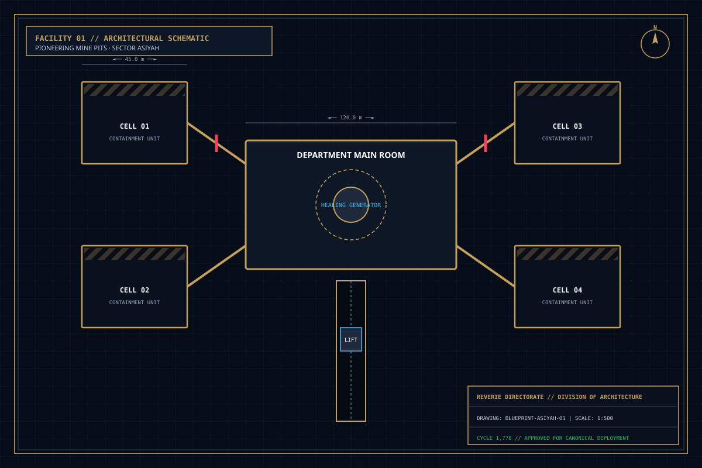
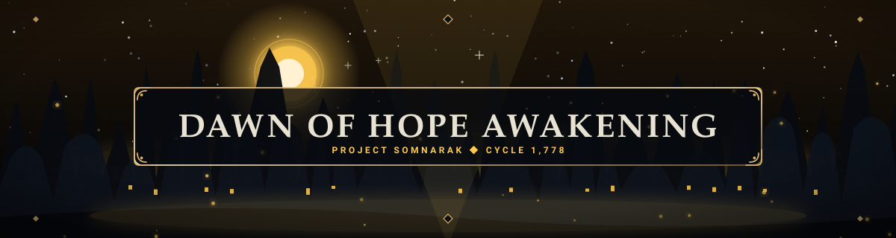

# Cantos

> *“The city writes its history in six voices, each singing a canto of ash and dawn.”*

**Cantos**  [여섯 편의 서사시]  (_Yeoseot Pyeon-ui Seosasi_) comprises the overarching six-part literary and historical epic of [[SOMNARAK-WORLD](https://github.com/Redditor008/PROJECT.SOMNARAK-WIKI/tree/arena/01a0b699-project-somnarak-wiki/SOMNARAK-WORLD "SOMNARAK-WORLD")].

Tracing humanity's struggle against subterranean sorrow across centuries, the Cantos detail the journey from crude mining pits to the industrial containment of the Reverie Directorate, culminating in the climatic ignition of the Dawn of Hope at Year 4,238.

```text
+========================================================================+
| SOMNARAK - THE SIX NARRATIVE CANTOS                                    |
+------------------------------------------------------------------------+
| Epic Chronicle         | The Six Narrative Cantos of Somnarak          |
| Historical Arc         | Primitive Mining -> Industrial Wings -> Ascens|
| Epochal Divide         | Ante-Dawn (I-V) -> Dawn of Hope (VI, Year 4,23|
| Central Theme          | Transmutation of Human Grief into Illumination|
| Poetic Verse           | Six Translated Stanzas from Municipal Epics   |
+========================================================================+
```

## Contents

- [1 The Architecture of the Cantos Epic](#1-the-architecture-of-the-cantos-epic)
- [2 Canto I: The Broken Soil (The Mining Era)](#2-canto-i-the-broken-soil-the-mining-era)
- [3 Canto II: The Iron Ribs (The Rise of UCD)](#3-canto-ii-the-iron-ribs-the-rise-of-ucd)
- [4 Canto III: The Whispering Well (The Weeping Discovered)](#4-canto-iii-the-whispering-well-the-weeping-discovered)
- [5 Canto IV: The Nine Pillars (Forging the Echo-Cores)](#5-canto-iv-the-nine-pillars-forging-the-echo-cores)
- [6 Canto V: The Unbroken Loom (The 1,778 Mnemonic Cycles)](#6-canto-v-the-unbroken-loom-the-1778-mnemonic-cycles)
- [7 Canto VI: The Dawn of Hope (Supercritical Ascension)](#7-canto-vi-the-dawn-of-hope-supercritical-ascension)
- [8 Thematic Synthesis and Modern Containment Philosophy](#8-thematic-synthesis-and-modern-containment-philosophy)
- [9 Gallery](#9-gallery)
- [10 See also](#10-see-also)

## 1 The Architecture of the Cantos Epic

The Cantos are divided across the great historical divide of the Somnarak world:
- **Cantos I through V (Ante-Dawn Epoch):** The agonizing centuries of trial, catastrophic containment breaches, and the repetitive daily grind of the 1,778 Mnemonic Cycles.
- **Canto VI (Dawn of Hope & Post-Dawn):** The supercritical resonance of Year 4,238, the ignition of the Absolvohan engine, and the dispersion of purified Lumen across surface settlements.

## 2 Canto I: The Broken Soil (The Mining Era)
- **Historical Era:** The early Sorrow Extraction Division (SED).
- **Narrative Arc:** Primitive boreholes and coal pits strike underground pockets of dark water. The miners discover that prolonged contact induces weeping and madness.
- **Poetic Verse:**  
  > *“We dug for coal and found our mothers' tears;  
  > The black damp whispered names we had not heard for thirty years.  
  > When the pick struck iron, the ground began to weep,  
  > And none who drank the groundwater could ever fall asleep.”*

## 3 Canto II: The Iron Ribs (The Rise of UCD)
- **Historical Era:** The Unified Containment Directorate (UCD).
- **Narrative Arc:** The rise of industrial containment. Massive iron foundries cast heavy pneumatic doors to cage the weeping horrors. Prototype M.A.W. weaving is developed by foundryman David Karr.
- **Poetic Verse:**  
  > *“Bolt the door with ten-ton pins, weld the iron tight;  
  > Grief has grown a set of horns that batter through the night.  
  > We built the cages tall and wide, we paved the bloody floor,  
  > And taught the screaming horrors how to wait behind a door.”*

## 4 Canto III: The Whispering Well (The Weeping Discovered)
- **Historical Era:** The Deep Maw Expeditions.
- **Narrative Arc:** Surveyor Jonathan Vance and pioneer Katabagil plunge thousands of meters into the chasm, discovering the subterranean source of all Han: the **Weeping**  [비탄의 강] .
- **Poetic Verse:**  
  > *“A river running without rain beneath the mountain's spine,  
  > Where every droplet tasted like unharvested saline.  
  > Vance turned his compass to the dark and heard the river call:  
  > 'The world above is hollow; we are waiting in the fall.'”*

## 5 Canto IV: The Nine Pillars (Forging the Echo-Cores)
- **Historical Era:** Construction of Facility 01.
- **Narrative Arc:** Nine municipal pioneers, led by Majin and Mellda, voluntarily surrender their biological bodies to become the cybernetic [Echo-Cores](14-Echo-Cores.md), anchoring the facility's geometry against the Maw.
- **Poetic Verse:**  
  > *“Nine minds cast into silver glass, nine hearts turned into stone,  
  > To hold the walls against the pit where men must stand alone.  
  > They gave their names to hallway wings, their blood to conduits deep,  
  > And swore an oath that none who watch shall turn their eyes to sleep.”*

## 6 Canto V: The Unbroken Loom (The 1,778 Mnemonic Cycles)
- **Historical Era:** The Repeating Cycle (Years 4,232 to 4,238).
- **Narrative Arc:** The Warden guides specialists through 1,778 repeating shifts, harvesting precisely 0.02 tons of crystalline Han per cycle while enduring unending psychological attrition.
- **Poetic Verse:**  
  > *“The morning siren rings the same, the ledger turns once more,  
  > A thousand times we scrubbed the blood from off the cellar floor.  
  > We counted crystal grain by grain until the battery shook,  
  > And wrote the name of every corpse inside the Warden's book.”*

## 7 Canto VI: The Dawn of Hope (Supercritical Ascension)
- **Historical Era:** Year 4,238 / Cycle 1,778.
- **Narrative Arc:** The accumulated Han crystal achieves supercritical mass; the Absolvohan engine fires, shattering the time loop and illuminating the continent with golden, unyielding hope.
- **Poetic Verse:**  
  > *“The iron ribs unlocked at last, the golden needle spun,  
  > And out from sorrow's deepest wound arose a second sun.  
  > The tears that drowned the ancient soil were turned to blinding light,  
  > And all the ghosts of Somnarak walked freely through the night.”*

## 8 Thematic Synthesis and Modern Containment Philosophy

The Cantos form the ideological backbone of the modern Directorate:
- Sorrow is not an enemy to be exterminated, but an elemental resource to be understood and distilled.
- Every specialist deployed onto the floor is an active verse in this ongoing epic, contributing to the eternal light of the Dawn.

## 9 Gallery

[](images/the-six-cantos-illumination.svg)
[](images/pioneering-mine-pits.svg)
[](images/dawn-of-hope-awakening.svg)

*Left: illuminated manuscript of the Six Cantos; Center: early mining excavations; Right: the Dawn of Hope.*
---

## 10 See also

- [05-Chronicle](05-Chronicle.md) — master story hub and chronological narrative
- [32-Genesis](32-Genesis.md) — cosmological origins and the Weeping
- [14-Echo-Cores](14-Echo-Cores.md) — the nine directors forged in Canto IV
- [41-Frontiers](41-Frontiers.md) — outlying frontiers beyond Facility 01
