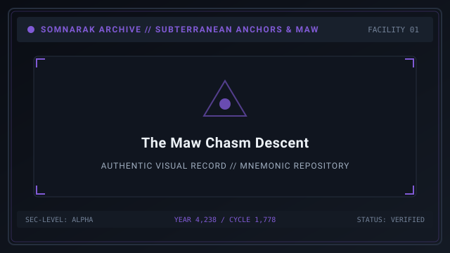
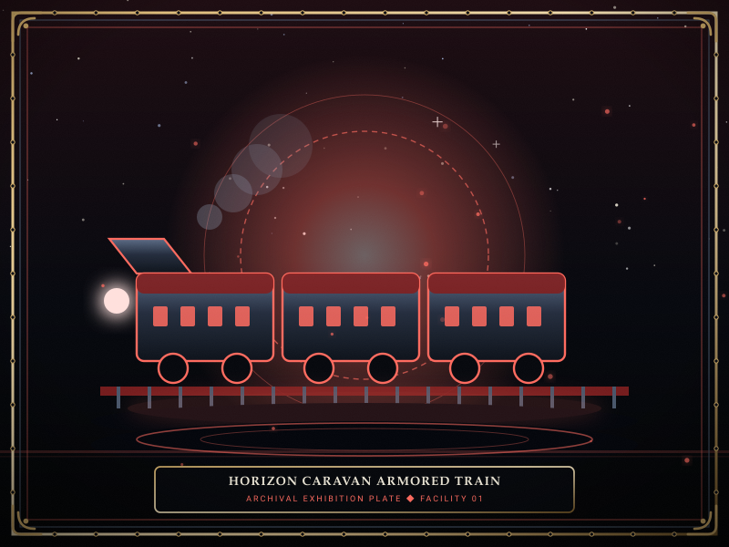
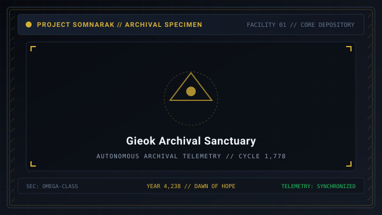

# Frontiers

> *“Beyond the walls of Facility 01, the world is not empty; it is wild with unharvested sorrow.”*

**Frontiers**  [외곽 개척 지대]  (_Oegwak Gaecheok Jidae_) details the vast external geography, subterranean descents, and industrial frontiers that surround Facility 01 in [[SOMNARAK-WORLD](https://github.com/Redditor008/PROJECT.SOMNARAK-WIKI/tree/arena/01a0b699-project-somnarak-wiki/SOMNARAK-WORLD "SOMNARAK-WORLD")].

While the Warden's daily duties are focused within the fortified wings of Facility 01, the Directorate maintains extensive logistical and exploratory operations across six major external frontiers: dredging the abyss, sweeping syndicate ruins, and trading along distant horizon caravan routes.

```text
+========================================================================+
| SOMNARAK - THE SIX OUTLYING FRONTIERS                                  |
+------------------------------------------------------------------------+
| Cosmological Scope     | Territories Beyond Facility 01 Bulkheads      |
| Subterranean Boundary  | The Maw (-2,000m to -7,200m Katabagil Descents|
| Corporate Frontier     | Katharcheok (Six Sweeps of the 5 Syndicates)  |
| Archival Frontier      | Gieok (Seven Stratified Memory Receptions)    |
| Caravan Frontier       | Jipyeongseondae (Six Arcs to Cheonbulok)      |
+========================================================================+
```

## Contents

- [1 Cosmological Geography Beyond Facility 01](#1-cosmological-geography-beyond-facility-01)
- [2 The Maw: Katabagil's Seven Subterranean Descents](#2-the-maw-katabagils-seven-subterranean-descents)
- [3 Katharcheok: The Six Sweeps of the Five Syndicates](#3-katharcheok-the-six-sweeps-of-the-five-syndicates)
- [4 Gieok: The Seven Receptions and Memory Stratum](#4-gieok-the-seven-receptions-and-memory-stratum)
- [5 Jipyeongseondae: The Horizon Caravans and Six Arcs](#5-jipyeongseondae-the-horizon-caravans-and-six-arcs)
- [6 The Outside Sovereign: Wilderness Tide](#6-the-outside-sovereign-wilderness-tide)
- [7 Resource Logistics and Frontier Transit](#7-resource-logistics-and-frontier-transit)
- [8 Gallery](#8-gallery)
- [9 See also](#9-see-also)

## 1 Cosmological Geography Beyond Facility 01

The world of Somnarak is divided into distinct environmental zones:
- **The Municipal Spire Ring:** Surface cities powered by harvested Lumen.
- **The Desolate Outskirts:** Barren wastelands swept by violent Han storms.
- **The Subterranean Core:** The abyssal depths where the [Weeping](32-Genesis.md) flows.

## 2 The Maw: Katabagil's Seven Subterranean Descents

Plunging beneath Facility 01 lies the **Maw**  [아가리]  (_Agari_), a colossal subterranean chasm first mapped by pioneer Katabagil across seven descending strata:

| Descent Stratum | Depth Elevation | Geological Environment | Dominant Elemental Pressure |
|---|---|---|---|
| **First Descent** | -2,000 meters | Fractured limestone and ancient mine shafts | 🔴 Grudge (Kinetic/Thermal) |
| **Second Descent** | -2,800 meters | Subterranean shale beds and weeping aquifers | 🔵 Lament (Sanity Drain) |
| **Third Descent** | -3,600 meters | Iron sediment galleries and fossilized roots | 🔴 Grudge (Heavy Physical) |
| **Fourth Descent** | -4,500 meters | Pressurized Han gas caverns; zero oxygen | 🔵 Lament (Hallucinatory) |
| **Fifth Descent** | -5,400 meters | Liquified Han tides and crystalline reefs | ⚫ Weight (Crushing Gravity) |
| **Sixth Descent** | -6,300 meters | Echoing bone caverns and ancient ruins | ⚪ Void (Percentage Decay) |
| **Seventh Descent** | -7,200 meters | The Bedrock of Tears: Shore of the Weeping | ⚪ Void & ⚫ Weight (Absolute) |

Lead Xyan's Gate Watch defends the massive blast doors at -2,000m, preventing horrors from the deeper descents from climbing into the facility.

## 3 Katharcheok: The Six Sweeps of the Five Syndicates

To the east lie the industrialized ruins of **Katharcheok**:
- Dominated by the **Five Commercial Syndicates** that compete for mining concessions.
- **The Six Sweeps:** Scheduled military cleanup operations conducted by heavy mechanized cadres to eliminate roaming Ordeals and rogue entities from railway corridors.

## 4 Gieok: The Seven Receptions and Memory Stratum

Located within a fortified mountain sanctuary, **Gieok** serves as a solemn municipal archive:
- Not a commercial enterprise, but a protected sanctuary of historical memory.
- Contains the **Seven Receptions**, where scholars study ancient pre-Dawn artifacts, decode forgotten dialects, and preserve the names of fallen specialists.

## 5 Jipyeongseondae: The Horizon Caravans and Six Arcs

The trade arteries connecting the frontiers are maintained by **Jipyeongseondae**:
- Massive armored crawler-trains known as **Horizon Caravans** traverse six designated arcs.
- Caravans journey through the Desolate Outskirts to **Cheonbulok** (the City of Unburning Fire) and **Mugeukji** (the Boundless Reach), ferrying refined Han crystal and M.A.W. alloys.

## 6 The Outside Sovereign: Wilderness Tide

Beyond municipal borders roams the sole registered Outside Sovereign:
- **SECC Code:** `SE-O-Vγ-003` (*Wilderness Tide*  [야생의 파도] ).
- Unlike facility-bound Sovereigns, Wilderness Tide cannot be caged inside a room; it manifests as a roaming, colossal storm of Grudge and Void that sweeps across the outskirts.

## 7 Resource Logistics and Frontier Transit

The Directorate relies on frontier convoys for vital materials:
- **Alloy Shipments:** Reinforced lead and obsidian plates mined in Katharcheok are shipped to the Insight Forge.
- **Crystal Export:** Refined Han crystal ingots are loaded onto Horizon Caravans to illuminate outer settlements.

## 8 Gallery

[](images/the-maw-chasm-descent.svg)
[](images/horizon-caravan-armored-train.svg)
[](images/gieok-archival-sanctuary.svg)

*Left: cross-section of the Maw and Katabagil descents; Center: armored caravan train; Right: Gieok mountain sanctuary.*
---

## 9 See also

- [05-Chronicle](05-Chronicle.md) — master story hub and Cantos
- [32-Genesis](32-Genesis.md) — cosmological origin of Han and the Weeping
- [06-Personnel](06-Personnel.md) — the 10 Primary Companies and corporate taxonomy
- [23-Risk Levels](23-Risk%20Levels.md) — Risk V Sovereigns and Outside entities
