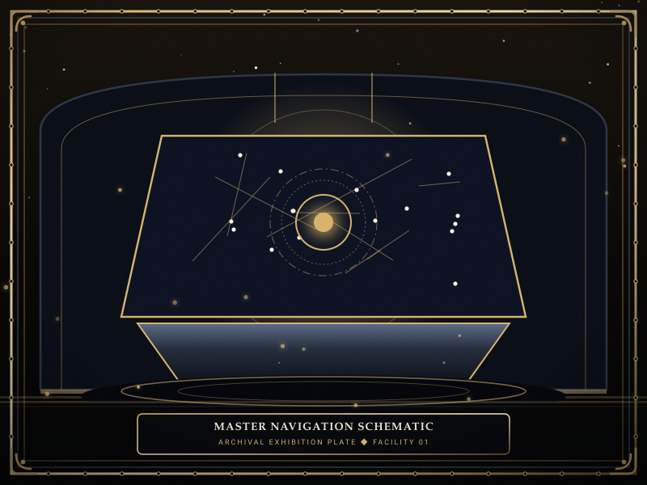
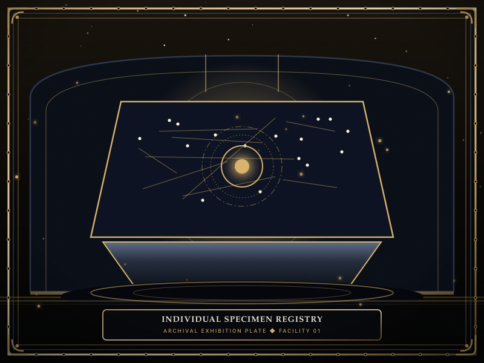

# Navigation

> *“Navigation is the map of the map — the index that the city keeps of its own knowledge so that a Warden never has to guess where a sorrow is filed.”*

**Navigation** provides the master directory map for the entire [[SOMNARAK-WORLD](https://github.com/Redditor008/PROJECT.SOMNARAK-WIKI/tree/arena/01a0b699-project-somnarak-wiki/SOMNARAK-WORLD "SOMNARAK-WORLD")] wiki archive. 

Rather than presenting an unstructured list of files, this index mirrors authentic encyclopedia architecture: organizing knowledge across **Three Main Ways** (Main Portal, Master Bestiary, Master Chronicle), **Two Sub Ways** (Personnel, Departments), and concrete **Individual Specimen Articles** demonstrating both standard non-tool subjects and the three distinct tool relic categories.

```text
+========================================================================+
| SOMNARAK - COMPREHENSIVE ARCHIVE NAVIGATION                            |
+------------------------------------------------------------------------+
| Archive Hub            | SOMNARAK-WORLD / Pages (Complete Navigation)  |
| Architecture           | 3 Main - 2 Sub - 4 Individual Specimens       |
| Core Bestiary          | 292 Sorrow Entities (285 SECC) - 88 Relics    |
| Facility Command       | 9 Echo-Cores across Floors 1 to 8 + Central   |
| Calendar Standard      | Year 4,238 / Reverie Cycle 1,778              |
+========================================================================+
```

## Contents

- [1 The 3 Main Ways (Primary Hubs)](#1-the-3-main-ways-primary-hubs)
- [2 The 2 Sub Ways (Facility Portals)](#2-the-2-sub-ways-facility-portals)
- [3 Individual Specimen Articles](#3-individual-specimen-articles)
- [4 Gameplay Systems and Technical Registers](#4-gameplay-systems-and-technical-registers)
- [5 Utility and Field Tools](#5-utility-and-field-tools)
- [6 Gallery](#6-gallery)
- [7 See also](#7-see-also)

## 1 The 3 Main Ways (Primary Hubs)

The three primary pillars that define the encyclopedia:

- **[01-Main Page](01-Main%20Page.md)** — Grand Central Portal: maintenance counts (**291** SE, **198** M.A.W. sets, **60** Ordeals), primary portal cards, Facility 01 department armbands table, and navigation directory.
- **[07-Sorrow Entities](07-Sorrow%20Entities.md)** — Master Bestiary Hub: the comprehensive thirteen-section bestiary covering cognitive manifestation, orange-and-blue morality, entity pairs and families, Weeping and Root Grid genesis, Lumen energy, M.A.W. gear and overload, related incursions, four canonical work protocols, tool relic mechanics, SECC decoding, and archival codex dissolution.
- **[05-Chronicle](05-Chronicle.md)** — Master Chronicle and Story Hub: the definitive history of Somnarak across Ante-Dawn expeditions, the 1,778 cycles of the Reverie Directorate, the Dawn of Hope at Year **4,238**, and the six Story Cantos.

## 2 The 2 Sub Ways (Facility Portals)

The operational foundations supporting facility management:

- **[06-Personnel](06-Personnel.md)** — Character Hub: the nine sovereign [Echo-Cores](14-Echo-Cores.md), their departmental armbands and signature weapons, ten specialist cadres, loadout pairing doctrine, and the ten Primary Companies.
- **[22-Departments](22-Departments.md)** — Department Hub: Facility 01 floor geography (Floors 1 to 8 + Central), Command Room healing generators (**6 HP/SP** base, **12 HP/SP** upgraded), containment chambers, transit hallways, elevator networks, and departmental mission unlocks.

## 3 Individual Specimen Articles

Authentic dossier articles demonstrating the primary operational archetypes cataloged in the archive:

| Article Title | Designation | Archetype | Key Operational Feature |
|---|---|---|---|
| **[27-The Debt Eater](27-The%20Debt%20Eater.md)** | `SE-C-IIIβ-014` | **Non-Tool Subject** | Mobile breaching entity; full 4-protocol preference table (I–V); management tips 1–4; M.A.W. gear (*Reaper Hungered*); observation log. |
| **[28-The Echo Compass](28-The%20Echo%20Compass.md)** | `SE-C-IIIβ-016` | **Tool: Single Use** | Relic instrument; single interaction triggers instant floor-wide acoustic scan; unlocked by cumulative Number of Uses; Log & Method table. |
| **[29-The Crucible](29-The%20Crucible.md)** | `SE-C-IIIβ-275` | **Tool: Channeled Use** | Basalt furnace; continuous endurance work produces rapid Han-Energy; fatal thermal critical mass past 30s; Log & Method table. |
| **[30-The Debt Scale](30-The%20Debt%20Scale.md)** | `SE-C-IIIβ-015` | **Tool: Equippable** | Silver balance pendant; equipped by specialist; passive SP healing and Void defense inversion; paired with The Debt Eater; Log & Method table. |

## 4 Gameplay Systems and Technical Registers

- **[08-Sorrow List](08-Sorrow%20List.md)** — complete index of all 285 unique SECC classification codes
- **[09-M.A.W. Equipment](09-M.A.W.%20Equipment.md)** — crystallized weapon, suit, and stigma armory (198 sets, 1,165 profiles)
- **[10-Ordeals](10-Ordeals.md)** — sixty hostile incursions across 5 Colors and 4 Watches
- **[11-Reverberations](11-Reverberations.md)** — department meltdown crises and stratum realizations
- **[12-Specialists](12-Specialists.md)** — operative recruitment, stat progression, and loadout pairing
- **[13-Operations](13-Operations.md)** — daily municipal missions and tactical deployment guidelines
- **[14-Echo-Cores](14-Echo-Cores.md)** — individual director dossiers, armbands, and meltdown trials
- **[15-Research](15-Research.md)** — facility research trees and restorative upgrades
- **[16-Daily Cycle](16-Daily%20Cycle.md)** — shift execution, watch timing, and daily quota management
- **[17-Pressure Types](17-Pressure%20Types.md)** — four elemental damage pressures: 🔴 **Grudge**, 🔵 **Lament**, ⚪ **Void**, ⚫ **Weight**
- **[18-Containment Levels](18-Containment%20Levels.md)** — departmental stability metrics from Tranquil to Rupture
- **[19-Lumen Surge](19-Lumen%20Surge.md)** — energy overload thresholds and emergency containment protocols
- **[20-Challenge Mode](20-Challenge%20Mode.md)** — high-difficulty operational trials and endgame encounters
- **[21-Game Mechanics](21-Game%20Mechanics.md)** — combat calculations, clash mechanics, and tactical formulas
- **[23-Risk Levels](23-Risk%20Levels.md)** — threat classifications from Whisper (Rank I) to Sovereign (Rank V)
- **[24-Origins](24-Origins.md)** — origin classification: City (도한), Inner (내한), and Outside (외한)
- **[25-Types](25-Types.md)** — entity manifestations: Subject, Object, Place, Time, Hazard
- **[26-Personnel Dossiers](26-Personnel%20Dossiers.md)** — key named historical figures and specialists
- **[36-Tactical Engine](36-Tactical%20Engine.md)** — deep-dive tactical combat engine specifications
- **[37-Relic Entities](37-Relic%20Entities.md)** — complete taxonomy of the 88 relic and tool specimens
- **[38-Classification Code](38-Classification%20Code.md)** — SECC classification decoding manual

## 5 Utility and Field Tools

- [02-Recent Echoes](02-Recent%20Echoes.md) — recent changes, patchnotes, and field logs
- [03-Random Dossier](03-Random%20Dossier.md) — random draw generator across all 292 containment records
- [04-Help](04-Help.md) — reading guide for novices and containment safety standards

## 6 Gallery

[](images/master-navigation-schematic.svg)
[](images/three-main-portals-diagram.svg)
[](images/individual-specimen-registry.svg)

*Left: complete facility navigation schematic; Center: three main portal relationships; Right: individual specimen registry.*
---

## 7 See also

- [01-Main Page](01-Main%20Page.md) — central wiki portal
- [07-Sorrow Entities](07-Sorrow%20Entities.md) — master entity bestiary
- [05-Chronicle](05-Chronicle.md) — master history and story cantos
- [[SOMNARAK-WORLD](https://github.com/Redditor008/PROJECT.SOMNARAK-WIKI/tree/arena/01a0b699-project-somnarak-wiki/SOMNARAK-WORLD "SOMNARAK-WORLD")] — the full in-universe lore archive
